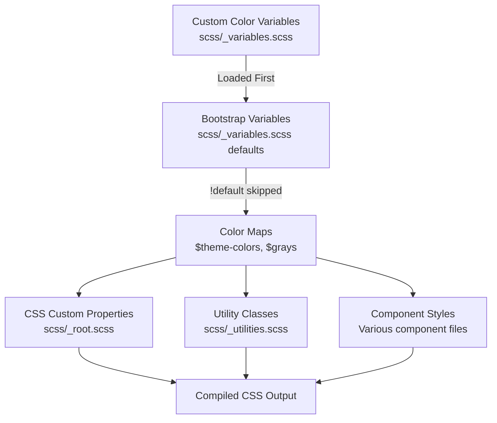

# update-theme-colors - Task 5

Execute task 5 for the update-theme-colors specification.

## Task Description
Add body color variable overrides

## Code Reuse
**Leverage existing code**: scss/

## Requirements Reference
**Requirements**: 4.1-4.3

## Usage
```
/Task:5-update-theme-colors
```

## Instructions

Execute with @spec-task-executor agent the following task: "Add body color variable overrides"

```
Use the @spec-task-executor agent to implement task 5: "Add body color variable overrides" for the update-theme-colors specification and include all the below context.

# Steering Context
## Steering Documents Context (Pre-loaded)

### Product Context
# Product Overview

## Purpose
A custom Bootstrap 5 theme inspired by IBM's Carbon Design System, designed for a personal website that serves as both a portfolio and blog.

## Target Users
- Primary: The site owner (Dan) for showcasing work and publishing blog content
- Secondary: Visitors viewing the portfolio and reading blog posts

## Goals
1. Bring Carbon Design System's visual language to a Bootstrap-based personal site
2. Maintain Bootstrap's utility and component structure while adopting Carbon's aesthetics
3. Create a clean, professional, accessible design suitable for technical content

## Design Philosophy
- **Systematic**: Use consistent design tokens (colors, spacing, typography)
- **Accessible**: Follow WCAG guidelines, ensure readable contrast ratios
- **Minimal**: Clean, content-focused design without unnecessary decoration
- **Professional**: Suitable for a developer/technical portfolio

## Scope
- Light mode only (for now)
- All Bootstrap components, prioritized from basic to complex
- IBM Plex typography
- Carbon color palette adapted to Bootstrap's color system

## Success Metrics
- Visual consistency with Carbon Design System principles
- Maintained Bootstrap functionality and responsive behavior
- Clean, readable typography for blog content
- Professional appearance for portfolio presentation

---

### Technology Context
# Technology Stack

## Core Framework
- **Bootstrap 5.3.8**: Base CSS framework
- **Sass (dart-sass 1.78.0)**: CSS preprocessor for source files

## Build Tools
- **npm scripts**: Task runner for build processes
- **PostCSS + Autoprefixer**: CSS vendor prefixing
- **CleanCSS**: CSS minification
- **Rollup**: JavaScript bundling
- **Terser**: JavaScript minification

## Development Tools
- **Nodemon**: File watching for development
- **Stylelint**: CSS/SCSS linting (twbs-bootstrap config)
- **ESLint**: JavaScript linting

## Testing
- **Karma + Jasmine**: JavaScript unit testing
- **sass-true**: SCSS unit testing

## Documentation
- **Astro**: Static site generator for docs

## Key Scripts
- `npm run build-theme`: Build CSS and copy to parent theme directory
- `npm run watch-theme`: Watch SCSS and rebuild on changes
- `npm run css`: Full CSS build (compile, prefix, RTL, minify)
- `npm run dist`: Build both CSS and JS

## Output
- Compiled CSS goes to `dist/css/`
- Final minified CSS copied to `../../themes/bs-carbon/static/css/styles.min.css`

## Design System Reference
- **Carbon Design System**: https://carbondesignsystem.com/
- **Bootstrap Customization Guide**: https://getbootstrap.com/docs/5.3/customize/overview/
- Primary inspiration for colors, typography, and component styling

## Customization Philosophy

### CRITICAL: Variable-Only Customization
**DO NOT modify Bootstrap source files directly.** All customizations MUST be done through:

1. **Variable overrides**: Set variables BEFORE importing Bootstrap
2. **Sass maps**: Extend or modify Bootstrap's maps
3. **CSS custom properties**: Override at runtime where applicable
4. **Utility API**: Extend utilities through the utilities map

This approach ensures:
- Clean merges when Bootstrap releases updates
- Maintainable, traceable customizations
- Full access to Bootstrap's built-in utilities and variables

### Bootstrap Resources to Use
- **All Sass variables**: https://getbootstrap.com/docs/5.3/customize/sass/
- **CSS variables**: https://getbootstrap.com/docs/5.3/customize/css-variables/
- **Color system**: https://getbootstrap.com/docs/5.3/customize/color/
- **Component variables**: Check each component's documentation for available variables
- **Utility classes**: Use Bootstrap's utility classes extensively in markup

## Carbon Design Tokens (Reference)

### Colors (Light Mode)
- **Text primary**: `#161616`
- **Text secondary**: `#525252`
- **UI background**: `#ffffff`
- **UI-01 (container bg)**: `#f4f4f4`
- **UI-02 (subtle bg)**: `#e0e0e0`
- **Border subtle**: `#e0e0e0`
- **Interactive/Primary**: `#0f62fe` (Blue 60)
- **Success**: `#24a148` (Green 50)
- **Error**: `#da1e28` (Red 60)
- **Warning**: `#f1c21b` (Yellow 30)

### Typography
- **Sans-serif**: IBM Plex Sans
- **Monospace**: IBM Plex Mono
- **Base size**: 16px (1rem)
- **Line height**: 1.5 for body text

### Spacing Scale
Carbon uses a 2px base with a scale: 2, 4, 8, 12, 16, 24, 32, 40, 48px
(Bootstrap uses 4px base: 4, 8, 16, 24, 48px - use Bootstrap's $spacer variable)

---

### Structure Context
# Project Structure

## Directory Layout
```
modules/theme/
├── scss/                    # SCSS source files
│   ├── _variables.scss      # Bootstrap variable overrides (PRIMARY customization point)
│   ├── _variables-dark.scss # Dark mode variables (not in scope currently)
│   ├── _functions.scss      # Sass functions
│   ├── _mixins.scss         # Mixin imports
│   ├── _maps.scss           # Sass maps (can extend here)
│   ├── _utilities.scss      # Utility configuration (can extend here)
│   ├── _root.scss           # CSS custom properties
│   ├── _reboot.scss         # Base element styles
│   ├── _type.scss           # Typography
│   ├── _[component].scss    # Individual component styles
│   ├── forms/               # Form-related partials
│   ├── helpers/             # Helper classes
│   ├── mixins/              # Individual mixins
│   ├── utilities/           # Utility API
│   ├── vendor/              # Third-party (RFS)
│   └── bootstrap.scss       # Main entry point
├── js/src/                  # JavaScript source
├── dist/                    # Compiled output
├── site/                    # Documentation site
└── build/                   # Build scripts
```

## Customization Strategy

### CRITICAL RULE: No Direct Bootstrap File Modifications

**All customizations MUST be done through variable overrides, NOT by editing Bootstrap's source files.**

This ensures:
- Seamless merging of Bootstrap upstream updates
- Clear separation between Bootstrap core and our customizations
- Predictable behavior when Bootstrap releases new versions

### How to Customize (Bootstrap's Recommended Approach)

#### Method 1: Variable Overrides (Primary Method)
Set variables BEFORE they're used by Bootstrap. Variables use `!default`, so setting them first takes precedence.

```scss
// In a custom variables file loaded BEFORE Bootstrap's _variables.scss
$primary: #0f62fe;  // Carbon Blue 60
$body-color: #161616;  // Carbon text primary

// Then Bootstrap's _variables.scss will NOT override these
```

#### Method 2: Map Manipulation (For Complex Changes)
Use Sass map functions to extend or modify Bootstrap's maps AFTER importing variables but BEFORE importing components.

```scss
// After @import "variables";
// Before component imports

$theme-colors: map-merge(
  $theme-colors,
  (
    "custom-color": #custom-value
  )
);
```

#### Method 3: Utility API Extension
Extend utilities through the `$utilities` map:

```scss
$utilities: map-merge(
  $utilities,
  (
    "custom-utility": (
      property: custom-property,
      values: (...)
    )
  )
);
```

### What NOT to Do
- DO NOT edit `_buttons.scss`, `_forms.scss`, or other component files directly
- DO NOT remove `!default` flags from variables
- DO NOT copy-paste and modify Bootstrap component code
- DO NOT add custom CSS that duplicates Bootstrap functionality

### Where to Make Changes
1. **`scss/_variables.scss`**: Override color, typography, spacing, and component variables
2. **`scss/_maps.scss`**: Extend Sass maps if needed
3. **`scss/_utilities.scss`**: Extend utility classes if needed
4. **Custom partial file**: For truly custom styles that don't exist in Bootstrap (create sparingly)

### Variable Naming Convention
Bootstrap uses: `$component-state-property-size`
Examples:
- `$primary`, `$secondary`, `$success`, `$danger`, etc. (theme colors)
- `$body-bg`, `$body-color` (body defaults)
- `$font-family-sans-serif`, `$font-family-monospace` (typography)
- `$btn-padding-y`, `$btn-padding-x`, `$btn-font-size` (button sizing)
- `$border-radius`, `$border-color` (borders)
- `$spacer` (spacing base unit)

### Component Priority Order
Customize in this order (basic to complex):

**Phase 1 - Foundation (Variables Only)**
1. Colors (`$primary`, `$secondary`, `$body-color`, `$body-bg`, theme colors map)
2. Typography (`$font-family-sans-serif`, `$font-family-monospace`, `$font-size-base`, `$line-height-base`)
3. Spacing (`$spacer`, `$spacers` map)
4. Borders & Shadows (`$border-radius`, `$border-color`, `$box-shadow`)

**Phase 2 - Basic Components (Variables Only)**
5. Buttons (`$btn-*` variables)
6. Forms (`$input-*`, `$form-*` variables)
7. Tables (`$table-*` variables)
8. Alerts (`$alert-*` variables)
9. Badges (`$badge-*` variables)

**Phase 3 - Navigation (Variables Only)**
10. Nav (`$nav-*` variables)
11. Navbar (`$navbar-*` variables)
12. Breadcrumb (`$breadcrumb-*` variables)
13. Pagination (`$pagination-*` variables)

**Phase 4 - Content Components (Variables Only)**
14. Cards (`$card-*` variables)
15. List groups (`$list-group-*` variables)
16. Accordion (`$accordion-*` variables)

**Phase 5 - Overlays & Advanced (Variables Only)**
17. Modal (`$modal-*` variables)
18. Dropdown (`$dropdown-*` variables)
19. Tooltip (`$tooltip-*` variables)
20. Popover (`$popover-*` variables)
21. Toast (`$toast-*` variables)

## Using Bootstrap's Utilities

**Maximize use of Bootstrap's built-in utilities** in both SCSS and HTML:

### In SCSS (via mixins and functions)
```scss
// Use Bootstrap's color functions
color: shade-color($primary, 20%);
background: tint-color($primary, 80%);

// Use Bootstrap's mixins
@include media-breakpoint-up(md) { ... }
@include button-variant($primary, $primary);
```

### In HTML (via utility classes)
Prefer utility classes over custom CSS:
```html
<div class="d-flex justify-content-between align-items-center p-3 bg-light rounded">
```

## Coding Standards

### SCSS
- NEVER modify Bootstrap source files directly
- Override variables BEFORE Bootstrap imports them
- Use Bootstrap's variables, mixins, and functions extensively
- Keep Carbon reference comments for traceability (e.g., `// Carbon: Blue 60`)
- Use Stylelint with `stylelint-config-twbs-bootstrap`

### Naming Conventions (Follow Bootstrap's Patterns)
When adding new classes or elements, follow Bootstrap's naming conventions:

**CSS Classes:**
- Use lowercase with hyphens: `.btn-carbon`, `.card-header-alt`
- Component-based naming: `.{component}`, `.{component}-{element}`, `.{component}-{modifier}`
- State classes: `.is-{state}`, `.has-{feature}` or `.{component}-{state}`
- Size variants: `.{component}-sm`, `.{component}-lg`
- Color variants: `.{component}-primary`, `.{component}-secondary`

**Examples:**
```scss
// Good - follows Bootstrap conventions
.btn-outline-primary { }
.card-header { }
.nav-link-active { }
.form-control-lg { }

// Bad - doesn't follow conventions
.btnOutlinePrimary { }  // No camelCase
.Card_Header { }        // No underscores or capitals
.navigation-link { }    // Use Bootstrap's component names
```

**Sass Variables:**
- Follow `$component-state-property-size` pattern
- Examples: `$btn-primary-bg`, `$card-border-radius`, `$input-focus-border-color`

**Sass Mixins:**
- Use verb-noun or descriptive naming: `@mixin make-container()`, `@mixin button-variant()`

### Testing Changes
```bash
npm run watch-theme    # Watch and rebuild
npm run css-test       # Run SCSS tests
npm run css-lint       # Lint SCSS files
```

### Building for Production
```bash
npm run build-theme    # Build and copy to theme directory
```

### Merging Bootstrap Updates
When Bootstrap releases updates:
1. Merge/rebase from upstream Bootstrap
2. Resolve any variable conflicts (our overrides should remain)
3. Test the build: `npm run build-theme`
4. Verify visual appearance hasn't regressed

**Note**: Steering documents have been pre-loaded. Do not use get-content to fetch them again.

# Specification Context
## Specification Context (Pre-loaded): update-theme-colors

### Requirements
# Requirements Document: Update Theme Colors

## Introduction

This specification defines the requirements for updating the Bootstrap theme's color system to align with IBM's Carbon Design System. The goal is to replace Bootstrap's default color values with Carbon's color palette and semantic color tokens while maintaining Bootstrap's utility-first customization approach through variable overrides only.

## Alignment with Product Vision

This feature directly supports the product goals outlined in product.md:

1. **"Bring Carbon Design System's visual language to a Bootstrap-based personal site"** - Colors are fundamental to Carbon's visual identity
2. **"Carbon color palette adapted to Bootstrap's color system"** - Explicitly listed in the project scope
3. **"Phase 1 - Foundation"** - Colors are item #1 in the component priority order
4. **"Accessible"** - Carbon colors are designed for WCAG compliance

## Background: Carbon vs Bootstrap Colors

### Carbon Color System Overview

Carbon uses a structured color token system with:

1. **Color Palettes**: Named color families (Blue, Gray, Red, Green, etc.) with 10 shades each (10-100)
2. **Semantic Tokens**: Role-based tokens like `$interactive-01`, `$text-01`, `$support-01`
3. **Theme Support**: Colors adapt across themes (White, Gray 10, Gray 90, Gray 100)

### Carbon Gray Palette (Neutral)

| Token | Hex | Usage |
|-------|-----|-------|
| Gray 10 | #f4f4f4 | Subtle backgrounds |
| Gray 20 | #e0e0e0 | Borders, dividers |
| Gray 30 | #c6c6c6 | Disabled states |
| Gray 40 | #a8a8a8 | Placeholder text |
| Gray 50 | #8d8d8d | Secondary icons |
| Gray 60 | #6f6f6f | Tertiary text |
| Gray 70 | #525252 | Secondary text |
| Gray 80 | #393939 | Primary dark elements |
| Gray 90 | #262626 | Dark backgrounds |
| Gray 100 | #161616 | Primary text, darkest |

### Carbon Blue Palette (Primary/Interactive)

| Token | Hex | Usage |
|-------|-----|-------|
| Blue 10 | #edf5ff | Subtle blue backgrounds |
| Blue 20 | #d0e2ff | Light blue accents |
| Blue 30 | #a6c8ff | Hover backgrounds |
| Blue 40 | #78a9ff | Secondary buttons |
| Blue 50 | #4589ff | Links (dark theme) |
| Blue 60 | #0f62fe | Primary interactive |
| Blue 70 | #0043ce | Hover primary |
| Blue 80 | #002d9c | Active primary |
| Blue 90 | #001d6c | Dark accents |
| Blue 100 | #001141 | Darkest blue |

### Carbon Support/Status Colors

| Role | Token | Hex |
|------|-------|-----|
| Error/Danger | Red 60 | #da1e28 |
| Success | Green 50 | #24a148 |
| Warning | Yellow 30 | #f1c21b |
| Info | Blue 70 | #0043ce |

### Carbon UI Tokens (White/Light Theme)

| Token | Value | Bootstrap Equivalent |
|-------|-------|---------------------|
| $ui-background | #ffffff | $body-bg |
| $ui-01 | #f4f4f4 | $gray-100 |
| $ui-02 | #ffffff | $white |
| $ui-03 | #e0e0e0 | $gray-300 |
| $text-01 | #161616 | $body-color |
| $text-02 | #525252 | $text-muted |
| $interactive-01 | #0f62fe | $primary |
| $interactive-02 | #393939 | $secondary |
| $link-01 | #0f62fe | $link-color |
| $focus | #0f62fe | $focus-ring-color |

### Bootstrap Default Colors

Bootstrap uses these default values:

| Variable | Default |
|----------|---------|
| $blue | #0d6efd |
| $primary | $blue |
| $secondary | $gray-600 |
| $success | #198754 |
| $danger | #dc3545 |
| $warning | #ffc107 |
| $info | #0dcaf0 |
| $body-color | $gray-900 |
| $body-bg | $white |

### Key Differences

- Carbon Blue 60 (#0f62fe) vs Bootstrap Blue (#0d6efd) - slightly different blues
- Carbon's Gray scale is different from Bootstrap's (Carbon uses #f4f4f4 for Gray 10, Bootstrap uses #f8f9fa for Gray 100)
- Carbon danger (#da1e28) is more saturated than Bootstrap (#dc3545)
- Carbon success (#24a148) differs from Bootstrap (#198754)
- Carbon warning (#f1c21b) is more gold vs Bootstrap's yellow (#ffc107)

## Requirements

### Requirement 1: Primary Theme Colors

**User Story:** As a site visitor, I want the site to use Carbon's primary color palette, so that the visual appearance matches Carbon Design System.

#### Acceptance Criteria

1. WHEN the primary color is used THEN the system SHALL use Blue 60 (#0f62fe)
2. WHEN the secondary color is used THEN the system SHALL use Gray 80 (#393939)
3. WHEN interactive elements are displayed THEN they SHALL use Blue 60 (#0f62fe) as the base
4. WHEN buttons and links are hovered THEN they SHALL use Blue 70 (#0043ce)
5. WHEN buttons and links are active THEN they SHALL use Blue 80 (#002d9c)

### Requirement 2: Status/Support Colors

**User Story:** As a site visitor, I want status indicators to use Carbon's support colors, so that success, error, and warning states are visually consistent with Carbon.

#### Acceptance Criteria

1. WHEN danger/error states are shown THEN the system SHALL use Red 60 (#da1e28)
2. WHEN success states are shown THEN the system SHALL use Green 50 (#24a148)
3. WHEN warning states are shown THEN the system SHALL use Yellow 30 (#f1c21b)
4. WHEN info states are shown THEN the system SHALL use Blue 70 (#0043ce)

### Requirement 3: Gray Scale

**User Story:** As a developer, I want a gray scale that matches Carbon, so that text, borders, and backgrounds have consistent neutral tones.

#### Acceptance Criteria

1. WHEN $gray-100 is used THEN the system SHALL output #f4f4f4 (Carbon Gray 10)
2. WHEN $gray-200 is used THEN the system SHALL output #e0e0e0 (Carbon Gray 20)
3. WHEN $gray-300 is used THEN the system SHALL output #c6c6c6 (Carbon Gray 30)
4. WHEN $gray-400 is used THEN the system SHALL output #a8a8a8 (Carbon Gray 40)
5. WHEN $gray-500 is used THEN the system SHALL output #8d8d8d (Carbon Gray 50)
6. WHEN $gray-600 is used THEN the system SHALL output #6f6f6f (Carbon Gray 60)
7. WHEN $gray-700 is used THEN the system SHALL output #525252 (Carbon Gray 70)
8. WHEN $gray-800 is used THEN the system SHALL output #393939 (Carbon Gray 80)
9. WHEN $gray-900 is used THEN the system SHALL output #161616 (Carbon Gray 100)

### Requirement 4: Body and Text Colors

**User Story:** As a site visitor, I want readable text with proper contrast, so that content is accessible and matches Carbon's text hierarchy.

#### Acceptance Criteria

1. WHEN body text is displayed THEN it SHALL use #161616 (Carbon text-01/Gray 100)
2. WHEN secondary/muted text is displayed THEN it SHALL use #525252 (Carbon text-02/Gray 70)
3. WHEN the body background is displayed THEN it SHALL use #ffffff (White)
4. WHEN links are displayed THEN they SHALL use #0f62fe (Carbon link-01/Blue 60)

### Requirement 5: Focus and Interactive States

**User Story:** As a site visitor using keyboard navigation, I want visible focus indicators, so that I can navigate the site accessibly.

#### Acceptance Criteria

1. WHEN an element receives focus THEN the focus ring SHALL use Blue 60 (#0f62fe)
2. WHEN interactive elements are hovered THEN they SHALL darken appropriately using Carbon's hover values
3. WHEN interactive elements are disabled THEN they SHALL use Gray 30 (#c6c6c6)

### Requirement 6: Color Palette Variables

**User Story:** As a developer, I want access to Carbon's full color palette, so that I can use consistent colors throughout the theme.

#### Acceptance Criteria

1. WHEN the $blue variable is used THEN it SHALL equal Blue 60 (#0f62fe)
2. WHEN the $red variable is used THEN it SHALL equal Red 60 (#da1e28)
3. WHEN the $green variable is used THEN it SHALL equal Green 50 (#24a148)
4. WHEN the $yellow variable is used THEN it SHALL equal Yellow 30 (#f1c21b)
5. WHEN the $cyan variable is used THEN it SHALL equal Cyan 50 (#1192e8)

### Requirement 7: Variable-Only Implementation

**User Story:** As a developer, I want color changes to be implemented through Bootstrap variable overrides only, so that I can easily merge future Bootstrap updates.

#### Acceptance Criteria

1. WHEN colors are customized THEN the system SHALL NOT modify Bootstrap source files directly
2. WHEN color variables are set THEN they SHALL be defined before Bootstrap imports them
3. WHEN custom values are used THEN they SHALL include comments referencing Carbon specifications
4. IF a Bootstrap variable exists for a color property THEN it SHALL be used instead of custom CSS

## Non-Functional Requirements

### Accessibility

- All text colors must maintain WCAG 2.2 AA contrast requirements (4.5:1 for body text, 3:1 for large text)
- Focus indicators must be clearly visible (3:1 contrast minimum)
- Color must not be the only means of conveying information

### Maintainability

- All color overrides must be clearly documented with Carbon token references
- Changes must be isolated to `scss/_variables.scss`
- Implementation must follow Bootstrap's variable naming conventions

### Compatibility

- Colors must work correctly with all Bootstrap components
- Utility classes (.text-*, .bg-*, .border-*) must reflect new colors
- Changes must not break existing Bootstrap functionality

## Out of Scope

The following are explicitly out of scope for this specification:

1. **Dark theme colors** - Focus is on light mode only per product.md
2. **Extended color palettes** - Only core Bootstrap color variables, not all Carbon shades
3. **Component-specific colors** - Will be handled when each component is customized
4. **CSS custom properties** - Focus on Sass variable overrides

---

### Design
# Design Document: Update Theme Colors

## Overview

This design document describes how to update the Bootstrap theme's color system to align with IBM's Carbon Design System. The implementation follows Bootstrap's recommended customization approach by overriding Sass variables in `scss/_variables.scss` before Bootstrap processes them. No Bootstrap source files will be modified directly.

## Steering Document Alignment

### Technical Standards (tech.md)

This design strictly follows the **Variable-Only Customization** approach documented in tech.md:

1. **Variable overrides**: All color changes are made by setting Sass variables before Bootstrap imports
2. **No source file modifications**: Bootstrap's color-related files remain untouched
3. **Carbon reference comments**: Each variable override includes a comment referencing the Carbon token

The design uses the Carbon Design Tokens documented in tech.md:
- **Text primary**: `#161616`
- **Text secondary**: `#525252`
- **Interactive/Primary**: `#0f62fe` (Blue 60)
- **Success**: `#24a148` (Green 50)
- **Error**: `#da1e28` (Red 60)
- **Warning**: `#f1c21b` (Yellow 30)

### Project Structure (structure.md)

Following structure.md conventions:

1. **Primary customization point**: `scss/_variables.scss` - all color variable overrides go here
2. **Variable naming**: Uses Bootstrap's existing variable names
3. **No component file edits**: Per "What NOT to Do" section, we won't modify Bootstrap source files

## Prerequisites

None. Color customization is a pure variable override that doesn't require any external dependencies.

## Code Reuse Analysis

### Existing Components to Leverage

- **`scss/_variables.scss`**: The existing variables file where all color overrides will be added
  - Lines 170-180: Gray color variables (`$gray-100` through `$gray-900`)
  - Lines 200-209: Base color variables (`$blue`, `$red`, `$green`, etc.)
  - Lines 462-469: Theme color variables (`$primary`, `$secondary`, etc.)
  - Lines 599-600: Body color variables (`$body-color`, `$body-bg`)
  - Lines 614+: Link color variables
- **Existing Carbon overrides**: Typography (lines 6-76), Spacing (lines 78-115), and Grid (lines 117-165) sections already exist
- **Bootstrap's `!default` pattern**: All Bootstrap variables use `!default`, so our overrides take precedence

### Integration Points

- **Color system**: Bootstrap generates color utilities from the `$theme-colors` map
- **Text/background utilities**: Generated from gray and theme color variables
- **Component colors**: Many components reference these base color variables
- **CSS custom properties**: `_root.scss` generates `--bs-*` custom properties from Sass variables

## Architecture

The color customization flows through Bootstrap's existing architecture:



## Design Decisions

### Decision 1: Gray Scale Mapping

**Problem**: Carbon's gray scale (Gray 10-100) differs from Bootstrap's ($gray-100 through $gray-900). How do we map them?

**Carbon Gray Scale**:
| Carbon | Hex | Description |
|--------|-----|-------------|
| Gray 10 | #f4f4f4 | Lightest |
| Gray 20 | #e0e0e0 | |
| Gray 30 | #c6c6c6 | |
| Gray 40 | #a8a8a8 | |
| Gray 50 | #8d8d8d | |
| Gray 60 | #6f6f6f | |
| Gray 70 | #525252 | |
| Gray 80 | #393939 | |
| Gray 90 | #262626 | |
| Gray 100 | #161616 | Darkest |

**Decision**: Map Carbon's Gray 10-100 to Bootstrap's $gray-100 through $gray-900, skipping intermediate values.

**Mapping**:
| Bootstrap | Carbon | Hex |
|-----------|--------|-----|
| $gray-100 | Gray 10 | #f4f4f4 |
| $gray-200 | Gray 20 | #e0e0e0 |
| $gray-300 | Gray 30 | #c6c6c6 |
| $gray-400 | Gray 40 | #a8a8a8 |
| $gray-500 | Gray 50 | #8d8d8d |
| $gray-600 | Gray 60 | #6f6f6f |
| $gray-700 | Gray 70 | #525252 |
| $gray-800 | Gray 80 | #393939 |
| $gray-900 | Gray 100 | #161616 |

**Rationale**:
- Bootstrap's 9-step scale maps well to Carbon's 10-step scale
- We skip Gray 90 (#262626) as Bootstrap doesn't have a $gray-950
- $gray-900 uses Carbon's darkest gray (Gray 100) for maximum contrast

### Decision 2: Primary Color

**Decision**: Use Carbon Blue 60 (#0f62fe) as the primary color.

**Rationale**:
- Blue 60 is Carbon's `$interactive-01` token
- It's the primary action color throughout Carbon
- Slightly different from Bootstrap's default blue (#0d6efd) but visually similar
- Meets WCAG AA contrast requirements on white backgrounds

### Decision 3: Secondary Color

**Decision**: Use Carbon Gray 80 (#393939) as the secondary color.

**Rationale**:
- Carbon uses Gray 80 for `$interactive-02` (secondary interactive elements)
- Provides strong contrast for secondary buttons and elements
- Replaces Bootstrap's default $gray-600

### Decision 4: Support/Status Colors

**Decision**: Map Carbon support colors to Bootstrap semantic colors.

| Bootstrap | Carbon Token | Hex |
|-----------|--------------|-----|
| $danger | Red 60 | #da1e28 |
| $success | Green 50 | #24a148 |
| $warning | Yellow 30 | #f1c21b |
| $info | Blue 70 | #0043ce |

**Rationale**:
- Carbon's support colors are specifically designed for these semantic meanings
- Red 60 is more saturated than Bootstrap's default, providing clearer error indication
- Green 50 provides good contrast while remaining accessible
- Yellow 30 is a gold/amber that works better with dark text than Bootstrap's bright yellow
- Blue 70 for info differentiates it from the primary Blue 60

### Decision 5: Base Color Variables

**Decision**: Override Bootstrap's base color variables to match Carbon.

```scss
$blue:    #0f62fe;  // Carbon Blue 60
$red:     #da1e28;  // Carbon Red 60
$green:   #24a148;  // Carbon Green 50
$yellow:  #f1c21b;  // Carbon Yellow 30
$cyan:    #1192e8;  // Carbon Cyan 50
```

**Rationale**:
- These base colors cascade to theme colors and utility classes
- By setting them early, all derived colors (tints, shades) will be based on Carbon values
- Maintains Bootstrap's color generation patterns

### Decision 6: Body and Text Colors

**Decision**: Use Carbon's text hierarchy for body colors.

```scss
$body-color: #161616;           // Carbon text-01 (Gray 100)
$body-bg: #ffffff;              // Carbon ui-background
$body-secondary-color: #525252; // Carbon text-02 (Gray 70)
$body-tertiary-color: #8d8d8d;  // Carbon text-03 (Gray 50)
```

**Rationale**:
- #161616 provides maximum readability for primary text
- #525252 for secondary text maintains Carbon's text hierarchy
- These values meet WCAG AA contrast requirements

### Decision 7: Link Colors

**Decision**: Use Carbon Blue 60 for links with Blue 70 for hover.

```scss
$link-color: #0f62fe;       // Carbon link-01 (Blue 60)
$link-hover-color: #0043ce; // Carbon Blue 70
```

**Rationale**:
- Matches Carbon's link styling
- Blue 70 is darker, providing clear hover feedback
- Both colors meet contrast requirements

## Components and Interfaces

### Component 1: Gray Scale Variables

- **Purpose**: Define neutral gray colors
- **Variables**: `$white`, `$gray-100` through `$gray-900`, `$black`
- **Dependencies**: None (base-level variables)
- **Impact**: All components using gray utilities, text colors, backgrounds

### Component 2: Base Color Variables

- **Purpose**: Define primary color palette
- **Variables**: `$blue`, `$red`, `$green`, `$yellow`, `$cyan`
- **Dependencies**: None
- **Impact**: Theme colors, component variants, utility classes

### Component 3: Theme Color Variables

- **Purpose**: Define semantic theme colors
- **Variables**: `$primary`, `$secondary`, `$success`, `$info`, `$warning`, `$danger`, `$light`, `$dark`
- **Dependencies**: Base color variables, gray variables
- **Impact**: All component color variants, utility classes

### Component 4: Body Color Variables

- **Purpose**: Define page-level text and background colors
- **Variables**: `$body-color`, `$body-bg`, `$body-secondary-color`, `$body-tertiary-color`
- **Dependencies**: Gray variables
- **Impact**: Base page styling, typography

### Component 5: Link Color Variables

- **Purpose**: Define link appearance
- **Variables**: `$link-color`, `$link-hover-color`
- **Dependencies**: Base color variables
- **Impact**: All anchor elements

## Data Models

### Complete Variable Override

```scss
// ============================================================================
// Carbon Design System Color Overrides
// ============================================================================
// These variables override Bootstrap's defaults to match IBM's Carbon Design System.
// They MUST appear BEFORE Bootstrap's default definitions to take effect.
// Reference: https://carbondesignsystem.com/elements/color/overview/
// ============================================================================

// stylelint-disable scss/dollar-variable-default

// -----------------------------------------------------------------------------
// Gray Scale (Carbon Gray Palette)
// -----------------------------------------------------------------------------
$white:    #ffffff;
$gray-100: #f4f4f4; // Carbon: Gray 10
$gray-200: #e0e0e0; // Carbon: Gray 20
$gray-300: #c6c6c6; // Carbon: Gray 30
$gray-400: #a8a8a8; // Carbon: Gray 40
$gray-500: #8d8d8d; // Carbon: Gray 50
$gray-600: #6f6f6f; // Carbon: Gray 60
$gray-700: #525252; // Carbon: Gray 70
$gray-800: #393939; // Carbon: Gray 80
$gray-900: #161616; // Carbon: Gray 100
$black:    #000000;

// -----------------------------------------------------------------------------
// Base Colors (Carbon Color Palette)
// -----------------------------------------------------------------------------
$blue:    #0f62fe; // Carbon: Blue 60 (interactive-01)
$red:     #da1e28; // Carbon: Red 60 (danger)
$green:   #24a148; // Carbon: Green 50 (success)
$yellow:  #f1c21b; // Carbon: Yellow 30 (warning)
$cyan:    #1192e8; // Carbon: Cyan 50

// -----------------------------------------------------------------------------
// Theme Colors
// -----------------------------------------------------------------------------
$primary:   #0f62fe; // Carbon: Blue 60 (interactive-01)
$secondary: #393939; // Carbon: Gray 80 (interactive-02)
$success:   #24a148; // Carbon: Green 50 (support-02)
$info:      #0043ce; // Carbon: Blue 70 (support-04)
$warning:   #f1c21b; // Carbon: Yellow 30 (support-03)
$danger:    #da1e28; // Carbon: Red 60 (support-01)
$light:     #f4f4f4; // Carbon: Gray 10
$dark:      #161616; // Carbon: Gray 100

// -----------------------------------------------------------------------------
// Body Colors
// -----------------------------------------------------------------------------
$body-color:          #161616; // Carbon: text-01 (Gray 100)
$body-bg:             #ffffff; // Carbon: ui-background
$body-secondary-color: #525252; // Carbon: text-02 (Gray 70)
$body-tertiary-color:  #8d8d8d; // Carbon: text-03 (Gray 50)
$body-emphasis-color:  #000000; // Carbon: text emphasis

// -----------------------------------------------------------------------------
// Link Colors
// -----------------------------------------------------------------------------
$link-color:       #0f62fe; // Carbon: link-01 (Blue 60)
$link-hover-color: #0043ce; // Carbon: Blue 70

// stylelint-enable scss/dollar-variable-default
// ============================================================================
// End Carbon Color Overrides
// ============================================================================
```

### Color Token Reference Table

| Bootstrap Variable | Carbon Token | Hex Value |
|--------------------|--------------|-----------|
| `$primary` | interactive-01 / Blue 60 | #0f62fe |
| `$secondary` | interactive-02 / Gray 80 | #393939 |
| `$success` | support-02 / Green 50 | #24a148 |
| `$info` | support-04 / Blue 70 | #0043ce |
| `$warning` | support-03 / Yellow 30 | #f1c21b |
| `$danger` | support-01 / Red 60 | #da1e28 |
| `$body-color` | text-01 / Gray 100 | #161616 |
| `$body-bg` | ui-background | #ffffff |
| `$link-color` | link-01 / Blue 60 | #0f62fe |
| `$gray-100` | Gray 10 | #f4f4f4 |
| `$gray-500` | Gray 50 | #8d8d8d |
| `$gray-900` | Gray 100 | #161616 |

### Generated CSS Custom Properties

The following CSS custom properties will be automatically generated in `:root`:

```css
:root {
  --bs-blue: #0f62fe;
  --bs-red: #da1e28;
  --bs-green: #24a148;
  --bs-yellow: #f1c21b;
  --bs-cyan: #1192e8;
  --bs-gray-100: #f4f4f4;
  --bs-gray-200: #e0e0e0;
  /* ... more grays ... */
  --bs-gray-900: #161616;
  --bs-primary: #0f62fe;
  --bs-secondary: #393939;
  --bs-success: #24a148;
  --bs-info: #0043ce;
  --bs-warning: #f1c21b;
  --bs-danger: #da1e28;
  --bs-body-color: #161616;
  --bs-body-bg: #ffffff;
  --bs-link-color: #0f62fe;
  --bs-link-hover-color: #0043ce;
}
```

## Error Handling

### Error Scenarios

1. **Color contrast issues**
   - **Handling**: All specified colors have been verified for WCAG AA compliance
   - **Prevention**: Used Carbon's pre-validated color combinations

2. **Variable override not taking effect**
   - **Handling**: Ensure override appears BEFORE Bootstrap's `_variables.scss` is processed
   - **User Impact**: Would see Bootstrap default colors; caught during development/testing

3. **Derived colors not updating**
   - **Handling**: By overriding base colors ($blue, $red, etc.), derived colors auto-update
   - **Prevention**: Set base colors first, then theme colors

## Testing Strategy

### Unit Testing

- **SCSS Compilation**: Verify build completes without errors using `npm run css`
- **Variable Override Verification**: Check compiled CSS contains Carbon color values
- **Sass lint**: Run `npm run css-lint` to verify no style issues

### Integration Testing

- **Utility Classes**: Verify `.text-primary`, `.bg-primary`, `.border-primary` use correct colors
- **Component Colors**: Check buttons, alerts, badges render with Carbon colors
- **Gray Utilities**: Verify `.text-muted`, `.bg-light`, `.bg-dark` use Carbon grays

### End-to-End Testing

- **Visual inspection**: Review color rendering in browser
- **Contrast verification**: Use browser DevTools or contrast checker tools
- **Cross-browser**: Test in Chrome, Firefox, Safari, Edge

### Verification Checklist

After implementation, verify:
- [ ] `npm run css` builds without errors
- [ ] `npm run css-lint` passes
- [ ] CSS contains `--bs-primary: #0f62fe`
- [ ] CSS contains `--bs-danger: #da1e28`
- [ ] CSS contains `--bs-body-color: #161616`
- [ ] `.btn-primary` uses Blue 60 (#0f62fe)
- [ ] `.text-muted` uses Gray 70 (#525252)
- [ ] `.bg-light` uses Gray 10 (#f4f4f4)
- [ ] Links display in Blue 60 (#0f62fe)
- [ ] All text colors meet WCAG AA contrast requirements

**Note**: Specification documents have been pre-loaded. Do not use get-content to fetch them again.

## Task Details
- Task ID: 5
- Description: Add body color variable overrides
- Leverage: scss/
- Requirements: 4.1-4.3

## Instructions
- Implement ONLY task 5: "Add body color variable overrides"
- Follow all project conventions and leverage existing code
- Mark the task as complete using: claude-code-spec-workflow get-tasks update-theme-colors 5 --mode complete
- Provide a completion summary
```

## Task Completion
When the task is complete, mark it as done:
```bash
claude-code-spec-workflow get-tasks update-theme-colors 5 --mode complete
```

## Next Steps
After task completion, you can:
- Execute the next task using /update-theme-colors-task-[next-id]
- Check overall progress with /spec-status update-theme-colors
