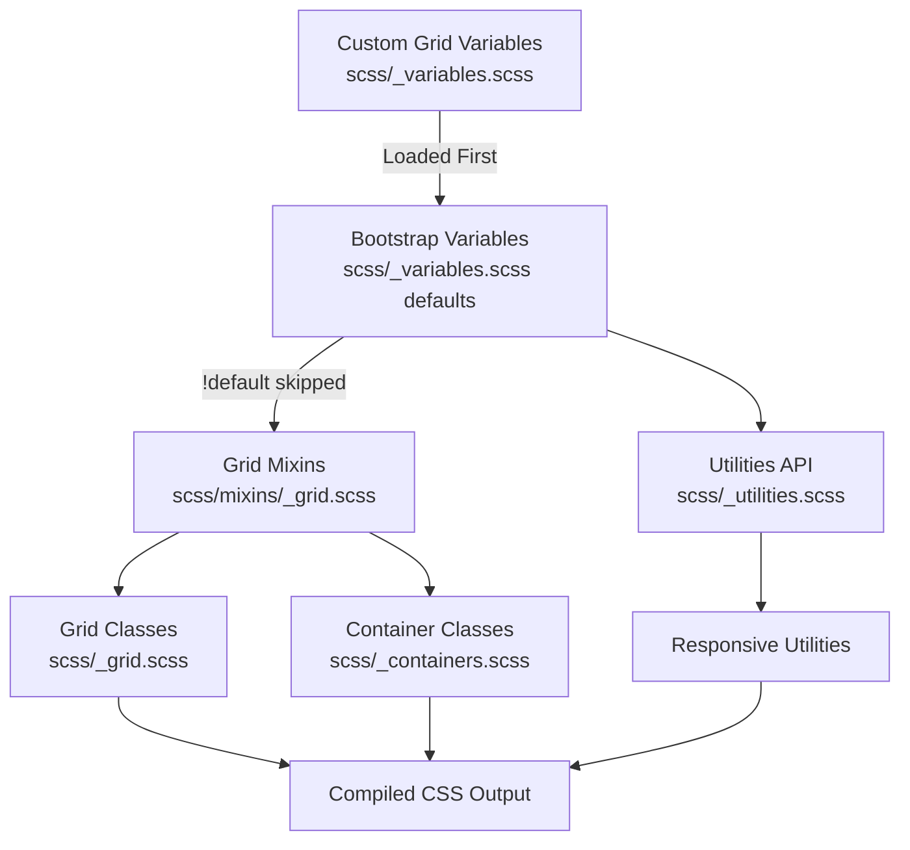

# update-theme-grid - Task 7

Execute task 7 for the update-theme-grid specification.

## Task Description
Run CSS linter to verify code quality

## Requirements Reference
**Requirements**: 5.1, 5.2

## Usage
```
/Task:7-update-theme-grid
```

## Instructions

Execute with @spec-task-executor agent the following task: "Run CSS linter to verify code quality"

```
Use the @spec-task-executor agent to implement task 7: "Run CSS linter to verify code quality" for the update-theme-grid specification and include all the below context.

# Steering Context
## Steering Documents Context (Pre-loaded)

### Product Context
# Product Overview

## Purpose
A custom Bootstrap 5 theme inspired by IBM's Carbon Design System, designed for a personal website that serves as both a portfolio and blog.

## Target Users
- Primary: The site owner (Dan) for showcasing work and publishing blog content
- Secondary: Visitors viewing the portfolio and reading blog posts

## Goals
1. Bring Carbon Design System's visual language to a Bootstrap-based personal site
2. Maintain Bootstrap's utility and component structure while adopting Carbon's aesthetics
3. Create a clean, professional, accessible design suitable for technical content

## Design Philosophy
- **Systematic**: Use consistent design tokens (colors, spacing, typography)
- **Accessible**: Follow WCAG guidelines, ensure readable contrast ratios
- **Minimal**: Clean, content-focused design without unnecessary decoration
- **Professional**: Suitable for a developer/technical portfolio

## Scope
- Light mode only (for now)
- All Bootstrap components, prioritized from basic to complex
- IBM Plex typography
- Carbon color palette adapted to Bootstrap's color system

## Success Metrics
- Visual consistency with Carbon Design System principles
- Maintained Bootstrap functionality and responsive behavior
- Clean, readable typography for blog content
- Professional appearance for portfolio presentation

---

### Technology Context
# Technology Stack

## Core Framework
- **Bootstrap 5.3.8**: Base CSS framework
- **Sass (dart-sass 1.78.0)**: CSS preprocessor for source files

## Build Tools
- **npm scripts**: Task runner for build processes
- **PostCSS + Autoprefixer**: CSS vendor prefixing
- **CleanCSS**: CSS minification
- **Rollup**: JavaScript bundling
- **Terser**: JavaScript minification

## Development Tools
- **Nodemon**: File watching for development
- **Stylelint**: CSS/SCSS linting (twbs-bootstrap config)
- **ESLint**: JavaScript linting

## Testing
- **Karma + Jasmine**: JavaScript unit testing
- **sass-true**: SCSS unit testing

## Documentation
- **Astro**: Static site generator for docs

## Key Scripts
- `npm run build-theme`: Build CSS and copy to parent theme directory
- `npm run watch-theme`: Watch SCSS and rebuild on changes
- `npm run css`: Full CSS build (compile, prefix, RTL, minify)
- `npm run dist`: Build both CSS and JS

## Output
- Compiled CSS goes to `dist/css/`
- Final minified CSS copied to `../../themes/bs-carbon/static/css/styles.min.css`

## Design System Reference
- **Carbon Design System**: https://carbondesignsystem.com/
- **Bootstrap Customization Guide**: https://getbootstrap.com/docs/5.3/customize/overview/
- Primary inspiration for colors, typography, and component styling

## Customization Philosophy

### CRITICAL: Variable-Only Customization
**DO NOT modify Bootstrap source files directly.** All customizations MUST be done through:

1. **Variable overrides**: Set variables BEFORE importing Bootstrap
2. **Sass maps**: Extend or modify Bootstrap's maps
3. **CSS custom properties**: Override at runtime where applicable
4. **Utility API**: Extend utilities through the utilities map

This approach ensures:
- Clean merges when Bootstrap releases updates
- Maintainable, traceable customizations
- Full access to Bootstrap's built-in utilities and variables

### Bootstrap Resources to Use
- **All Sass variables**: https://getbootstrap.com/docs/5.3/customize/sass/
- **CSS variables**: https://getbootstrap.com/docs/5.3/customize/css-variables/
- **Color system**: https://getbootstrap.com/docs/5.3/customize/color/
- **Component variables**: Check each component's documentation for available variables
- **Utility classes**: Use Bootstrap's utility classes extensively in markup

## Carbon Design Tokens (Reference)

### Colors (Light Mode)
- **Text primary**: `#161616`
- **Text secondary**: `#525252`
- **UI background**: `#ffffff`
- **UI-01 (container bg)**: `#f4f4f4`
- **UI-02 (subtle bg)**: `#e0e0e0`
- **Border subtle**: `#e0e0e0`
- **Interactive/Primary**: `#0f62fe` (Blue 60)
- **Success**: `#24a148` (Green 50)
- **Error**: `#da1e28` (Red 60)
- **Warning**: `#f1c21b` (Yellow 30)

### Typography
- **Sans-serif**: IBM Plex Sans
- **Monospace**: IBM Plex Mono
- **Base size**: 16px (1rem)
- **Line height**: 1.5 for body text

### Spacing Scale
Carbon uses a 2px base with a scale: 2, 4, 8, 12, 16, 24, 32, 40, 48px
(Bootstrap uses 4px base: 4, 8, 16, 24, 48px - use Bootstrap's $spacer variable)

---

### Structure Context
# Project Structure

## Directory Layout
```
modules/theme/
├── scss/                    # SCSS source files
│   ├── _variables.scss      # Bootstrap variable overrides (PRIMARY customization point)
│   ├── _variables-dark.scss # Dark mode variables (not in scope currently)
│   ├── _functions.scss      # Sass functions
│   ├── _mixins.scss         # Mixin imports
│   ├── _maps.scss           # Sass maps (can extend here)
│   ├── _utilities.scss      # Utility configuration (can extend here)
│   ├── _root.scss           # CSS custom properties
│   ├── _reboot.scss         # Base element styles
│   ├── _type.scss           # Typography
│   ├── _[component].scss    # Individual component styles
│   ├── forms/               # Form-related partials
│   ├── helpers/             # Helper classes
│   ├── mixins/              # Individual mixins
│   ├── utilities/           # Utility API
│   ├── vendor/              # Third-party (RFS)
│   └── bootstrap.scss       # Main entry point
├── js/src/                  # JavaScript source
├── dist/                    # Compiled output
├── site/                    # Documentation site
└── build/                   # Build scripts
```

## Customization Strategy

### CRITICAL RULE: No Direct Bootstrap File Modifications

**All customizations MUST be done through variable overrides, NOT by editing Bootstrap's source files.**

This ensures:
- Seamless merging of Bootstrap upstream updates
- Clear separation between Bootstrap core and our customizations
- Predictable behavior when Bootstrap releases new versions

### How to Customize (Bootstrap's Recommended Approach)

#### Method 1: Variable Overrides (Primary Method)
Set variables BEFORE they're used by Bootstrap. Variables use `!default`, so setting them first takes precedence.

```scss
// In a custom variables file loaded BEFORE Bootstrap's _variables.scss
$primary: #0f62fe;  // Carbon Blue 60
$body-color: #161616;  // Carbon text primary

// Then Bootstrap's _variables.scss will NOT override these
```

#### Method 2: Map Manipulation (For Complex Changes)
Use Sass map functions to extend or modify Bootstrap's maps AFTER importing variables but BEFORE importing components.

```scss
// After @import "variables";
// Before component imports

$theme-colors: map-merge(
  $theme-colors,
  (
    "custom-color": #custom-value
  )
);
```

#### Method 3: Utility API Extension
Extend utilities through the `$utilities` map:

```scss
$utilities: map-merge(
  $utilities,
  (
    "custom-utility": (
      property: custom-property,
      values: (...)
    )
  )
);
```

### What NOT to Do
- DO NOT edit `_buttons.scss`, `_forms.scss`, or other component files directly
- DO NOT remove `!default` flags from variables
- DO NOT copy-paste and modify Bootstrap component code
- DO NOT add custom CSS that duplicates Bootstrap functionality

### Where to Make Changes
1. **`scss/_variables.scss`**: Override color, typography, spacing, and component variables
2. **`scss/_maps.scss`**: Extend Sass maps if needed
3. **`scss/_utilities.scss`**: Extend utility classes if needed
4. **Custom partial file**: For truly custom styles that don't exist in Bootstrap (create sparingly)

### Variable Naming Convention
Bootstrap uses: `$component-state-property-size`
Examples:
- `$primary`, `$secondary`, `$success`, `$danger`, etc. (theme colors)
- `$body-bg`, `$body-color` (body defaults)
- `$font-family-sans-serif`, `$font-family-monospace` (typography)
- `$btn-padding-y`, `$btn-padding-x`, `$btn-font-size` (button sizing)
- `$border-radius`, `$border-color` (borders)
- `$spacer` (spacing base unit)

### Component Priority Order
Customize in this order (basic to complex):

**Phase 1 - Foundation (Variables Only)**
1. Colors (`$primary`, `$secondary`, `$body-color`, `$body-bg`, theme colors map)
2. Typography (`$font-family-sans-serif`, `$font-family-monospace`, `$font-size-base`, `$line-height-base`)
3. Spacing (`$spacer`, `$spacers` map)
4. Borders & Shadows (`$border-radius`, `$border-color`, `$box-shadow`)

**Phase 2 - Basic Components (Variables Only)**
5. Buttons (`$btn-*` variables)
6. Forms (`$input-*`, `$form-*` variables)
7. Tables (`$table-*` variables)
8. Alerts (`$alert-*` variables)
9. Badges (`$badge-*` variables)

**Phase 3 - Navigation (Variables Only)**
10. Nav (`$nav-*` variables)
11. Navbar (`$navbar-*` variables)
12. Breadcrumb (`$breadcrumb-*` variables)
13. Pagination (`$pagination-*` variables)

**Phase 4 - Content Components (Variables Only)**
14. Cards (`$card-*` variables)
15. List groups (`$list-group-*` variables)
16. Accordion (`$accordion-*` variables)

**Phase 5 - Overlays & Advanced (Variables Only)**
17. Modal (`$modal-*` variables)
18. Dropdown (`$dropdown-*` variables)
19. Tooltip (`$tooltip-*` variables)
20. Popover (`$popover-*` variables)
21. Toast (`$toast-*` variables)

## Using Bootstrap's Utilities

**Maximize use of Bootstrap's built-in utilities** in both SCSS and HTML:

### In SCSS (via mixins and functions)
```scss
// Use Bootstrap's color functions
color: shade-color($primary, 20%);
background: tint-color($primary, 80%);

// Use Bootstrap's mixins
@include media-breakpoint-up(md) { ... }
@include button-variant($primary, $primary);
```

### In HTML (via utility classes)
Prefer utility classes over custom CSS:
```html
<div class="d-flex justify-content-between align-items-center p-3 bg-light rounded">
```

## Coding Standards

### SCSS
- NEVER modify Bootstrap source files directly
- Override variables BEFORE Bootstrap imports them
- Use Bootstrap's variables, mixins, and functions extensively
- Keep Carbon reference comments for traceability (e.g., `// Carbon: Blue 60`)
- Use Stylelint with `stylelint-config-twbs-bootstrap`

### Naming Conventions (Follow Bootstrap's Patterns)
When adding new classes or elements, follow Bootstrap's naming conventions:

**CSS Classes:**
- Use lowercase with hyphens: `.btn-carbon`, `.card-header-alt`
- Component-based naming: `.{component}`, `.{component}-{element}`, `.{component}-{modifier}`
- State classes: `.is-{state}`, `.has-{feature}` or `.{component}-{state}`
- Size variants: `.{component}-sm`, `.{component}-lg`
- Color variants: `.{component}-primary`, `.{component}-secondary`

**Examples:**
```scss
// Good - follows Bootstrap conventions
.btn-outline-primary { }
.card-header { }
.nav-link-active { }
.form-control-lg { }

// Bad - doesn't follow conventions
.btnOutlinePrimary { }  // No camelCase
.Card_Header { }        // No underscores or capitals
.navigation-link { }    // Use Bootstrap's component names
```

**Sass Variables:**
- Follow `$component-state-property-size` pattern
- Examples: `$btn-primary-bg`, `$card-border-radius`, `$input-focus-border-color`

**Sass Mixins:**
- Use verb-noun or descriptive naming: `@mixin make-container()`, `@mixin button-variant()`

### Testing Changes
```bash
npm run watch-theme    # Watch and rebuild
npm run css-test       # Run SCSS tests
npm run css-lint       # Lint SCSS files
```

### Building for Production
```bash
npm run build-theme    # Build and copy to theme directory
```

### Merging Bootstrap Updates
When Bootstrap releases updates:
1. Merge/rebase from upstream Bootstrap
2. Resolve any variable conflicts (our overrides should remain)
3. Test the build: `npm run build-theme`
4. Verify visual appearance hasn't regressed

**Note**: Steering documents have been pre-loaded. Do not use get-content to fetch them again.

# Specification Context
## Specification Context (Pre-loaded): update-theme-grid

### Requirements
# Requirements Document: Update Theme Grid

## Introduction

This specification defines the requirements for updating the Bootstrap theme's grid system to align with IBM's Carbon Design System 2x grid. The goal is to replace Bootstrap's default breakpoints and container widths with Carbon's breakpoint values while maintaining Bootstrap's 12-column grid system and utility-first customization approach through variable overrides only.

## Alignment with Product Vision

This feature directly supports the product goals outlined in product.md:

1. **"Bring Carbon Design System's visual language to a Bootstrap-based personal site"** - The grid system is foundational to Carbon's layout structure
2. **"Phase 1 - Foundation"** - Grid/layout is part of the foundational styling elements
3. **"Maintain Bootstrap's utility and component structure"** - We adapt Carbon breakpoints to Bootstrap's grid system

## Background: Carbon vs Bootstrap Grid

### Carbon 2x Grid Breakpoints
Carbon uses a 2x grid system with these breakpoints:

| Name | Min-Width | Columns |
|------|-----------|---------|
| sm | 320px | 4 |
| md | 672px | 8 |
| lg | 1056px | 16 |
| xlg | 1312px | 16 |
| max | 1584px | 16 |

### Carbon Grid Modes
Carbon provides three grid gutter modes:

| Mode | Gutter Width | Use Case |
|------|--------------|----------|
| Wide (default) | 32px (2rem) | Standard layouts, most components |
| Narrow | 16px (1rem) | Tighter layouts |
| Condensed | 1px | Compact UI, data-dense layouts |

### Carbon Container Margins
Carbon uses responsive container padding:

| Breakpoint | Container Padding |
|------------|-------------------|
| < 672px | 16px (1rem) |
| 672px - 1583px | 32px (2rem) |
| 1584px+ | 40px (2.5rem) |

**Max-width**: 1584px (99rem)

### Bootstrap Default Breakpoints
Bootstrap uses these breakpoints:

| Name | Min-Width |
|------|-----------|
| xs | 0 |
| sm | 576px |
| md | 768px |
| lg | 992px |
| xl | 1200px |
| xxl | 1400px |

### Key Differences
- Carbon has 5 named breakpoints (sm, md, lg, xlg, max) vs Bootstrap's 6 (xs, sm, md, lg, xl, xxl)
- Carbon breakpoints are at different pixel values
- Carbon uses 16 columns (at lg+) vs Bootstrap's default 12
- Carbon's default gutter is 32px vs Bootstrap's 24px (1.5rem)
- Carbon's max container width is 1584px vs Bootstrap's 1320px (at xxl)
- Carbon has three grid modes (wide/narrow/condensed) vs Bootstrap's single mode

### Design Decision: Breakpoint Strategy

**Problem**: Carbon and Bootstrap have different breakpoint naming and values. How do we map them?

**Decision**: Adopt Carbon's 5 breakpoints with Bootstrap's naming convention for familiarity.

**Mapping**:
| Bootstrap Name | Carbon Equivalent | Value |
|----------------|-------------------|-------|
| xs | (base) | 0 |
| sm | sm | 320px |
| md | md | 672px |
| lg | lg | 1056px |
| xl | xlg | 1312px |
| xxl | max | 1584px |

**Rationale**:
- Maintains Bootstrap's 6-tier breakpoint system (xs through xxl)
- Maps Carbon values to familiar Bootstrap names
- Allows existing Bootstrap utility classes (.col-md-*, .d-lg-*, etc.) to work at Carbon breakpoints
- Container max-widths can be adjusted to complement Carbon breakpoints

## Requirements

### Requirement 1: Grid Breakpoints

**User Story:** As a developer, I want grid breakpoints to match Carbon's responsive design points, so that layouts respond at the same viewport widths as Carbon applications.

#### Acceptance Criteria

1. WHEN the viewport is below 320px THEN the system SHALL apply xs (extra-small) styles
2. WHEN the viewport is 320px or wider THEN the system SHALL apply sm (small) styles
3. WHEN the viewport is 672px or wider THEN the system SHALL apply md (medium) styles
4. WHEN the viewport is 1056px or wider THEN the system SHALL apply lg (large) styles
5. WHEN the viewport is 1312px or wider THEN the system SHALL apply xl (extra-large) styles
6. WHEN the viewport is 1584px or wider THEN the system SHALL apply xxl (extra-extra-large) styles

### Requirement 2: Container Max-Widths

**User Story:** As a developer, I want container max-widths that complement Carbon breakpoints, so that content areas have appropriate widths at each responsive tier.

#### Acceptance Criteria

1. WHEN using a container at sm breakpoint THEN the system SHALL limit max-width appropriately (approximately 304px)
2. WHEN using a container at md breakpoint THEN the system SHALL limit max-width appropriately (approximately 640px)
3. WHEN using a container at lg breakpoint THEN the system SHALL limit max-width appropriately (approximately 1024px)
4. WHEN using a container at xl breakpoint THEN the system SHALL limit max-width appropriately (approximately 1280px)
5. WHEN using a container at xxl breakpoint THEN the system SHALL limit max-width to 1584px (Carbon max)

### Requirement 3: Grid Columns

**User Story:** As a developer, I want a 16-column grid system matching Carbon's recommendation, so that I have more granular control over layouts.

#### Acceptance Criteria

1. WHEN using grid columns THEN the system SHALL provide 16 columns at all breakpoints
2. WHEN using column utilities (.col-*, .col-md-*, etc.) THEN they SHALL support values 1-16
3. WHEN using offset utilities (.offset-*, .offset-md-*, etc.) THEN they SHALL support values 0-15
4. WHEN using row-columns utilities (.row-cols-*) THEN they SHALL function correctly with the 16-column system

### Requirement 4: Grid Gutter Width

**User Story:** As a developer, I want gutter widths that align with Carbon's spacing system, so that grid spacing is consistent with other Carbon-inspired spacing.

#### Acceptance Criteria

1. WHEN grid gutters are applied THEN the system SHALL use 2rem (32px) as the default gutter width
2. WHEN container padding is applied THEN it SHALL match the grid gutter width (2rem)

### Requirement 5: Variable-Only Implementation

**User Story:** As a developer, I want grid changes to be implemented through Bootstrap variable overrides only, so that I can easily merge future Bootstrap updates.

#### Acceptance Criteria

1. WHEN grid values are customized THEN the system SHALL NOT modify Bootstrap source files directly
2. WHEN grid variables are set THEN they SHALL be defined before Bootstrap imports them
3. WHEN custom values are used THEN they SHALL include comments referencing Carbon specifications
4. IF a Bootstrap variable exists for a grid property THEN it SHALL be used instead of custom CSS

### Requirement 6: Responsive Utility Compatibility

**User Story:** As a developer, I want all Bootstrap responsive utilities to work with the new breakpoints, so that I can use familiar utility classes for responsive design.

#### Acceptance Criteria

1. WHEN using display utilities (.d-none, .d-md-block, etc.) THEN they SHALL respond at Carbon breakpoints
2. WHEN using flex utilities (.flex-column, .flex-lg-row, etc.) THEN they SHALL respond at Carbon breakpoints
3. WHEN using spacing utilities (.mt-md-3, .px-lg-4, etc.) THEN they SHALL respond at Carbon breakpoints
4. WHEN using text utilities (.text-center, .text-md-start, etc.) THEN they SHALL respond at Carbon breakpoints

## Non-Functional Requirements

### Maintainability
- All grid overrides must be clearly documented with Carbon reference comments
- Changes must be isolated to `scss/_variables.scss`
- Implementation must follow Bootstrap's variable naming conventions

### Compatibility
- Grid must work correctly with all Bootstrap components
- Responsive utilities must function at all new breakpoints
- Changes must not break existing layouts that use Bootstrap grid classes

### Performance
- Grid changes should not significantly increase CSS output size
- Media queries should be efficiently generated

## Out of Scope

The following are explicitly out of scope for this specification:

1. **Variable column count per breakpoint** - Carbon uses 4/8/16 columns at different breakpoints, but implementing variable columns would require significant customization beyond variable overrides. We use a consistent 16-column system throughout.
2. **Carbon's narrow/condensed grid modes** - Carbon provides three gutter modes (wide: 32px, narrow: 16px, condensed: 1px). We implement wide mode (32px) as the default. Narrow and condensed modes would require custom utility classes beyond variable overrides.
3. **Responsive container padding** - Carbon varies container padding by breakpoint (16px/32px/40px). Bootstrap uses a single `$container-padding-x` value. Implementing responsive padding would require custom CSS.
4. **Carbon's CSS Grid implementation** - Bootstrap uses flexbox grid; we maintain this approach
5. **Subgrid features** - Not part of Bootstrap's current grid system

---

### Design
# Design Document: Update Theme Grid

## Overview

This design document describes how to update the Bootstrap theme's grid system to align with IBM's Carbon Design System 2x grid. The implementation follows Bootstrap's recommended customization approach by overriding Sass variables in `scss/_variables.scss` before Bootstrap processes them. No Bootstrap source files will be modified directly.

## Steering Document Alignment

### Technical Standards (tech.md)

This design strictly follows the **Variable-Only Customization** approach documented in tech.md:

1. **Variable overrides**: All grid changes are made by setting Sass variables before Bootstrap imports
2. **No source file modifications**: Bootstrap's grid-related files remain untouched
3. **Carbon reference comments**: Each variable override includes a comment referencing the Carbon specification

### Project Structure (structure.md)

Following structure.md conventions:

1. **Primary customization point**: `scss/_variables.scss` - all grid variable overrides go here
2. **Variable naming**: Uses Bootstrap's existing variable names
3. **No component file edits**: Per "What NOT to Do" section, we won't modify Bootstrap source files

## Prerequisites

None. Grid customization is a pure variable override that doesn't require any external dependencies.

## Code Reuse Analysis

### Existing Components to Leverage

- **`scss/_variables.scss`**: The existing variables file where all grid overrides will be added
  - Lines 595-602: `$grid-breakpoints` map
  - Lines 614-620: `$container-max-widths` map
  - Lines 630-632: `$grid-columns`, `$grid-gutter-width`, `$grid-row-columns`
  - Line 636: `$container-padding-x`
- **Bootstrap's `!default` pattern**: All Bootstrap variables use `!default`, so our overrides take precedence
- **Existing Carbon overrides**: Typography (lines 6-76) and Spacing (lines 78-115) sections already exist

### Integration Points

- **Grid system**: `scss/_grid.scss` uses these variables to generate the grid
- **Utilities API**: `scss/_utilities.scss` generates responsive utilities based on breakpoints
- **Container component**: Uses `$container-max-widths` and `$container-padding-x`
- **All responsive utilities**: Generated from `$grid-breakpoints` map

## Architecture

The grid customization flows through Bootstrap's existing architecture:



## Design Decisions

### Decision 1: Breakpoint Values

**Implementation**: Override `$grid-breakpoints` map with Carbon values mapped to Bootstrap names.

```scss
$grid-breakpoints: (
  xs: 0,
  sm: 320px,    // Carbon: sm
  md: 672px,    // Carbon: md
  lg: 1056px,   // Carbon: lg
  xl: 1312px,   // Carbon: xlg
  xxl: 1584px   // Carbon: max
);
```

**Rationale**:
- Maintains Bootstrap's 6-tier naming convention (xs through xxl)
- All responsive utilities automatically work at Carbon breakpoints
- No custom CSS or additional utilities needed

### Decision 2: Container Max-Widths

**Problem**: Bootstrap calculates container widths differently than Carbon. We need appropriate max-widths that work with Carbon breakpoints.

**Decision**: Calculate container max-widths as breakpoint minus gutter (32px), rounded to clean values.

```scss
$container-max-widths: (
  sm: 288px,    // 320px - 32px gutter
  md: 640px,    // 672px - 32px gutter
  lg: 1024px,   // 1056px - 32px gutter
  xl: 1280px,   // 1312px - 32px gutter
  xxl: 1584px   // Carbon max-width (no subtraction at max)
);
```

**Rationale**:
- Container width + gutter = breakpoint width (approximately)
- xxl uses full 1584px as Carbon specifies this as the max-width
- Clean, memorable values for developer experience

### Decision 3: Grid Columns

**Decision**: Set `$grid-columns: 16` globally.

**Rationale**:
- Matches Carbon's 16-column recommendation for modern layouts
- Provides more granular layout control (6.25% increments)
- Single variable change, fully supported by Bootstrap
- All column utilities (.col-1 through .col-16) auto-generated

### Decision 4: Grid Gutter Width

**Decision**: Set `$grid-gutter-width: 2rem` (32px) to match Carbon's wide mode.

**Rationale**:
- Carbon's wide mode (32px) is the default and most commonly used
- Aligns with Carbon's spacing scale (spacing-07 = 32px)
- Bootstrap's default is 1.5rem (24px), so this is a modest increase

### Decision 5: Container Padding

**Decision**: Set `$container-padding-x: $grid-gutter-width` (2rem/32px).

**Rationale**:
- Matches the grid gutter for visual consistency
- Carbon uses 32px padding at medium breakpoints (our most common use case)
- Bootstrap's default ties container padding to gutter width, maintaining this relationship

### Decision 6: Row Columns

**Decision**: Set `$grid-row-columns: 8` (increased from default 6).

**Rationale**:
- With 16 columns, allowing up to 8 items per row (.row-cols-8) is reasonable
- Maintains proportional relationship (half of total columns)
- Generates .row-cols-1 through .row-cols-8 utilities

## Components and Interfaces

### Component 1: Grid Breakpoints Override

- **Purpose**: Define responsive breakpoint values matching Carbon
- **Variable**: `$grid-breakpoints` Sass map
- **Dependencies**: None (base-level variable)
- **Impact**: All responsive utilities, media queries, and grid classes

### Component 2: Container Max-Widths Override

- **Purpose**: Define container widths for each breakpoint
- **Variable**: `$container-max-widths` Sass map
- **Dependencies**: `$grid-breakpoints` (breakpoint names must match)
- **Impact**: `.container` and `.container-{breakpoint}` classes

### Component 3: Grid Configuration Override

- **Purpose**: Configure column count, gutter width, and row columns
- **Variables**: `$grid-columns`, `$grid-gutter-width`, `$grid-row-columns`
- **Dependencies**: None
- **Impact**: All `.col-*`, `.row-cols-*`, `.g-*` (gutter) classes

### Component 4: Container Padding Override

- **Purpose**: Set container horizontal padding
- **Variable**: `$container-padding-x`
- **Dependencies**: `$grid-gutter-width` (should match)
- **Impact**: `.container` and `.container-fluid` padding

## Data Models

### Complete Variable Override

```scss
// ============================================================================
// Carbon Design System Grid Overrides
// ============================================================================
// These variables override Bootstrap's defaults to match IBM's Carbon Design System.
// They MUST appear BEFORE Bootstrap's default definitions to take effect.
// Reference: https://carbondesignsystem.com/elements/2x-grid/overview/
// ============================================================================

// stylelint-disable scss/dollar-variable-default

// -----------------------------------------------------------------------------
// Grid Breakpoints (Carbon 2x Grid)
// -----------------------------------------------------------------------------
$grid-breakpoints: (
  xs: 0,
  sm: 320px,    // Carbon: sm
  md: 672px,    // Carbon: md
  lg: 1056px,   // Carbon: lg
  xl: 1312px,   // Carbon: xlg
  xxl: 1584px   // Carbon: max
);

// -----------------------------------------------------------------------------
// Container Max-Widths
// -----------------------------------------------------------------------------
$container-max-widths: (
  sm: 288px,    // Carbon: sm - gutter
  md: 640px,    // Carbon: md - gutter
  lg: 1024px,   // Carbon: lg - gutter
  xl: 1280px,   // Carbon: xlg - gutter
  xxl: 1584px   // Carbon: max-width
);

// -----------------------------------------------------------------------------
// Grid Configuration
// -----------------------------------------------------------------------------
$grid-columns: 16;              // Carbon: 16-column grid
$grid-gutter-width: 2rem;       // Carbon: wide mode (32px)
$grid-row-columns: 8;           // Half of grid columns

// -----------------------------------------------------------------------------
// Container Padding
// -----------------------------------------------------------------------------
$container-padding-x: $grid-gutter-width; // Carbon: matches gutter

// stylelint-enable scss/dollar-variable-default
// ============================================================================
// End Carbon Grid Overrides
// ============================================================================
```

### Generated CSS Classes

The following classes will be generated with the new values:

**Column classes** (at each breakpoint):
- `.col-1` through `.col-16`
- `.col-sm-1` through `.col-sm-16`
- `.col-md-1` through `.col-md-16`
- `.col-lg-1` through `.col-lg-16`
- `.col-xl-1` through `.col-xl-16`
- `.col-xxl-1` through `.col-xxl-16`

**Offset classes** (at each breakpoint):
- `.offset-0` through `.offset-15`
- `.offset-sm-0` through `.offset-sm-15`
- (etc. for md, lg, xl, xxl)

**Row columns classes**:
- `.row-cols-1` through `.row-cols-8`
- `.row-cols-sm-1` through `.row-cols-sm-8`
- (etc. for md, lg, xl, xxl)

**Responsive utilities** (examples):
- `.d-none`, `.d-sm-block`, `.d-md-flex` (at Carbon breakpoints)
- `.flex-sm-row`, `.flex-lg-column` (at Carbon breakpoints)
- `.text-md-center`, `.text-xl-start` (at Carbon breakpoints)

### Breakpoint Comparison Table

| Bootstrap Name | Original Value | New Value (Carbon) | Change |
|----------------|----------------|-------------------|--------|
| xs | 0 | 0 | - |
| sm | 576px | 320px | -256px |
| md | 768px | 672px | -96px |
| lg | 992px | 1056px | +64px |
| xl | 1200px | 1312px | +112px |
| xxl | 1400px | 1584px | +184px |

## Error Handling

### Error Scenarios

1. **Breakpoint map syntax error**
   - **Handling**: Build will fail with Sass compilation error
   - **Prevention**: Follow exact Sass map syntax

2. **Breakpoints not ascending**
   - **Handling**: Bootstrap's `_assert-ascending` mixin will throw an error
   - **Prevention**: Ensure breakpoints are in ascending order

3. **Container max-width exceeds breakpoint**
   - **Handling**: Container may overflow at certain viewports
   - **Prevention**: Calculate max-widths appropriately

4. **Variable override not taking effect**
   - **Handling**: Grid uses Bootstrap defaults
   - **Prevention**: Ensure overrides appear BEFORE Bootstrap imports

## Testing Strategy

### Unit Testing

- **SCSS Compilation**: Verify build completes without errors using `npm run css`
- **Sass lint**: Run `npm run css-lint` to verify no style issues
- **Breakpoint assertions**: Bootstrap's built-in assertions verify ascending order

### Integration Testing

- **Column classes**: Verify `.col-1` through `.col-16` exist in output
- **Responsive utilities**: Test `.d-md-block` triggers at 672px (not 768px)
- **Container widths**: Verify `.container` max-widths at each breakpoint
- **Gutter width**: Verify `.g-*` classes use new gutter value

### End-to-End Testing

- **Visual inspection**: Review grid layouts in browser at each breakpoint
- **DevTools verification**: Check computed styles match expected values
- **Cross-browser**: Test in Chrome, Firefox, Safari, Edge

### Verification Checklist

After implementation, verify:
- [ ] `npm run css` builds without errors
- [ ] `npm run css-lint` passes
- [ ] CSS contains `.col-16` class (16 columns enabled)
- [ ] CSS contains `.col-md-*` classes triggering at 672px
- [ ] CSS contains `.container` with max-width 1584px at xxl
- [ ] Grid gutter is 32px (2rem)
- [ ] All responsive utilities respond at Carbon breakpoints

**Note**: Specification documents have been pre-loaded. Do not use get-content to fetch them again.

## Task Details
- Task ID: 7
- Description: Run CSS linter to verify code quality
- Requirements: 5.1, 5.2

## Instructions
- Implement ONLY task 7: "Run CSS linter to verify code quality"
- Follow all project conventions and leverage existing code
- Mark the task as complete using: claude-code-spec-workflow get-tasks update-theme-grid 7 --mode complete
- Provide a completion summary
```

## Task Completion
When the task is complete, mark it as done:
```bash
claude-code-spec-workflow get-tasks update-theme-grid 7 --mode complete
```

## Next Steps
After task completion, you can:
- Execute the next task using /update-theme-grid-task-[next-id]
- Check overall progress with /spec-status update-theme-grid
