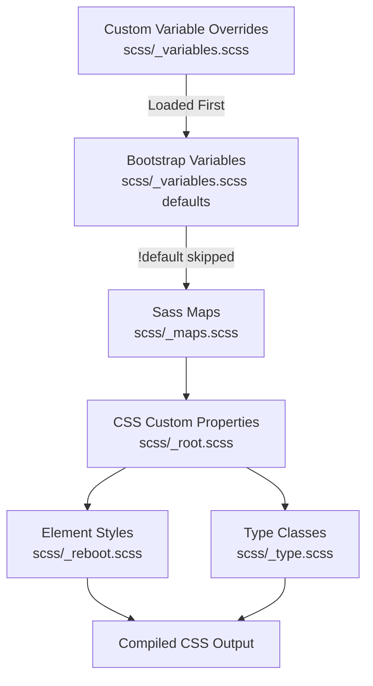
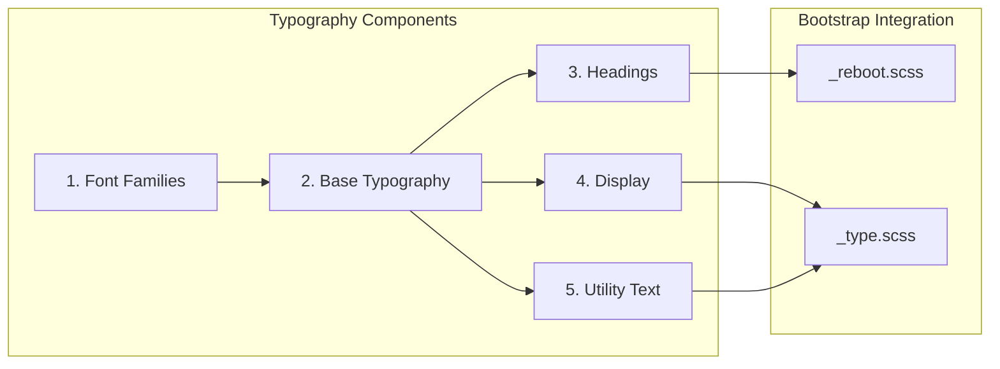

# update-theme-typography - Task 6

Execute task 6 for the update-theme-typography specification.

## Task Description
Add display font sizes map override

## Code Reuse
**Leverage existing code**: scss/

## Requirements Reference
**Requirements**: 4.1

## Usage
```
/Task:6-update-theme-typography
```

## Instructions

Execute with @spec-task-executor agent the following task: "Add display font sizes map override"

```
Use the @spec-task-executor agent to implement task 6: "Add display font sizes map override" for the update-theme-typography specification and include all the below context.

# Steering Context
## Steering Documents Context (Pre-loaded)

### Product Context
# Product Overview

## Purpose
A custom Bootstrap 5 theme inspired by IBM's Carbon Design System, designed for a personal website that serves as both a portfolio and blog.

## Target Users
- Primary: The site owner (Dan) for showcasing work and publishing blog content
- Secondary: Visitors viewing the portfolio and reading blog posts

## Goals
1. Bring Carbon Design System's visual language to a Bootstrap-based personal site
2. Maintain Bootstrap's utility and component structure while adopting Carbon's aesthetics
3. Create a clean, professional, accessible design suitable for technical content

## Design Philosophy
- **Systematic**: Use consistent design tokens (colors, spacing, typography)
- **Accessible**: Follow WCAG guidelines, ensure readable contrast ratios
- **Minimal**: Clean, content-focused design without unnecessary decoration
- **Professional**: Suitable for a developer/technical portfolio

## Scope
- Light mode only (for now)
- All Bootstrap components, prioritized from basic to complex
- IBM Plex typography
- Carbon color palette adapted to Bootstrap's color system

## Success Metrics
- Visual consistency with Carbon Design System principles
- Maintained Bootstrap functionality and responsive behavior
- Clean, readable typography for blog content
- Professional appearance for portfolio presentation

---

### Technology Context
# Technology Stack

## Core Framework
- **Bootstrap 5.3.8**: Base CSS framework
- **Sass (dart-sass 1.78.0)**: CSS preprocessor for source files

## Build Tools
- **npm scripts**: Task runner for build processes
- **PostCSS + Autoprefixer**: CSS vendor prefixing
- **CleanCSS**: CSS minification
- **Rollup**: JavaScript bundling
- **Terser**: JavaScript minification

## Development Tools
- **Nodemon**: File watching for development
- **Stylelint**: CSS/SCSS linting (twbs-bootstrap config)
- **ESLint**: JavaScript linting

## Testing
- **Karma + Jasmine**: JavaScript unit testing
- **sass-true**: SCSS unit testing

## Documentation
- **Astro**: Static site generator for docs

## Key Scripts
- `npm run build-theme`: Build CSS and copy to parent theme directory
- `npm run watch-theme`: Watch SCSS and rebuild on changes
- `npm run css`: Full CSS build (compile, prefix, RTL, minify)
- `npm run dist`: Build both CSS and JS

## Output
- Compiled CSS goes to `dist/css/`
- Final minified CSS copied to `../../themes/bs-carbon/static/css/styles.min.css`

## Design System Reference
- **Carbon Design System**: https://carbondesignsystem.com/
- **Bootstrap Customization Guide**: https://getbootstrap.com/docs/5.3/customize/overview/
- Primary inspiration for colors, typography, and component styling

## Customization Philosophy

### CRITICAL: Variable-Only Customization
**DO NOT modify Bootstrap source files directly.** All customizations MUST be done through:

1. **Variable overrides**: Set variables BEFORE importing Bootstrap
2. **Sass maps**: Extend or modify Bootstrap's maps
3. **CSS custom properties**: Override at runtime where applicable
4. **Utility API**: Extend utilities through the utilities map

This approach ensures:
- Clean merges when Bootstrap releases updates
- Maintainable, traceable customizations
- Full access to Bootstrap's built-in utilities and variables

### Bootstrap Resources to Use
- **All Sass variables**: https://getbootstrap.com/docs/5.3/customize/sass/
- **CSS variables**: https://getbootstrap.com/docs/5.3/customize/css-variables/
- **Color system**: https://getbootstrap.com/docs/5.3/customize/color/
- **Component variables**: Check each component's documentation for available variables
- **Utility classes**: Use Bootstrap's utility classes extensively in markup

## Carbon Design Tokens (Reference)

### Colors (Light Mode)
- **Text primary**: `#161616`
- **Text secondary**: `#525252`
- **UI background**: `#ffffff`
- **UI-01 (container bg)**: `#f4f4f4`
- **UI-02 (subtle bg)**: `#e0e0e0`
- **Border subtle**: `#e0e0e0`
- **Interactive/Primary**: `#0f62fe` (Blue 60)
- **Success**: `#24a148` (Green 50)
- **Error**: `#da1e28` (Red 60)
- **Warning**: `#f1c21b` (Yellow 30)

### Typography
- **Sans-serif**: IBM Plex Sans
- **Monospace**: IBM Plex Mono
- **Base size**: 16px (1rem)
- **Line height**: 1.5 for body text

### Spacing Scale
Carbon uses a 2px base with a scale: 2, 4, 8, 12, 16, 24, 32, 40, 48px
(Bootstrap uses 4px base: 4, 8, 16, 24, 48px - use Bootstrap's $spacer variable)

---

### Structure Context
# Project Structure

## Directory Layout
```
modules/theme/
├── scss/                    # SCSS source files
│   ├── _variables.scss      # Bootstrap variable overrides (PRIMARY customization point)
│   ├── _variables-dark.scss # Dark mode variables (not in scope currently)
│   ├── _functions.scss      # Sass functions
│   ├── _mixins.scss         # Mixin imports
│   ├── _maps.scss           # Sass maps (can extend here)
│   ├── _utilities.scss      # Utility configuration (can extend here)
│   ├── _root.scss           # CSS custom properties
│   ├── _reboot.scss         # Base element styles
│   ├── _type.scss           # Typography
│   ├── _[component].scss    # Individual component styles
│   ├── forms/               # Form-related partials
│   ├── helpers/             # Helper classes
│   ├── mixins/              # Individual mixins
│   ├── utilities/           # Utility API
│   ├── vendor/              # Third-party (RFS)
│   └── bootstrap.scss       # Main entry point
├── js/src/                  # JavaScript source
├── dist/                    # Compiled output
├── site/                    # Documentation site
└── build/                   # Build scripts
```

## Customization Strategy

### CRITICAL RULE: No Direct Bootstrap File Modifications

**All customizations MUST be done through variable overrides, NOT by editing Bootstrap's source files.**

This ensures:
- Seamless merging of Bootstrap upstream updates
- Clear separation between Bootstrap core and our customizations
- Predictable behavior when Bootstrap releases new versions

### How to Customize (Bootstrap's Recommended Approach)

#### Method 1: Variable Overrides (Primary Method)
Set variables BEFORE they're used by Bootstrap. Variables use `!default`, so setting them first takes precedence.

```scss
// In a custom variables file loaded BEFORE Bootstrap's _variables.scss
$primary: #0f62fe;  // Carbon Blue 60
$body-color: #161616;  // Carbon text primary

// Then Bootstrap's _variables.scss will NOT override these
```

#### Method 2: Map Manipulation (For Complex Changes)
Use Sass map functions to extend or modify Bootstrap's maps AFTER importing variables but BEFORE importing components.

```scss
// After @import "variables";
// Before component imports

$theme-colors: map-merge(
  $theme-colors,
  (
    "custom-color": #custom-value
  )
);
```

#### Method 3: Utility API Extension
Extend utilities through the `$utilities` map:

```scss
$utilities: map-merge(
  $utilities,
  (
    "custom-utility": (
      property: custom-property,
      values: (...)
    )
  )
);
```

### What NOT to Do
- DO NOT edit `_buttons.scss`, `_forms.scss`, or other component files directly
- DO NOT remove `!default` flags from variables
- DO NOT copy-paste and modify Bootstrap component code
- DO NOT add custom CSS that duplicates Bootstrap functionality

### Where to Make Changes
1. **`scss/_variables.scss`**: Override color, typography, spacing, and component variables
2. **`scss/_maps.scss`**: Extend Sass maps if needed
3. **`scss/_utilities.scss`**: Extend utility classes if needed
4. **Custom partial file**: For truly custom styles that don't exist in Bootstrap (create sparingly)

### Variable Naming Convention
Bootstrap uses: `$component-state-property-size`
Examples:
- `$primary`, `$secondary`, `$success`, `$danger`, etc. (theme colors)
- `$body-bg`, `$body-color` (body defaults)
- `$font-family-sans-serif`, `$font-family-monospace` (typography)
- `$btn-padding-y`, `$btn-padding-x`, `$btn-font-size` (button sizing)
- `$border-radius`, `$border-color` (borders)
- `$spacer` (spacing base unit)

### Component Priority Order
Customize in this order (basic to complex):

**Phase 1 - Foundation (Variables Only)**
1. Colors (`$primary`, `$secondary`, `$body-color`, `$body-bg`, theme colors map)
2. Typography (`$font-family-sans-serif`, `$font-family-monospace`, `$font-size-base`, `$line-height-base`)
3. Spacing (`$spacer`, `$spacers` map)
4. Borders & Shadows (`$border-radius`, `$border-color`, `$box-shadow`)

**Phase 2 - Basic Components (Variables Only)**
5. Buttons (`$btn-*` variables)
6. Forms (`$input-*`, `$form-*` variables)
7. Tables (`$table-*` variables)
8. Alerts (`$alert-*` variables)
9. Badges (`$badge-*` variables)

**Phase 3 - Navigation (Variables Only)**
10. Nav (`$nav-*` variables)
11. Navbar (`$navbar-*` variables)
12. Breadcrumb (`$breadcrumb-*` variables)
13. Pagination (`$pagination-*` variables)

**Phase 4 - Content Components (Variables Only)**
14. Cards (`$card-*` variables)
15. List groups (`$list-group-*` variables)
16. Accordion (`$accordion-*` variables)

**Phase 5 - Overlays & Advanced (Variables Only)**
17. Modal (`$modal-*` variables)
18. Dropdown (`$dropdown-*` variables)
19. Tooltip (`$tooltip-*` variables)
20. Popover (`$popover-*` variables)
21. Toast (`$toast-*` variables)

## Using Bootstrap's Utilities

**Maximize use of Bootstrap's built-in utilities** in both SCSS and HTML:

### In SCSS (via mixins and functions)
```scss
// Use Bootstrap's color functions
color: shade-color($primary, 20%);
background: tint-color($primary, 80%);

// Use Bootstrap's mixins
@include media-breakpoint-up(md) { ... }
@include button-variant($primary, $primary);
```

### In HTML (via utility classes)
Prefer utility classes over custom CSS:
```html
<div class="d-flex justify-content-between align-items-center p-3 bg-light rounded">
```

## Coding Standards

### SCSS
- NEVER modify Bootstrap source files directly
- Override variables BEFORE Bootstrap imports them
- Use Bootstrap's variables, mixins, and functions extensively
- Keep Carbon reference comments for traceability (e.g., `// Carbon: Blue 60`)
- Use Stylelint with `stylelint-config-twbs-bootstrap`

### Naming Conventions (Follow Bootstrap's Patterns)
When adding new classes or elements, follow Bootstrap's naming conventions:

**CSS Classes:**
- Use lowercase with hyphens: `.btn-carbon`, `.card-header-alt`
- Component-based naming: `.{component}`, `.{component}-{element}`, `.{component}-{modifier}`
- State classes: `.is-{state}`, `.has-{feature}` or `.{component}-{state}`
- Size variants: `.{component}-sm`, `.{component}-lg`
- Color variants: `.{component}-primary`, `.{component}-secondary`

**Examples:**
```scss
// Good - follows Bootstrap conventions
.btn-outline-primary { }
.card-header { }
.nav-link-active { }
.form-control-lg { }

// Bad - doesn't follow conventions
.btnOutlinePrimary { }  // No camelCase
.Card_Header { }        // No underscores or capitals
.navigation-link { }    // Use Bootstrap's component names
```

**Sass Variables:**
- Follow `$component-state-property-size` pattern
- Examples: `$btn-primary-bg`, `$card-border-radius`, `$input-focus-border-color`

**Sass Mixins:**
- Use verb-noun or descriptive naming: `@mixin make-container()`, `@mixin button-variant()`

### Testing Changes
```bash
npm run watch-theme    # Watch and rebuild
npm run css-test       # Run SCSS tests
npm run css-lint       # Lint SCSS files
```

### Building for Production
```bash
npm run build-theme    # Build and copy to theme directory
```

### Merging Bootstrap Updates
When Bootstrap releases updates:
1. Merge/rebase from upstream Bootstrap
2. Resolve any variable conflicts (our overrides should remain)
3. Test the build: `npm run build-theme`
4. Verify visual appearance hasn't regressed

**Note**: Steering documents have been pre-loaded. Do not use get-content to fetch them again.

# Specification Context
## Specification Context (Pre-loaded): update-theme-typography

### Requirements
# Requirements Document: Update Theme Typography

## Introduction

This specification defines the requirements for updating the Bootstrap theme's typography to match IBM's Carbon Design System. The goal is to replace Bootstrap's default typography (system fonts, sizing, weights) with Carbon's typography specifications (IBM Plex fonts, Carbon type scale) while maintaining Bootstrap's customization approach through variable overrides only.

## Alignment with Product Vision

This feature directly supports the product goals outlined in product.md:

1. **"Bring Carbon Design System's visual language to a Bootstrap-based personal site"** - Typography is a foundational element of Carbon's visual language
2. **"IBM Plex typography"** - Explicitly listed in the project scope
3. **"Clean, readable typography for blog content"** - Carbon's typography is designed for readability
4. **"Phase 1 - Foundation"** - Typography is item #2 in the component priority order

## Requirements

### Requirement 1: IBM Plex Font Families

**User Story:** As a site visitor, I want to see content rendered in IBM Plex fonts, so that the site has a consistent Carbon Design System appearance.

#### Acceptance Criteria

1. WHEN the page loads THEN the system SHALL render body text using IBM Plex Sans font family
2. WHEN code or monospace content is displayed THEN the system SHALL render it using IBM Plex Mono font family
3. IF IBM Plex fonts fail to load THEN the system SHALL fall back to appropriate system fonts (sans-serif, monospace)
4. WHEN fonts are loaded THEN the system SHALL use variable font versions (IBM Plex Sans VF, IBM Plex Mono) for optimal performance where supported

### Requirement 2: Base Typography Scale

**User Story:** As a site visitor, I want body text to be sized according to Carbon specifications, so that content is readable and visually consistent with Carbon Design System.

#### Acceptance Criteria

1. WHEN body text is rendered THEN the system SHALL use 1rem (16px) as the base font size
2. WHEN body text is rendered THEN the system SHALL use font-weight 400 (regular)
3. WHEN body text is rendered THEN the system SHALL use line-height 1.5
4. WHEN small text (.small, small) is rendered THEN the system SHALL use 0.875rem (14px)

### Requirement 3: Heading Typography

**User Story:** As a site visitor, I want headings to follow Carbon's type scale, so that the visual hierarchy is clear and consistent with Carbon Design System.

#### Acceptance Criteria

1. WHEN h1 is rendered THEN the system SHALL use font-size 2rem, font-weight 300-400, line-height 1.25
2. WHEN h2 is rendered THEN the system SHALL use font-size 1.75rem, font-weight 400, line-height 1.28572
3. WHEN h3 is rendered THEN the system SHALL use font-size 1.25rem, font-weight 400, line-height 1.4
4. WHEN h4 is rendered THEN the system SHALL use font-size 1rem, font-weight 600, line-height 1.375
5. WHEN h5 is rendered THEN the system SHALL use font-size 0.875rem, font-weight 600, line-height 1.28572
6. WHEN h6 is rendered THEN the system SHALL use font-size 0.875rem, font-weight 600, line-height 1.28572
7. WHEN any heading is rendered THEN the system SHALL use IBM Plex Sans font family

### Requirement 4: Display Typography

**User Story:** As a site visitor, I want display headings to use Carbon-inspired styling, so that hero sections and large text have appropriate visual impact.

#### Acceptance Criteria

1. WHEN display-1 is rendered THEN the system SHALL use a large font size (3.75rem or larger) with font-weight 300
2. WHEN display headings are rendered THEN the system SHALL use line-height appropriate for large text (1.2 or lower)
3. WHEN display headings are rendered THEN the system SHALL use IBM Plex Sans font family

### Requirement 5: Utility Text Styles

**User Story:** As a site visitor, I want utility text elements (labels, captions, helper text) to follow Carbon specifications, so that supporting content is appropriately sized.

#### Acceptance Criteria

1. WHEN lead text is rendered THEN the system SHALL use font-size 1.25rem with font-weight 300
2. WHEN blockquotes are rendered THEN the system SHALL use font-size 1.25rem
3. WHEN code is rendered inline THEN the system SHALL use IBM Plex Mono at 0.875em
4. WHEN code blocks are rendered THEN the system SHALL use IBM Plex Mono at appropriate size

### Requirement 6: Variable-Only Implementation

**User Story:** As a developer, I want typography changes to be implemented through Bootstrap variable overrides only, so that I can easily merge future Bootstrap updates.

#### Acceptance Criteria

1. WHEN typography is customized THEN the system SHALL NOT modify Bootstrap source files directly
2. WHEN typography variables are set THEN they SHALL be defined before Bootstrap imports them
3. WHEN custom values are used THEN they SHALL include comments referencing Carbon specifications (e.g., `// Carbon: productive-heading-02`)
4. IF a Bootstrap variable exists for a typography property THEN it SHALL be used instead of custom CSS

## Non-Functional Requirements

### Performance
- Font files should be loaded efficiently (prefer variable fonts, use font-display: swap)
- Total additional font weight should not exceed 200KB for initial load
- Consider using `font-display: swap` to prevent invisible text during font loading

### Accessibility
- All text must maintain WCAG 2.2 AA contrast requirements (4.5:1 for body text, 3:1 for large text)
- Font sizes must be specified in relative units (rem/em) to support user font scaling
- Line heights must provide adequate spacing for readability

### Maintainability
- All variable overrides must be clearly documented with Carbon token references
- Changes must be isolated to `scss/_variables.scss` or a dedicated custom variables file
- Implementation must follow Bootstrap's `$component-state-property-size` naming convention

### Compatibility
- Typography must render correctly in all modern browsers (Chrome, Firefox, Safari, Edge)
- Typography must be responsive and readable at all viewport sizes
- Changes must not break existing Bootstrap components that rely on typography variables

---

### Design
# Design Document: Update Theme Typography

## Overview

This design document describes how to update the Bootstrap theme's typography to match IBM's Carbon Design System. The implementation follows Bootstrap's recommended customization approach by overriding Sass variables in `scss/_variables.scss` before Bootstrap processes them. No Bootstrap source files will be modified directly.

## Steering Document Alignment

### Technical Standards (tech.md)

This design strictly follows the **Variable-Only Customization** approach documented in tech.md:

1. **Variable overrides**: All typography changes are made by setting Sass variables before Bootstrap imports
2. **No source file modifications**: `_reboot.scss`, `_type.scss`, and other Bootstrap files remain untouched
3. **Carbon reference comments**: Each variable override includes a comment referencing the Carbon specification

The design uses the Carbon Design Tokens documented in tech.md:
- **Sans-serif**: IBM Plex Sans
- **Monospace**: IBM Plex Mono
- **Base size**: 16px (1rem)
- **Line height**: 1.5 for body text

### Project Structure (structure.md)

Following structure.md conventions:

1. **Primary customization point**: `scss/_variables.scss` - all typography variable overrides go here
2. **Variable naming**: Uses Bootstrap's `$component-state-property-size` convention
3. **No component file edits**: Per "What NOT to Do" section, we won't modify `_type.scss` or `_reboot.scss`

## Prerequisites

### Font Loading (Out of Scope)

IBM Plex fonts must be loaded before the theme is used. This is handled separately from the SCSS customization:

**Recommended approach** - Add to HTML `<head>`:
```html
<link href="https://fonts.googleapis.com/css2?family=IBM+Plex+Mono:wght@400;600&family=IBM+Plex+Sans:wght@300;400;500;600;700&display=swap" rel="stylesheet">
```

**Alternative** - Self-host font files or use variable fonts for optimal performance.

Font loading implementation is outside the scope of this typography variable update.

## Code Reuse Analysis

### Existing Components to Leverage

- **`scss/_variables.scss`**: The existing variables file where all typography overrides will be added (lines 600-723 contain current typography variables)
- **`scss/_root.scss`**: Automatically generates CSS custom properties from Sass variables (lines 44-56 handle font variables)
- **`scss/_reboot.scss`**: Already uses the variables we'll override; no changes needed
- **`scss/_type.scss`**: Already uses the variables we'll override; no changes needed
- **Bootstrap's `!default` pattern**: All Bootstrap variables use `!default`, so our overrides take precedence

### Integration Points

- **CSS Custom Properties**: Variables flow from `_variables.scss` → `_root.scss` → CSS output as `--bs-font-*` properties
- **RFS (Responsive Font Sizing)**: Bootstrap's RFS mixin will continue to work with our font sizes
- **Component inheritance**: All components using `$font-*` variables will automatically use our overrides
- **Heading utility classes**: `.h1` through `.h6` classes will also reflect changes since they `@extend` the heading elements

## Architecture

The typography customization flows through Bootstrap's existing architecture:





## Design Decisions

### Decision 1: Heading Font Weights

**Problem**: Carbon specifies different font-weights per heading level:
- h1-h3: font-weight 400
- h4-h6: font-weight 600

Bootstrap's `$headings-font-weight` applies a single value to ALL headings. This creates a conflict with the requirements.

**Options Considered**:
1. Use weight 400 (matches h1-h3, incorrect for h4-h6)
2. Use weight 500 (compromise, matches neither exactly)
3. Use weight 600 (matches h4-h6, incorrect for h1-h3)
4. Add custom CSS overrides per heading level (violates variable-only approach)

**Decision**: Use **weight 400** for all headings.

**Rationale**:
- Weight 400 matches Carbon's h1-h3 specifications exactly
- h1-h3 are the most visually prominent headings and benefit most from correct weight
- h4-h6 are smaller headings where the weight difference is less noticeable
- This maintains the variable-only approach without custom CSS
- Can be refined in a future iteration if needed

### Decision 2: Heading Line Heights

**Problem**: Carbon specifies different line-heights per heading level (1.25, 1.28572, 1.4, 1.375). Bootstrap's `$headings-line-height` applies a single value to ALL headings.

**Decision**: Use **line-height 1.3** as a balanced value.

**Rationale**:
- 1.3 falls within the range of Carbon's values (1.25 to 1.4)
- Provides adequate spacing for all heading sizes
- Maintains consistency across headings
- Variable-only approach without custom CSS

### Decision 3: Responsive Font Sizing (RFS)

**Context**: Both Bootstrap and Carbon have responsive typography systems, but they work differently:

| Aspect | Bootstrap RFS | Carbon Type Sets |
|--------|--------------|------------------|
| Approach | Single breakpoint, automatic scaling | Multiple breakpoints (42rem, 66rem, 82rem) |
| Scaling | Formula-based (`$rfs-factor`) | Explicit sizes per breakpoint |
| Breakpoint | 1200px (75rem) default | 672px, 1056px, 1312px |
| Fluid sizing | Below breakpoint | Between breakpoints with `calc()` + `vw` |

**Carbon's responsive heading sizes** (from documentation):
| Heading | Mobile | 42rem (672px) | 66rem (1056px) | 82rem+ (1312px) |
|---------|--------|---------------|----------------|-----------------|
| h1 | 2rem | 2.25rem | 2.625rem | 3rem → 3.75rem |
| h2 | 1.75rem | - | - | 2rem |
| h3 | 1.25rem | (consistent) | (consistent) | (consistent) |
| h4-h6 | 0.875-1rem | (consistent) | (consistent) | (consistent) |

**Decision**: Use Bootstrap's RFS with tuned settings to approximate Carbon's behavior.

**Rationale**:
- Implementing Carbon's exact multi-breakpoint system would require custom CSS/media queries, violating the variable-only approach
- Bootstrap's RFS provides similar fluid scaling behavior
- We can tune RFS variables to better match Carbon's scaling

**RFS Configuration** (to be added to variable overrides):
```scss
// RFS tuning to approximate Carbon's responsive behavior
$rfs-base-value: 1rem;        // Carbon's smallest body size
$rfs-breakpoint: 1056px;      // Closer to Carbon's 66rem breakpoint
$rfs-factor: 8;               // Slightly more aggressive scaling than default (10)
```

**Impact**:
- Headings will scale fluidly below 1056px viewport width
- Scaling approximates Carbon's behavior but isn't an exact match
- Can be refined in future iterations if more precise Carbon matching is needed

## Components and Interfaces

### Component 1: Font Family Variables

- **Purpose**: Define IBM Plex font families to replace Bootstrap's system font stack
- **Variables to Override**:
  - `$font-family-sans-serif`: IBM Plex Sans with fallbacks
  - `$font-family-monospace`: IBM Plex Mono with fallbacks
- **Dependencies**: None (base-level variables)
- **Reuses**: Bootstrap's `$font-family-base` and `$font-family-code` which reference these

### Component 2: Base Typography Variables

- **Purpose**: Set body text typography matching Carbon's body-long-02 token
- **Variables to Override**:
  - `$font-size-base`: 1rem (16px) - matches Carbon, unchanged from Bootstrap
  - `$font-weight-base`: 400 - matches Carbon, unchanged from Bootstrap
  - `$line-height-base`: 1.5 - matches Carbon, unchanged from Bootstrap
  - `$font-size-sm`: 0.875rem (14px) - matches Carbon body-short-01
  - `$font-size-lg`: 1.25rem (20px)
- **Dependencies**: Font family variables
- **Reuses**: Bootstrap's existing typography system

### Component 3: Heading Typography Variables

- **Purpose**: Map Bootstrap headings to Carbon's productive heading tokens
- **Variables to Override**:
  - `$h1-font-size`: 2rem - Carbon productive-heading-05
  - `$h2-font-size`: 1.75rem - Carbon productive-heading-04
  - `$h3-font-size`: 1.25rem - Carbon productive-heading-03
  - `$h4-font-size`: 1rem - Carbon productive-heading-02
  - `$h5-font-size`: 0.875rem - Carbon productive-heading-01
  - `$h6-font-size`: 0.875rem - Carbon productive-heading-01
  - `$headings-font-weight`: 400 (see Design Decision 1)
  - `$headings-line-height`: 1.3 (see Design Decision 2)
- **Dependencies**: `$font-size-base`
- **Reuses**: Bootstrap's heading placeholder `%heading` in `_reboot.scss`

### Component 4: Display Typography Variables

- **Purpose**: Style large display headings with Carbon-inspired values
- **Variables to Override**:
  - `$display-font-sizes` map (see Data Models section for exact values)
  - `$display-font-weight`: 300 (light) - Carbon expressive style
  - `$display-line-height`: 1.2
- **Dependencies**: None
- **Reuses**: Bootstrap's `.display-*` classes in `_type.scss`

### Component 5: Utility Typography Variables

- **Purpose**: Style supporting text elements (lead, small, blockquote, code)
- **Variables to Override**:
  - `$lead-font-size`: 1.25rem
  - `$lead-font-weight`: 300
  - `$small-font-size`: 0.875em
  - `$blockquote-font-size`: 1.25rem
  - `$code-font-size`: 0.875em
- **Dependencies**: Base typography variables
- **Reuses**: Bootstrap's utility classes

## Data Models

### Complete Variable Override List

```scss
// ============================================
// Carbon Typography Variable Overrides
// Add these at the TOP of scss/_variables.scss
// BEFORE Bootstrap's default variable definitions
// ============================================

// ---------------------------------------------
// Font Families (Carbon: IBM Plex)
// ---------------------------------------------
$font-family-sans-serif: "IBM Plex Sans", system-ui, -apple-system, "Segoe UI", Roboto, "Helvetica Neue", "Noto Sans", "Liberation Sans", Arial, sans-serif, "Apple Color Emoji", "Segoe UI Emoji", "Segoe UI Symbol", "Noto Color Emoji"; // Carbon: IBM Plex Sans
$font-family-monospace: "IBM Plex Mono", SFMono-Regular, Menlo, Monaco, Consolas, "Liberation Mono", "Courier New", monospace; // Carbon: IBM Plex Mono

// ---------------------------------------------
// Base Typography (Carbon: body-long-02)
// ---------------------------------------------
$font-size-base: 1rem;        // Carbon: 16px
$font-weight-base: 400;       // Carbon: regular
$line-height-base: 1.5;       // Carbon: body-long-02
$font-size-sm: .875rem;       // Carbon: 14px (body-short-01)
$font-size-lg: 1.25rem;       // Carbon: 20px

// ---------------------------------------------
// Heading Typography (Carbon: productive headings)
// ---------------------------------------------
$h1-font-size: 2rem;          // Carbon: productive-heading-05
$h2-font-size: 1.75rem;       // Carbon: productive-heading-04
$h3-font-size: 1.25rem;       // Carbon: productive-heading-03
$h4-font-size: 1rem;          // Carbon: productive-heading-02
$h5-font-size: .875rem;       // Carbon: productive-heading-01
$h6-font-size: .875rem;       // Carbon: productive-heading-01
$headings-font-weight: 400;   // Carbon: h1-h3 use 400
$headings-line-height: 1.3;   // Carbon: balanced value

// ---------------------------------------------
// Display Typography (Carbon: expressive style)
// ---------------------------------------------
$display-font-sizes: (
  1: 3.75rem,   // 60px - Carbon expressive
  2: 3.25rem,   // 52px
  3: 2.75rem,   // 44px
  4: 2.25rem,   // 36px
  5: 2rem,      // 32px
  6: 1.75rem    // 28px
);
$display-font-weight: 300;    // Carbon: light weight for display
$display-line-height: 1.2;    // Carbon: tighter for large text

// ---------------------------------------------
// Utility Typography
// ---------------------------------------------
$lead-font-size: 1.25rem;     // Carbon: emphasis text
$lead-font-weight: 300;       // Carbon: light emphasis
$small-font-size: .875em;     // Carbon: 14px equivalent
$blockquote-font-size: 1.25rem;
$code-font-size: .875em;      // Carbon: code-02

// ---------------------------------------------
// Responsive Font Sizing (RFS) Tuning
// ---------------------------------------------
$rfs-base-value: 1rem;        // Carbon: minimum body size
$rfs-breakpoint: 1056px;      // Carbon: 66rem breakpoint
$rfs-factor: 8;               // More aggressive than default (10)
```

### Typography Variable Mapping Table

| Bootstrap Variable | Carbon Token | Value | Notes |
|-------------------|--------------|-------|-------|
| `$font-family-sans-serif` | IBM Plex Sans | See font stack above | Primary typeface |
| `$font-family-monospace` | IBM Plex Mono | See font stack above | Code typeface |
| `$font-size-base` | body-long-02 | 1rem (16px) | Unchanged |
| `$line-height-base` | body-long-02 | 1.5 | Unchanged |
| `$h1-font-size` | productive-heading-05 | 2rem | 32px |
| `$h2-font-size` | productive-heading-04 | 1.75rem | 28px |
| `$h3-font-size` | productive-heading-03 | 1.25rem | 20px |
| `$h4-font-size` | productive-heading-02 | 1rem | 16px |
| `$h5-font-size` | productive-heading-01 | 0.875rem | 14px |
| `$h6-font-size` | productive-heading-01 | 0.875rem | 14px |
| `$headings-font-weight` | varies | 400 | Design decision |
| `$headings-line-height` | varies | 1.3 | Balanced |
| `$display-font-weight` | expressive | 300 | Light |
| `$display-line-height` | expressive | 1.2 | Tight |

### CSS Custom Properties Generated

The following CSS custom properties will be automatically generated by `_root.scss`:

```css
:root {
  --bs-font-sans-serif: "IBM Plex Sans", system-ui, ...;
  --bs-font-monospace: "IBM Plex Mono", SFMono-Regular, ...;
  --bs-body-font-family: var(--bs-font-sans-serif);
  --bs-body-font-size: 1rem;
  --bs-body-font-weight: 400;
  --bs-body-line-height: 1.5;
}
```

## Error Handling

### Error Scenarios

1. **IBM Plex fonts not loaded**
   - **Handling**: Font stack includes comprehensive fallbacks (system-ui, Segoe UI, etc.)
   - **User Impact**: Site renders with system fonts; design remains readable, just not IBM Plex

2. **Variable override not taking effect**
   - **Handling**: Ensure override appears BEFORE Bootstrap's `_variables.scss` is processed
   - **User Impact**: Would see Bootstrap default typography; caught during development/testing

3. **CSS variable not generated**
   - **Handling**: `_root.scss` automatically generates CSS custom properties from Sass variables
   - **User Impact**: Fonts might not update dynamically; verify in browser DevTools

## Testing Strategy

### Unit Testing

- **SCSS Compilation**: Verify build completes without errors using `npm run css`
- **Variable Override Verification**: Check that compiled CSS contains expected font families and sizes
- **CSS Custom Property Generation**: Verify `--bs-font-sans-serif` and `--bs-font-monospace` in output
- **Sass lint**: Run `npm run css-lint` to verify no style issues

### Integration Testing

- **Component Typography**: Verify buttons, forms, navbars use updated typography
- **Utility Classes**: Test `.fs-*`, `.fw-*`, `.lh-*` utilities work with new values
- **Heading Classes**: Verify `.h1` through `.h6` classes match element styles
- **Responsive Behavior**: Test RFS scaling at different viewport widths

### End-to-End Testing

- **Font Loading**: Open site in browser and verify IBM Plex renders
- **Visual Inspection**: Review all heading levels, body text, and code blocks
- **Fallback Testing**: Block Google Fonts and verify fallback fonts render correctly
- **Cross-browser**: Test in Chrome, Firefox, Safari, Edge
- **Performance**: Verify font-display: swap prevents invisible text

### Performance Testing

- **Font File Size**: Verify total font weight is under 200KB (from requirements)
- **Lighthouse Audit**: Check for font-related performance warnings
- **Network Tab**: Verify fonts load with `font-display: swap`

**Note**: Specification documents have been pre-loaded. Do not use get-content to fetch them again.

## Task Details
- Task ID: 6
- Description: Add display font sizes map override
- Leverage: scss/
- Requirements: 4.1

## Instructions
- Implement ONLY task 6: "Add display font sizes map override"
- Follow all project conventions and leverage existing code
- Mark the task as complete using: claude-code-spec-workflow get-tasks update-theme-typography 6 --mode complete
- Provide a completion summary
```

## Task Completion
When the task is complete, mark it as done:
```bash
claude-code-spec-workflow get-tasks update-theme-typography 6 --mode complete
```

## Next Steps
After task completion, you can:
- Execute the next task using /update-theme-typography-task-[next-id]
- Check overall progress with /spec-status update-theme-typography
