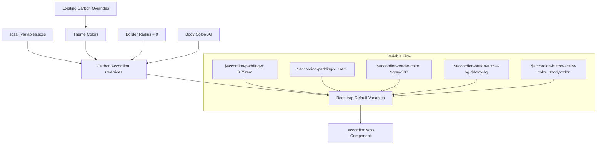

# Design Document: Update Theme Accordion

## Overview

This design document describes how to customize Bootstrap 5's Accordion component to match IBM's Carbon Design System. The implementation uses Bootstrap's variable override system exclusively, following the project's established pattern for component customization.

## Steering Document Alignment

### Technical Standards (tech.md)

- **Variable Overrides**: Accordion variables set before Bootstrap imports them using `!default` pattern
- **No Source Modifications**: All changes through variables, no editing of `_accordion.scss`
- **Carbon Token References**: All values include comments referencing Carbon design tokens

### Project Structure (structure.md)

- **Primary File**: `scss/_variables.scss` for Accordion variable overrides
- **Existing Pattern**: Follows the same approach used for colors, typography, buttons, borders, and list groups
- **Comment Documentation**: Each variable includes Carbon reference

## Code Reuse Analysis

### Existing Components to Leverage

- **Carbon Color Overrides Pattern**: Lines 168-234 in `_variables.scss` demonstrate the override pattern
- **Carbon Button Overrides Pattern**: Lines 236-309 show component-specific overrides with `stylelint-disable`
- **Carbon Border Radius Overrides**: Lines 311-339 show how border-radius is set to 0 globally
- **Carbon List Group Overrides**: Lines 341-374 show recent component override pattern
- **Existing Theme Variables**: `$primary`, `$body-color`, `$body-bg`, `$border-color`, `$gray-300` already defined

### Integration Points

- **Accordion Variables**: Bootstrap defines accordion variables at lines 1736-1768 in `_variables.scss` with `!default`
- **Border Radius**: Global `$border-radius` already set to 0 from border spec (applies to accordion)
- **Focus Shadow**: `$btn-focus-box-shadow` already configured and used by accordion focus
- **Body Colors**: `$body-color` and `$body-bg` already set to Carbon values

## Architecture



## Components and Interfaces

### Bootstrap Accordion Variables Analysis

| Variable | Carbon Value | Bootstrap Default | Needs Override |
|----------|--------------|-------------------|----------------|
| `$accordion-padding-y` | `$spacer * .75` (12px) | `1rem` | ✅ Yes |
| `$accordion-padding-x` | `$spacer` (16px) | `1.25rem` | ✅ Yes |
| `$accordion-color` | `$body-color` | `var(--bs-body-color)` | ❌ No (inherits) |
| `$accordion-bg` | `$body-bg` | `var(--bs-body-bg)` | ❌ No (inherits) |
| `$accordion-border-width` | Default | `var(--bs-border-width)` | ❌ No |
| `$accordion-border-color` | `$gray-300` | `var(--bs-border-color)` | ✅ Yes |
| `$accordion-border-radius` | `0` | `var(--bs-border-radius)` | ❌ No (global) |
| `$accordion-button-padding-y` | Inherits from `$accordion-padding-y` | `$accordion-padding-y` | ❌ No |
| `$accordion-button-padding-x` | Inherits from `$accordion-padding-x` | `$accordion-padding-x` | ❌ No |
| `$accordion-button-color` | `$body-color` | `var(--bs-body-color)` | ❌ No (inherits) |
| `$accordion-button-bg` | `$body-bg` | `var(--bs-accordion-bg)` | ❌ No (inherits) |
| `$accordion-button-active-bg` | `$body-bg` | `var(--bs-primary-bg-subtle)` | ✅ Yes |
| `$accordion-button-active-color` | `$body-color` | `var(--bs-primary-text-emphasis)` | ✅ Yes |
| `$accordion-icon-color` | `$body-color` | `$body-color` | ❌ No (matches) |
| `$accordion-icon-active-color` | `$body-color` | `$primary-text-emphasis` | ✅ Yes |

### Variables That Need Override

Based on analysis, only these variables need explicit override:

| Variable | Value | Reason |
|----------|-------|--------|
| `$accordion-padding-y` | `$spacer * .75` | Reduce to 12px (Carbon spacing-04) |
| `$accordion-padding-x` | `$spacer` | Reduce to 16px (Carbon spacing-05) |
| `$accordion-border-color` | `$gray-300` | Use Carbon Gray 30 |
| `$accordion-button-active-bg` | `$body-bg` | No background change on expand |
| `$accordion-button-active-color` | `$body-color` | Keep text color on expand |
| `$accordion-icon-active-color` | `$body-color` | Keep icon color consistent |

### Variables Already Correct

These variables already work correctly through existing Carbon overrides:
- `$accordion-color` - inherits from `$body-color`
- `$accordion-bg` - inherits from `$body-bg`
- `$accordion-border-radius` - already 0 from global border radius override
- `$accordion-button-color` - inherits from `$body-color`
- `$accordion-button-bg` - inherits from `$body-bg`
- `$accordion-icon-color` - already uses `$body-color`

## Implementation Details

### Add Accordion Overrides in `_variables.scss`

Add after the Carbon List Group Overrides section (after line 374):

```scss
// ============================================================================
// Carbon Accordion Overrides
// ============================================================================
// Reference: https://carbondesignsystem.com/components/accordion/style
// stylelint-disable scss/dollar-variable-default

// -----------------------------------------------------------------------------
// Accordion Spacing
// -----------------------------------------------------------------------------
// Carbon uses spacing-04 (12px) vertical, spacing-05 (16px) horizontal
$accordion-padding-y: $spacer * .75; // Carbon: spacing-04 (12px)
$accordion-padding-x: $spacer;       // Carbon: spacing-05 (16px)

// -----------------------------------------------------------------------------
// Accordion Border
// -----------------------------------------------------------------------------
// Carbon uses Gray 30 for accordion borders
$accordion-border-color: $gray-300; // Carbon: ui-03 (Gray 30)

// -----------------------------------------------------------------------------
// Accordion Active/Expanded State
// -----------------------------------------------------------------------------
// Carbon accordion headers don't change color when expanded
$accordion-button-active-bg:    $body-bg;    // Carbon: no background change
$accordion-button-active-color: $body-color; // Carbon: text-01

// -----------------------------------------------------------------------------
// Accordion Icon
// -----------------------------------------------------------------------------
// Keep icon color consistent in both states
$accordion-icon-active-color: $body-color; // Carbon: icon-01

// stylelint-enable scss/dollar-variable-default
// ============================================================================
// End Carbon Accordion Overrides
// ============================================================================
```

## Error Handling

### Compilation Errors
- **Variable Not Found**: All variables use Bootstrap's existing names; no new variables introduced
- **Circular References**: Using existing `$spacer`, `$body-color`, `$body-bg`, and `$gray-300` variables

### Visual Regressions
- **Existing Accordions**: Will update automatically with new padding and colors
- **Active States**: Will no longer have primary color background (intended)
- **Icons**: Color will remain consistent in both states

## Testing Strategy

### Visual Testing
1. Create `demo/carbon-accordion.html` to showcase all accordion variations
2. Compare with Carbon Design System documentation
3. Verify accordion states (collapsed, expanded, hover, focus)
4. Test flush variant maintains borderless appearance

### Specific Test Cases

| Test | Expected Result | Requirement |
|------|-----------------|-------------|
| Accordion border radius | 0 (square corners) | 1.1 |
| Accordion border color | `#dee2e6` (Gray 30) | 1.3 |
| Button padding vertical | 12px (0.75rem) | 2.2 |
| Button padding horizontal | 16px (1rem) | 2.3 |
| Expanded button background | Same as collapsed | 3.1 |
| Expanded button text color | `#161616` (body-color) | 3.2 |
| Icon rotation on expand | 180° | 3.3 |
| Icon color (both states) | `#161616` (body-color) | 4.4 |
| Body padding | 16px all around | 5.1, 5.2 |

### Unit Testing
1. Build CSS with `npm run css` and verify compilation succeeds
2. Verify no SCSS linting errors with `npm run css-lint`
3. Inspect compiled CSS for correct accordion values

### Integration Testing
1. Test accordion in various contexts (standalone, in cards)
2. Test multiple accordions on same page
3. Test accordion with long content
4. Test keyboard navigation (Tab, Enter, Space)

## Appendix: Bootstrap Accordion Variable Locations

### Variables Definition (`_variables.scss` lines 1736-1768)
```scss
$accordion-padding-y:                     1rem !default;
$accordion-padding-x:                     1.25rem !default;
$accordion-color:                         var(--#{$prefix}body-color) !default;
$accordion-bg:                            var(--#{$prefix}body-bg) !default;
$accordion-border-width:                  var(--#{$prefix}border-width) !default;
$accordion-border-color:                  var(--#{$prefix}border-color) !default;
$accordion-border-radius:                 var(--#{$prefix}border-radius) !default;
$accordion-inner-border-radius:           subtract($accordion-border-radius, $accordion-border-width) !default;

$accordion-body-padding-y:                $accordion-padding-y !default;
$accordion-body-padding-x:                $accordion-padding-x !default;

$accordion-button-padding-y:              $accordion-padding-y !default;
$accordion-button-padding-x:              $accordion-padding-x !default;
$accordion-button-color:                  var(--#{$prefix}body-color) !default;
$accordion-button-bg:                     var(--#{$prefix}accordion-bg) !default;
$accordion-transition:                    $btn-transition, border-radius .15s ease !default;
$accordion-button-active-bg:              var(--#{$prefix}primary-bg-subtle) !default;
$accordion-button-active-color:           var(--#{$prefix}primary-text-emphasis) !default;

$accordion-button-focus-border-color:     $input-focus-border-color !default;
$accordion-button-focus-box-shadow:       $btn-focus-box-shadow !default;

$accordion-icon-width:                    1.25rem !default;
$accordion-icon-color:                    $body-color !default;
$accordion-icon-active-color:             $primary-text-emphasis !default;
$accordion-icon-transition:               transform .2s ease-in-out !default;
$accordion-icon-transform:                rotate(-180deg) !default;

$accordion-button-icon:         url("data:image/svg+xml,...") !default;
$accordion-button-active-icon:  url("data:image/svg+xml,...") !default;
```

### Component Styling (`_accordion.scss`)
The accordion component uses CSS custom properties that reference the Sass variables, allowing runtime customization while maintaining the cascade.
