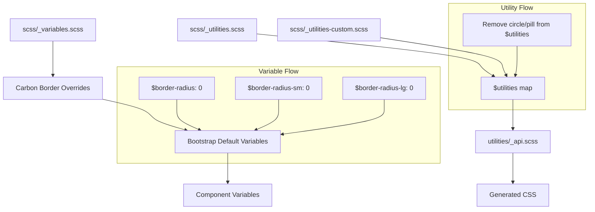

# Design Document: Update Theme Borders

## Overview

This design document describes how to customize Bootstrap 5's border-radius styling across all components to match IBM's Carbon Design System rectangular aesthetic. The implementation uses Bootstrap's variable override system for border-radius values and utility map manipulation to remove rounded utility classes (`.rounded-circle`, `.rounded-pill`).

## Steering Document Alignment

### Technical Standards (tech.md)

- **Variable Overrides**: Border-radius variables set before Bootstrap imports them using `!default` pattern
- **Utility API**: Use Bootstrap's approved utility map manipulation to remove unwanted classes
- **SCSS Architecture**: Changes isolated to `scss/_variables.scss` and a new utility customization file
- **Carbon Token References**: All values include comments referencing Carbon design principles

### Project Structure (structure.md)

- **Primary File**: `scss/_variables.scss` for border-radius variable overrides
- **Secondary File**: New `scss/_utilities-custom.scss` for utility map manipulation
- **Existing Pattern**: Follows the same approach used for colors and buttons
- **Comment Documentation**: Each variable/change includes Carbon reference

## Code Reuse Analysis

### Existing Components to Leverage

- **Carbon Color Overrides Pattern**: Lines 165-231 in `_variables.scss` demonstrate the override pattern
- **Carbon Button Overrides Pattern**: Lines 233-306 show component-specific overrides with `stylelint-disable`
- **Existing Border Variables**: Button border-radius already set to 0 at lines 243-245

### Integration Points

- **Bootstrap Border Variables**: Lines 848-855 define base `$border-radius-*` variables
- **Component Variables**: ~30+ component-specific border-radius variables reference the base variables
- **Utility Map**: `_utilities.scss` lines 711-785 define rounded utility classes
- **Bootstrap Import Order**: `bootstrap.scss` imports utilities before api

## Architecture



### Affected CSS Classes

Setting base border-radius variables to 0 will cascade to these components:

| Component | Variables Affected | Result |
|-----------|-------------------|--------|
| Forms | `$input-border-radius`, `$form-select-border-radius` | Square inputs |
| Cards | `$card-border-radius` | Square cards |
| Modals | `$modal-content-border-radius` | Square modals |
| Dropdowns | `$dropdown-border-radius` | Square dropdowns |
| Alerts | `$alert-border-radius` | Square alerts |
| Badges | `$badge-border-radius` | Square badges |
| Toasts | `$toast-border-radius` | Square toasts |
| Tooltips | `$tooltip-border-radius` | Square tooltips |
| Popovers | `$popover-border-radius` | Square popovers |
| List Groups | `$list-group-border-radius` | Square list groups |
| Accordions | `$accordion-border-radius` | Square accordions |
| Pagination | `$pagination-border-radius` | Square pagination |
| Nav | `$nav-tabs-border-radius`, `$nav-pills-border-radius` | Square nav items |
| Progress | `$progress-border-radius` | Square progress bars |
| Thumbnails | `$thumbnail-border-radius` | Square thumbnails |

## Components and Interfaces

### Base Border Radius Variables

| Variable | Carbon Value | Bootstrap Default | Notes |
|----------|--------------|-------------------|-------|
| `$border-radius` | `0` | `.375rem` | Base radius for most components |
| `$border-radius-sm` | `0` | `.25rem` | Small variant |
| `$border-radius-lg` | `0` | `.5rem` | Large variant |
| `$border-radius-xl` | `0` | `1rem` | Extra large variant |
| `$border-radius-xxl` | `0` | `2rem` | XXL variant |
| `$border-radius-pill` | `0` | `50rem` | Set to 0 (pill utilities removed) |

### Form-Specific Overrides

| Variable | Carbon Value | Bootstrap Default | Notes |
|----------|--------------|-------------------|-------|
| `$form-check-input-border-radius` | `0` | `.25em` | Square checkboxes |
| `$form-check-radio-border-radius` | `50%` | `50%` | Keep circular (usability) |

### Utility Classes to Remove

The following utility classes will be removed by manipulating the `$utilities` map:

| Utility | Classes Removed |
|---------|-----------------|
| `rounded` | `.rounded-circle`, `.rounded-pill` |
| `rounded-top` | `.rounded-top-circle`, `.rounded-top-pill` |
| `rounded-end` | `.rounded-end-circle`, `.rounded-end-pill` |
| `rounded-bottom` | `.rounded-bottom-circle`, `.rounded-bottom-pill` |
| `rounded-start` | `.rounded-start-circle`, `.rounded-start-pill` |

### Utility Classes Preserved (but all become 0)

| Class | Original Value | New Value |
|-------|---------------|-----------|
| `.rounded` | `var(--bs-border-radius)` | `0` |
| `.rounded-0` | `0` | `0` (unchanged) |
| `.rounded-1` | `var(--bs-border-radius-sm)` | `0` |
| `.rounded-2` | `var(--bs-border-radius)` | `0` |
| `.rounded-3` | `var(--bs-border-radius-lg)` | `0` |
| `.rounded-4` | `var(--bs-border-radius-xl)` | `0` |
| `.rounded-5` | `var(--bs-border-radius-xxl)` | `0` |

## Implementation Details

### Part 1: Variable Overrides in `_variables.scss`

Add after the Carbon Button Overrides section (after line 306):

```scss
// ============================================================================
// Carbon Border Radius Overrides
// ============================================================================
// Reference: https://carbondesignsystem.com/elements/spacing/overview/
// Carbon uses rectangular elements with 0 border-radius for most components
// stylelint-disable scss/dollar-variable-default

// -----------------------------------------------------------------------------
// Base Border Radius
// -----------------------------------------------------------------------------
// Carbon uses square corners (0px border-radius) for all UI elements
$border-radius:     0;
$border-radius-sm:  0;
$border-radius-lg:  0;
$border-radius-xl:  0;
$border-radius-xxl: 0;
$border-radius-pill: 0;  // Pill utilities will be removed

// -----------------------------------------------------------------------------
// Form-Specific Border Radius
// -----------------------------------------------------------------------------
// Checkboxes should be square in Carbon, radio buttons remain circular
$form-check-input-border-radius: 0;
// $form-check-radio-border-radius: 50%; // Keep default - radios must be circular

// stylelint-enable scss/dollar-variable-default
// ============================================================================
// End Carbon Border Radius Overrides
// ============================================================================
```

### Part 2: Utility Map Manipulation

Create a new file `scss/_utilities-custom.scss` or add to existing customization layer. This file must be imported AFTER `_utilities.scss` but BEFORE `utilities/_api.scss`.

```scss
// ============================================================================
// Carbon Utility Customizations
// ============================================================================
// Remove rounded circle and pill utilities to maintain square design language

// Helper function to remove circle and pill from rounded utility values
@function remove-rounded-variants($values) {
  @return map-remove($values, "circle", "pill");
}

// Update each rounded utility to remove circle and pill values
$utilities: map-merge(
  $utilities,
  (
    "rounded": map-merge(
      map-get($utilities, "rounded"),
      (values: remove-rounded-variants(map-get(map-get($utilities, "rounded"), "values")))
    ),
    "rounded-top": map-merge(
      map-get($utilities, "rounded-top"),
      (values: remove-rounded-variants(map-get(map-get($utilities, "rounded-top"), "values")))
    ),
    "rounded-end": map-merge(
      map-get($utilities, "rounded-end"),
      (values: remove-rounded-variants(map-get(map-get($utilities, "rounded-end"), "values")))
    ),
    "rounded-bottom": map-merge(
      map-get($utilities, "rounded-bottom"),
      (values: remove-rounded-variants(map-get(map-get($utilities, "rounded-bottom"), "values")))
    ),
    "rounded-start": map-merge(
      map-get($utilities, "rounded-start"),
      (values: remove-rounded-variants(map-get(map-get($utilities, "rounded-start"), "values")))
    )
  )
);

// ============================================================================
// End Carbon Utility Customizations
// ============================================================================
```

### Part 3: Update bootstrap.scss Import Order

Modify `bootstrap.scss` to import the utility customizations:

```scss
// Current (line 12):
@import "utilities";

// Change to:
@import "utilities";
@import "utilities-custom";  // Carbon utility customizations
```

## Error Handling

### Compilation Errors
- **Map Key Not Found**: The `map-remove` function safely handles missing keys
- **Circular References**: No circular dependencies; all changes are additive/subtractive

### Visual Regressions
- **Radio Buttons**: `$form-check-radio-border-radius` remains 50% for usability
- **Form Switches**: Switch pill shape is controlled by `$form-switch-border-radius` which uses width, not border-radius-pill
- **Existing Rounded Elements**: Any element using `.rounded-circle` or `.rounded-pill` will need markup updates

## Testing Strategy

### Visual Testing
1. Create `demo/carbon-borders.html` to showcase all affected components
2. Compare side-by-side with Carbon Design System documentation
3. Verify radio buttons remain circular
4. Verify form switches maintain pill shape

### Specific Test Cases

| Test | Expected Result | Requirement |
|------|-----------------|-------------|
| Input field corners | 0px border-radius | §2.1 |
| Card corners | 0px border-radius | §4.1 |
| Modal corners | 0px border-radius | §5.1 |
| `.rounded-circle` class | Should not exist in CSS | §7.1 |
| `.rounded-pill` class | Should not exist in CSS | §7.2 |
| Radio button | Circular (50%) | §2.5 |
| Form switch | Pill-shaped | §2.6 |

### Unit Testing
1. Build CSS with `npm run css` and verify compilation succeeds
2. Verify no SCSS linting errors with `npm run css-lint`
3. Search compiled CSS for `.rounded-circle` and `.rounded-pill` (should not exist)

### Integration Testing
1. Test all Bootstrap components render correctly
2. Test form elements remain functional
3. Test focus states are visible on square elements
4. Test dropdown/modal animations work correctly

## Appendix: Components That Auto-Inherit Border Radius

These components use `var(--#{$prefix}border-radius)` or similar references and will automatically become square:

### Direct References (no additional variables needed)
- Buttons (already 0 from previous spec)
- Form controls (inputs, selects, textareas)
- Cards
- Alerts
- Badges
- List groups
- Dropdowns
- Modals
- Tooltips
- Popovers
- Toasts
- Progress bars
- Pagination
- Nav tabs/pills
- Accordions

### Special Cases
| Component | Behavior | Notes |
|-----------|----------|-------|
| Radio buttons | Stays circular | Uses `$form-check-radio-border-radius: 50%` |
| Form switches | Stays pill-shaped | Uses `$form-switch-border-radius: $form-switch-width` |
| Spinners | Not affected | Uses rotation, not border-radius |
| Close buttons | Not affected | Uses padding, not border-radius |
