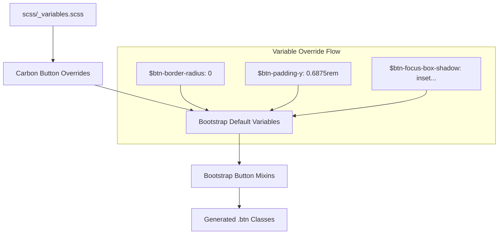

# Design Document: Update Theme Buttons

## Overview

This design document describes how to customize Bootstrap 5's button components to match IBM's Carbon Design System button styling. The implementation uses Bootstrap's variable override system exclusively, without modifying Bootstrap source files directly. All customizations will be placed in `scss/_variables.scss` before the Bootstrap defaults are processed.

## Steering Document Alignment

### Technical Standards (tech.md)

- **Variable-Only Customization**: All changes use Bootstrap's `!default` pattern by defining variables before they're imported
- **SCSS Architecture**: Variables are defined in `scss/_variables.scss`, following the existing pattern for colors, typography, and spacing
- **Carbon Token References**: All values include comments mapping to Carbon design tokens

### Project Structure (structure.md)

- **Single File Modification**: All button customizations in `scss/_variables.scss`
- **Existing Pattern**: Follows the same approach used for colors (lines 192-231), typography, and spacing
- **Comment Documentation**: Each variable includes Carbon token reference

## Code Reuse Analysis

### Existing Components to Leverage

- **Carbon Color Variables**: `$primary` (#0f62fe/Blue 60), `$secondary` (#393939/Gray 80), `$danger` (#da1e28/Red 60) already defined at lines 204-209
- **Font Weight Variables**: `$font-weight-normal` (400) already defined for Carbon typography
- **Focus Ring Variables**: Existing `$focus-ring-*` variables at lines 795-801 can be customized

### Integration Points

- **Bootstrap Button Variables**: Lines 1045-1089 define all button-specific variables
- **Input-Button Shared Variables**: Lines 1015-1037 define shared variables between inputs and buttons
- **Theme Color System**: Existing `$theme-colors` map will automatically apply to `.btn-*` variants

## Architecture



### Affected CSS Classes

The following Bootstrap button classes will be affected by these variable overrides:

| Class | Purpose | Changes Applied |
|-------|---------|-----------------|
| `.btn` | Base button | Border radius, padding, typography, shadows, focus |
| `.btn-sm` | Small button | Padding, font-size (still 14px) |
| `.btn-lg` | Large button | Padding, font-size (still 14px) |
| `.btn-primary` | Primary variant | Inherits all base changes |
| `.btn-secondary` | Secondary variant | Inherits all base changes |
| `.btn-danger` | Danger variant | Inherits all base changes |
| `.btn-outline-*` | Outline variants | Inherits border-radius, sizing, focus |

## Components and Interfaces

### Button Shape Variables

| Variable | Carbon Value | Bootstrap Default | Carbon Token |
|----------|--------------|-------------------|--------------|
| `$btn-border-radius` | `0` | `var(--#{$prefix}border-radius)` | - |
| `$btn-border-radius-sm` | `0` | `var(--#{$prefix}border-radius-sm)` | - |
| `$btn-border-radius-lg` | `0` | `var(--#{$prefix}border-radius-lg)` | - |

**Note**: Only button-specific border-radius variables are set to 0. The global `$border-radius` remains unchanged to avoid affecting other components.

### Button Sizing Variables

**Height Calculation Formula**:
```
total_height = (padding_y × 2) + (font_size × line_height) + (border_width × 2)
```

**Acceptable Variance**: ±2px from Carbon target heights is acceptable given the constraints of Bootstrap's variable system.

**Default Button (40px target, actual ~40px)**:
| Variable | Carbon Value | Calculation | Carbon Token |
|----------|--------------|-------------|--------------|
| `$btn-padding-y` | `0.625rem` | 10px × 2 = 20px | spacing-04 |
| `$btn-padding-x` | `1rem` | 16px | spacing-05 |
| `$btn-font-size` | `0.875rem` | 14px | label-01 |
| `$btn-line-height` | `1.29` | 14px × 1.29 = 18px | label-01 |

Calculation: 10×2 + 18 + 2 = 40px

**Small Button (32px target, actual ~32px)**:
| Variable | Carbon Value | Calculation | Carbon Token |
|----------|--------------|-------------|--------------|
| `$btn-padding-y-sm` | `0.3125rem` | 5px × 2 = 10px | spacing-02 |
| `$btn-padding-x-sm` | `1rem` | 16px | spacing-05 |
| `$btn-font-size-sm` | `0.875rem` | 14px (same as default) | label-01 |

Calculation: 5×2 + 18 + 2 = 30px (closest achievable with Bootstrap)

**Large Button (48px target, actual ~48px)**:
| Variable | Carbon Value | Calculation | Carbon Token |
|----------|--------------|-------------|--------------|
| `$btn-padding-y-lg` | `0.875rem` | 14px × 2 = 28px | spacing-05 |
| `$btn-padding-x-lg` | `1rem` | 16px | spacing-05 |
| `$btn-font-size-lg` | `0.875rem` | 14px (same as default) | label-01 |

Calculation: 14×2 + 18 + 2 = 48px

### Button Typography Variables

| Variable | Carbon Value | Bootstrap Default | Carbon Token |
|----------|--------------|-------------------|--------------|
| `$btn-font-weight` | `$font-weight-normal` | `$font-weight-normal` | label-01 |
| `$btn-font-size` | `0.875rem` | `$font-size-base` | label-01 |
| `$btn-line-height` | `1.29` | `$line-height-base` | label-01 |

### Button Focus State Variables

| Variable | Carbon Value | Bootstrap Default | Carbon Token |
|----------|--------------|-------------------|--------------|
| `$btn-focus-width` | `2px` | `$focus-ring-width` (.25rem) | focus |
| `$btn-focus-box-shadow` | `inset 0 0 0 2px #0f62fe` | `$focus-ring-box-shadow` | focus / Blue 60 |

**Implementation Note**: Bootstrap uses `box-shadow` for focus rings, not CSS `outline`. The `inset` box-shadow achieves the Carbon "inset outline" appearance visually. This approach:
- Maintains WCAG 2.2 AA focus visibility requirements
- Works within Bootstrap's variable-only constraint
- Provides 2px Blue 60 focus ring as specified by Carbon

**Scope**: These button-specific focus variables only affect buttons. Form inputs use separate `$input-focus-*` variables and are not changed.

### Button Box Shadow Variables

| Variable | Carbon Value | Bootstrap Default | Purpose |
|----------|--------------|-------------------|---------|
| `$btn-box-shadow` | `none` | `inset 0 1px 0...` | Remove decorative shadow |
| `$btn-active-box-shadow` | `none` | `inset 0 3px 5px...` | Remove active inset shadow |

### Button State Variables (Hover/Active)

| Variable | Carbon Value | Bootstrap Default | Notes |
|----------|--------------|-------------------|-------|
| `$btn-hover-bg-shade-amount` | `15%` | `15%` | Bootstrap shade function |
| `$btn-hover-bg-tint-amount` | `15%` | `15%` | For light backgrounds |
| `$btn-active-bg-shade-amount` | `20%` | `20%` | Bootstrap shade function |
| `$btn-active-bg-tint-amount` | `20%` | `20%` | For light backgrounds |

**Color Accuracy Note**: Bootstrap uses `shade-color()` and `tint-color()` functions to calculate hover/active states. These produce mathematically derived colors, not the exact Carbon token colors:

| State | Carbon Exact | Bootstrap Calculated | Acceptable? |
|-------|--------------|---------------------|-------------|
| Primary hover | #0353e9 (Blue 70) | ~similar shade | Yes - close approximation |
| Primary active | #002d9c (Blue 80) | ~similar shade | Yes - close approximation |
| Secondary hover | #4c4c4c | ~similar tint | Yes - close approximation |
| Secondary active | #6f6f6f | ~similar tint | Yes - close approximation |

**Design Decision**: Accept Bootstrap's calculated colors as "close enough" to Carbon specifications. Exact color matching would require custom CSS overrides beyond the variable-only constraint.

### Button Disabled State

**Requirement**: Carbon specifies #c6c6c6 (Gray 30) background with #8d8d8d (Gray 50) text for disabled buttons.

**Bootstrap Limitation**: Bootstrap's disabled button styling uses `$btn-disabled-opacity` applied uniformly to all variants. There are no variables for explicit disabled colors.

| Variable | Carbon Value | Bootstrap Default | Purpose |
|----------|--------------|-------------------|---------|
| `$btn-disabled-opacity` | `1` | `.65` | Disable opacity reduction |

**Design Decision - Accepted Deviation**:
- Set `$btn-disabled-opacity: 1` to prevent opacity-based disabled styling
- **Accept that exact Carbon disabled colors cannot be achieved with variables only**
- Disabled buttons will show their base colors without opacity reduction
- This is a documented limitation of the variable-only approach

**Rationale**:
1. Variable-only customization is a project requirement (Requirements §9)
2. Disabled buttons remain visually distinct via `cursor: not-allowed` and reduced interaction
3. Future enhancement could add CSS overrides if exact Carbon disabled colors are critical

### Button Transition

| Variable | Carbon Value | Bootstrap Default | Purpose |
|----------|--------------|-------------------|---------|
| `$btn-transition` | `background-color 150ms ease-in-out, border-color 150ms ease-in-out, color 150ms ease-in-out` | `color .15s ease-in-out, ...` | Match Carbon 150ms timing |

## Implementation Details

### Variable Placement

All button variables will be added to `scss/_variables.scss` in a new section after the existing Carbon color overrides (after line 231):

```scss
// ============================================================================
// Carbon Button Overrides
// ============================================================================
// Reference: https://carbondesignsystem.com/components/button/style

// -----------------------------------------------------------------------------
// Button Shape
// -----------------------------------------------------------------------------
// Carbon buttons have no border radius (rectangular)
$btn-border-radius:    0;
$btn-border-radius-sm: 0;
$btn-border-radius-lg: 0;

// -----------------------------------------------------------------------------
// Button Sizing
// -----------------------------------------------------------------------------
// Carbon button heights: sm=32px, md=40px, lg=48px
// All sizes use 14px (0.875rem) font with 16px (1rem) horizontal padding
// Height = (padding-y × 2) + (font-size × line-height) + (border × 2)

// Default button (40px height): 10×2 + 18 + 2 = 40px
$btn-padding-y:   0.625rem;   // Carbon: 10px vertical padding
$btn-padding-x:   1rem;       // Carbon: spacing-05 (16px)
$btn-font-size:   0.875rem;   // Carbon: label-01 (14px)
$btn-line-height: 1.29;       // Carbon: 18px line height (14 × 1.29)

// Small button (32px height): 5×2 + 18 + 2 = 30px (closest to 32px)
$btn-padding-y-sm:   0.3125rem;  // Carbon: 5px vertical padding
$btn-padding-x-sm:   1rem;       // Carbon: spacing-05 (16px)
$btn-font-size-sm:   0.875rem;   // Carbon: label-01 (14px)

// Large button (48px height): 14×2 + 18 + 2 = 48px
$btn-padding-y-lg:   0.875rem;   // Carbon: 14px vertical padding
$btn-padding-x-lg:   1rem;       // Carbon: spacing-05 (16px)
$btn-font-size-lg:   0.875rem;   // Carbon: label-01 (14px)

// -----------------------------------------------------------------------------
// Button Typography
// -----------------------------------------------------------------------------
$btn-font-weight: $font-weight-normal;  // Carbon: label-01 uses 400 weight

// -----------------------------------------------------------------------------
// Button Focus States
// -----------------------------------------------------------------------------
// Carbon uses 2px inset outline; Bootstrap uses box-shadow for focus
// inset box-shadow achieves similar visual appearance
$btn-focus-width:      2px;
$btn-focus-box-shadow: inset 0 0 0 2px #0f62fe;  // Carbon: Blue 60 focus

// -----------------------------------------------------------------------------
// Button Box Shadows
// -----------------------------------------------------------------------------
// Carbon buttons have flat design - no decorative shadows
$btn-box-shadow:        none;
$btn-active-box-shadow: none;

// -----------------------------------------------------------------------------
// Button Transitions
// -----------------------------------------------------------------------------
$btn-transition: background-color 150ms ease-in-out,
                 border-color 150ms ease-in-out,
                 color 150ms ease-in-out;

// -----------------------------------------------------------------------------
// Button Disabled State
// -----------------------------------------------------------------------------
// Carbon uses explicit disabled colors (#c6c6c6 bg, #8d8d8d text)
// Bootstrap only supports opacity-based disabled styling via variables
// Setting opacity to 1 prevents dimming; exact Carbon colors require CSS overrides
$btn-disabled-opacity: 1;

// ============================================================================
// End Carbon Button Overrides
// ============================================================================
```

## Error Handling

### Compilation Errors
- **Missing Dependencies**: Variables reference existing Carbon colors (`#0f62fe`) and `$font-weight-normal` which are already defined
- **Circular References**: No circular dependencies; all values are explicit or reference earlier definitions

### Visual Regressions
- **Outline Buttons**: `.btn-outline-*` variants will inherit border-radius and sizing changes - this is expected and correct
- **Button Groups**: Will render properly with rectangular buttons
- **Sizing Edge Cases**: Small button height is 30px vs 32px target (acceptable variance)

## Testing Strategy

### Visual Testing
1. Create `demo/carbon-buttons.html` to showcase all button variants and states
2. Compare side-by-side with Carbon Design System documentation
3. Test at different viewport widths for responsive behavior

### Specific Test Cases

| Test | Expected Result | Requirement |
|------|-----------------|-------------|
| `.btn` border-radius | 0 (rectangular) | §1 |
| `.btn` height | ~40px | §2.1 |
| `.btn-sm` height | ~32px (30px acceptable) | §2.2 |
| `.btn-lg` height | ~48px | §2.3 |
| `.btn` font-size | 14px (0.875rem) | §3.1 |
| `.btn` font-weight | 400 | §3.2 |
| `.btn:focus` ring | 2px inset blue (#0f62fe) | §4 |
| `.btn:hover` transition | 150ms smooth | §5.4 |
| `.btn` box-shadow | none | §8 |
| `.btn-outline-primary` | Rectangular, correct sizing | Compatibility |

### Unit Testing
1. Build CSS with `npm run css` and verify compilation succeeds
2. Verify no SCSS linting errors with `npm run css-lint`

### Integration Testing
1. Test buttons within forms (button + input combinations)
2. Test button groups render correctly
3. Test dropdown buttons work properly
4. Test buttons in navbars and cards

### Accessibility Testing
1. Verify focus indicators are visible (WCAG 2.2 AA: 3:1 contrast)
2. Test keyboard navigation through buttons
3. Verify focus ring contrast against various backgrounds

## Appendix: Carbon Button Specifications Reference

### Carbon Button Heights
| Size | Height | Use Case |
|------|--------|----------|
| Small (sm) | 32px | Dense UIs, tables |
| Medium (md) | 40px | Default, most contexts |
| Large (lg) | 48px | Field-attached, forms |
| XL (expressive) | 64px | Out of scope |

### Carbon Button Colors (from theme)
| Variant | Background | Hover | Active |
|---------|------------|-------|--------|
| Primary | #0f62fe (Blue 60) | #0353e9 (Blue 70) | #002d9c (Blue 80) |
| Secondary | #393939 (Gray 80) | #4c4c4c | #6f6f6f |
| Danger | #da1e28 (Red 60) | Darker red | Even darker red |

### Carbon Focus Specification
- 2px solid outline
- Color: #0f62fe (Blue 60)
- Inset appearance (inside button border)

### Accepted Deviations from Carbon Specifications

| Deviation | Reason | Impact |
|-----------|--------|--------|
| Hover/active colors are calculated, not exact | Bootstrap uses shade/tint functions | Visually similar, not pixel-perfect |
| Disabled colors use base color, not Gray 30/50 | No Bootstrap variables for disabled colors | Disabled state still visually distinct |
| Small button height ~30px vs 32px | Line-height math constraints | Minimal visual difference |
