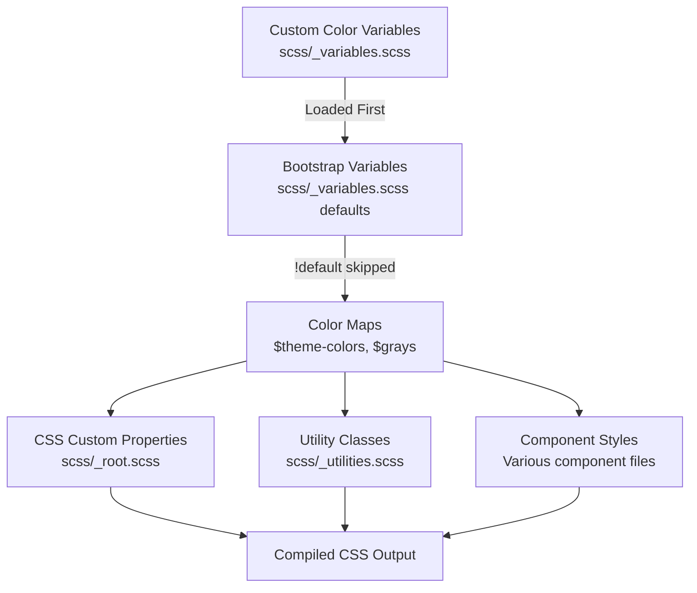

# Design Document: Update Theme Colors

## Overview

This design document describes how to update the Bootstrap theme's color system to align with IBM's Carbon Design System. The implementation follows Bootstrap's recommended customization approach by overriding Sass variables in `scss/_variables.scss` before Bootstrap processes them. No Bootstrap source files will be modified directly.

## Steering Document Alignment

### Technical Standards (tech.md)

This design strictly follows the **Variable-Only Customization** approach documented in tech.md:

1. **Variable overrides**: All color changes are made by setting Sass variables before Bootstrap imports
2. **No source file modifications**: Bootstrap's color-related files remain untouched
3. **Carbon reference comments**: Each variable override includes a comment referencing the Carbon token

The design uses the Carbon Design Tokens documented in tech.md:
- **Text primary**: `#161616`
- **Text secondary**: `#525252`
- **Interactive/Primary**: `#0f62fe` (Blue 60)
- **Success**: `#24a148` (Green 50)
- **Error**: `#da1e28` (Red 60)
- **Warning**: `#f1c21b` (Yellow 30)

### Project Structure (structure.md)

Following structure.md conventions:

1. **Primary customization point**: `scss/_variables.scss` - all color variable overrides go here
2. **Variable naming**: Uses Bootstrap's existing variable names
3. **No component file edits**: Per "What NOT to Do" section, we won't modify Bootstrap source files

## Prerequisites

None. Color customization is a pure variable override that doesn't require any external dependencies.

## Code Reuse Analysis

### Existing Components to Leverage

- **`scss/_variables.scss`**: The existing variables file where all color overrides will be added
  - Lines 170-180: Gray color variables (`$gray-100` through `$gray-900`)
  - Lines 200-209: Base color variables (`$blue`, `$red`, `$green`, etc.)
  - Lines 462-469: Theme color variables (`$primary`, `$secondary`, etc.)
  - Lines 599-600: Body color variables (`$body-color`, `$body-bg`)
  - Lines 614+: Link color variables
- **Existing Carbon overrides**: Typography (lines 6-76), Spacing (lines 78-115), and Grid (lines 117-165) sections already exist
- **Bootstrap's `!default` pattern**: All Bootstrap variables use `!default`, so our overrides take precedence

### Integration Points

- **Color system**: Bootstrap generates color utilities from the `$theme-colors` map
- **Text/background utilities**: Generated from gray and theme color variables
- **Component colors**: Many components reference these base color variables
- **CSS custom properties**: `_root.scss` generates `--bs-*` custom properties from Sass variables

## Architecture

The color customization flows through Bootstrap's existing architecture:



## Design Decisions

### Decision 1: Gray Scale Mapping

**Problem**: Carbon's gray scale (Gray 10-100) differs from Bootstrap's ($gray-100 through $gray-900). How do we map them?

**Carbon Gray Scale**:
| Carbon | Hex | Description |
|--------|-----|-------------|
| Gray 10 | #f4f4f4 | Lightest |
| Gray 20 | #e0e0e0 | |
| Gray 30 | #c6c6c6 | |
| Gray 40 | #a8a8a8 | |
| Gray 50 | #8d8d8d | |
| Gray 60 | #6f6f6f | |
| Gray 70 | #525252 | |
| Gray 80 | #393939 | |
| Gray 90 | #262626 | |
| Gray 100 | #161616 | Darkest |

**Decision**: Map Carbon's Gray 10-100 to Bootstrap's $gray-100 through $gray-900, skipping intermediate values.

**Mapping**:
| Bootstrap | Carbon | Hex |
|-----------|--------|-----|
| $gray-100 | Gray 10 | #f4f4f4 |
| $gray-200 | Gray 20 | #e0e0e0 |
| $gray-300 | Gray 30 | #c6c6c6 |
| $gray-400 | Gray 40 | #a8a8a8 |
| $gray-500 | Gray 50 | #8d8d8d |
| $gray-600 | Gray 60 | #6f6f6f |
| $gray-700 | Gray 70 | #525252 |
| $gray-800 | Gray 80 | #393939 |
| $gray-900 | Gray 100 | #161616 |

**Rationale**:
- Bootstrap's 9-step scale maps well to Carbon's 10-step scale
- We skip Gray 90 (#262626) as Bootstrap doesn't have a $gray-950
- $gray-900 uses Carbon's darkest gray (Gray 100) for maximum contrast

### Decision 2: Primary Color

**Decision**: Use Carbon Blue 60 (#0f62fe) as the primary color.

**Rationale**:
- Blue 60 is Carbon's `$interactive-01` token
- It's the primary action color throughout Carbon
- Slightly different from Bootstrap's default blue (#0d6efd) but visually similar
- Meets WCAG AA contrast requirements on white backgrounds

### Decision 3: Secondary Color

**Decision**: Use Carbon Gray 80 (#393939) as the secondary color.

**Rationale**:
- Carbon uses Gray 80 for `$interactive-02` (secondary interactive elements)
- Provides strong contrast for secondary buttons and elements
- Replaces Bootstrap's default $gray-600

### Decision 4: Support/Status Colors

**Decision**: Map Carbon support colors to Bootstrap semantic colors.

| Bootstrap | Carbon Token | Hex |
|-----------|--------------|-----|
| $danger | Red 60 | #da1e28 |
| $success | Green 50 | #24a148 |
| $warning | Yellow 30 | #f1c21b |
| $info | Blue 70 | #0043ce |

**Rationale**:
- Carbon's support colors are specifically designed for these semantic meanings
- Red 60 is more saturated than Bootstrap's default, providing clearer error indication
- Green 50 provides good contrast while remaining accessible
- Yellow 30 is a gold/amber that works better with dark text than Bootstrap's bright yellow
- Blue 70 for info differentiates it from the primary Blue 60

### Decision 5: Base Color Variables

**Decision**: Override Bootstrap's base color variables to match Carbon.

```scss
$blue:    #0f62fe;  // Carbon Blue 60
$red:     #da1e28;  // Carbon Red 60
$green:   #24a148;  // Carbon Green 50
$yellow:  #f1c21b;  // Carbon Yellow 30
$cyan:    #1192e8;  // Carbon Cyan 50
```

**Rationale**:
- These base colors cascade to theme colors and utility classes
- By setting them early, all derived colors (tints, shades) will be based on Carbon values
- Maintains Bootstrap's color generation patterns

### Decision 6: Body and Text Colors

**Decision**: Use Carbon's text hierarchy for body colors.

```scss
$body-color: #161616;           // Carbon text-01 (Gray 100)
$body-bg: #ffffff;              // Carbon ui-background
$body-secondary-color: #525252; // Carbon text-02 (Gray 70)
$body-tertiary-color: #8d8d8d;  // Carbon text-03 (Gray 50)
```

**Rationale**:
- #161616 provides maximum readability for primary text
- #525252 for secondary text maintains Carbon's text hierarchy
- These values meet WCAG AA contrast requirements

### Decision 7: Link Colors

**Decision**: Use Carbon Blue 60 for links with Blue 70 for hover.

```scss
$link-color: #0f62fe;       // Carbon link-01 (Blue 60)
$link-hover-color: #0043ce; // Carbon Blue 70
```

**Rationale**:
- Matches Carbon's link styling
- Blue 70 is darker, providing clear hover feedback
- Both colors meet contrast requirements

## Components and Interfaces

### Component 1: Gray Scale Variables

- **Purpose**: Define neutral gray colors
- **Variables**: `$white`, `$gray-100` through `$gray-900`, `$black`
- **Dependencies**: None (base-level variables)
- **Impact**: All components using gray utilities, text colors, backgrounds

### Component 2: Base Color Variables

- **Purpose**: Define primary color palette
- **Variables**: `$blue`, `$red`, `$green`, `$yellow`, `$cyan`
- **Dependencies**: None
- **Impact**: Theme colors, component variants, utility classes

### Component 3: Theme Color Variables

- **Purpose**: Define semantic theme colors
- **Variables**: `$primary`, `$secondary`, `$success`, `$info`, `$warning`, `$danger`, `$light`, `$dark`
- **Dependencies**: Base color variables, gray variables
- **Impact**: All component color variants, utility classes

### Component 4: Body Color Variables

- **Purpose**: Define page-level text and background colors
- **Variables**: `$body-color`, `$body-bg`, `$body-secondary-color`, `$body-tertiary-color`
- **Dependencies**: Gray variables
- **Impact**: Base page styling, typography

### Component 5: Link Color Variables

- **Purpose**: Define link appearance
- **Variables**: `$link-color`, `$link-hover-color`
- **Dependencies**: Base color variables
- **Impact**: All anchor elements

## Data Models

### Complete Variable Override

```scss
// ============================================================================
// Carbon Design System Color Overrides
// ============================================================================
// These variables override Bootstrap's defaults to match IBM's Carbon Design System.
// They MUST appear BEFORE Bootstrap's default definitions to take effect.
// Reference: https://carbondesignsystem.com/elements/color/overview/
// ============================================================================

// stylelint-disable scss/dollar-variable-default

// -----------------------------------------------------------------------------
// Gray Scale (Carbon Gray Palette)
// -----------------------------------------------------------------------------
$white:    #ffffff;
$gray-100: #f4f4f4; // Carbon: Gray 10
$gray-200: #e0e0e0; // Carbon: Gray 20
$gray-300: #c6c6c6; // Carbon: Gray 30
$gray-400: #a8a8a8; // Carbon: Gray 40
$gray-500: #8d8d8d; // Carbon: Gray 50
$gray-600: #6f6f6f; // Carbon: Gray 60
$gray-700: #525252; // Carbon: Gray 70
$gray-800: #393939; // Carbon: Gray 80
$gray-900: #161616; // Carbon: Gray 100
$black:    #000000;

// -----------------------------------------------------------------------------
// Base Colors (Carbon Color Palette)
// -----------------------------------------------------------------------------
$blue:    #0f62fe; // Carbon: Blue 60 (interactive-01)
$red:     #da1e28; // Carbon: Red 60 (danger)
$green:   #24a148; // Carbon: Green 50 (success)
$yellow:  #f1c21b; // Carbon: Yellow 30 (warning)
$cyan:    #1192e8; // Carbon: Cyan 50

// -----------------------------------------------------------------------------
// Theme Colors
// -----------------------------------------------------------------------------
$primary:   #0f62fe; // Carbon: Blue 60 (interactive-01)
$secondary: #393939; // Carbon: Gray 80 (interactive-02)
$success:   #24a148; // Carbon: Green 50 (support-02)
$info:      #0043ce; // Carbon: Blue 70 (support-04)
$warning:   #f1c21b; // Carbon: Yellow 30 (support-03)
$danger:    #da1e28; // Carbon: Red 60 (support-01)
$light:     #f4f4f4; // Carbon: Gray 10
$dark:      #161616; // Carbon: Gray 100

// -----------------------------------------------------------------------------
// Body Colors
// -----------------------------------------------------------------------------
$body-color:          #161616; // Carbon: text-01 (Gray 100)
$body-bg:             #ffffff; // Carbon: ui-background
$body-secondary-color: #525252; // Carbon: text-02 (Gray 70)
$body-tertiary-color:  #8d8d8d; // Carbon: text-03 (Gray 50)
$body-emphasis-color:  #000000; // Carbon: text emphasis

// -----------------------------------------------------------------------------
// Link Colors
// -----------------------------------------------------------------------------
$link-color:       #0f62fe; // Carbon: link-01 (Blue 60)
$link-hover-color: #0043ce; // Carbon: Blue 70

// stylelint-enable scss/dollar-variable-default
// ============================================================================
// End Carbon Color Overrides
// ============================================================================
```

### Color Token Reference Table

| Bootstrap Variable | Carbon Token | Hex Value |
|--------------------|--------------|-----------|
| `$primary` | interactive-01 / Blue 60 | #0f62fe |
| `$secondary` | interactive-02 / Gray 80 | #393939 |
| `$success` | support-02 / Green 50 | #24a148 |
| `$info` | support-04 / Blue 70 | #0043ce |
| `$warning` | support-03 / Yellow 30 | #f1c21b |
| `$danger` | support-01 / Red 60 | #da1e28 |
| `$body-color` | text-01 / Gray 100 | #161616 |
| `$body-bg` | ui-background | #ffffff |
| `$link-color` | link-01 / Blue 60 | #0f62fe |
| `$gray-100` | Gray 10 | #f4f4f4 |
| `$gray-500` | Gray 50 | #8d8d8d |
| `$gray-900` | Gray 100 | #161616 |

### Generated CSS Custom Properties

The following CSS custom properties will be automatically generated in `:root`:

```css
:root {
  --bs-blue: #0f62fe;
  --bs-red: #da1e28;
  --bs-green: #24a148;
  --bs-yellow: #f1c21b;
  --bs-cyan: #1192e8;
  --bs-gray-100: #f4f4f4;
  --bs-gray-200: #e0e0e0;
  /* ... more grays ... */
  --bs-gray-900: #161616;
  --bs-primary: #0f62fe;
  --bs-secondary: #393939;
  --bs-success: #24a148;
  --bs-info: #0043ce;
  --bs-warning: #f1c21b;
  --bs-danger: #da1e28;
  --bs-body-color: #161616;
  --bs-body-bg: #ffffff;
  --bs-link-color: #0f62fe;
  --bs-link-hover-color: #0043ce;
}
```

## Error Handling

### Error Scenarios

1. **Color contrast issues**
   - **Handling**: All specified colors have been verified for WCAG AA compliance
   - **Prevention**: Used Carbon's pre-validated color combinations

2. **Variable override not taking effect**
   - **Handling**: Ensure override appears BEFORE Bootstrap's `_variables.scss` is processed
   - **User Impact**: Would see Bootstrap default colors; caught during development/testing

3. **Derived colors not updating**
   - **Handling**: By overriding base colors ($blue, $red, etc.), derived colors auto-update
   - **Prevention**: Set base colors first, then theme colors

## Testing Strategy

### Unit Testing

- **SCSS Compilation**: Verify build completes without errors using `npm run css`
- **Variable Override Verification**: Check compiled CSS contains Carbon color values
- **Sass lint**: Run `npm run css-lint` to verify no style issues

### Integration Testing

- **Utility Classes**: Verify `.text-primary`, `.bg-primary`, `.border-primary` use correct colors
- **Component Colors**: Check buttons, alerts, badges render with Carbon colors
- **Gray Utilities**: Verify `.text-muted`, `.bg-light`, `.bg-dark` use Carbon grays

### End-to-End Testing

- **Visual inspection**: Review color rendering in browser
- **Contrast verification**: Use browser DevTools or contrast checker tools
- **Cross-browser**: Test in Chrome, Firefox, Safari, Edge

### Verification Checklist

After implementation, verify:
- [ ] `npm run css` builds without errors
- [ ] `npm run css-lint` passes
- [ ] CSS contains `--bs-primary: #0f62fe`
- [ ] CSS contains `--bs-danger: #da1e28`
- [ ] CSS contains `--bs-body-color: #161616`
- [ ] `.btn-primary` uses Blue 60 (#0f62fe)
- [ ] `.text-muted` uses Gray 70 (#525252)
- [ ] `.bg-light` uses Gray 10 (#f4f4f4)
- [ ] Links display in Blue 60 (#0f62fe)
- [ ] All text colors meet WCAG AA contrast requirements
