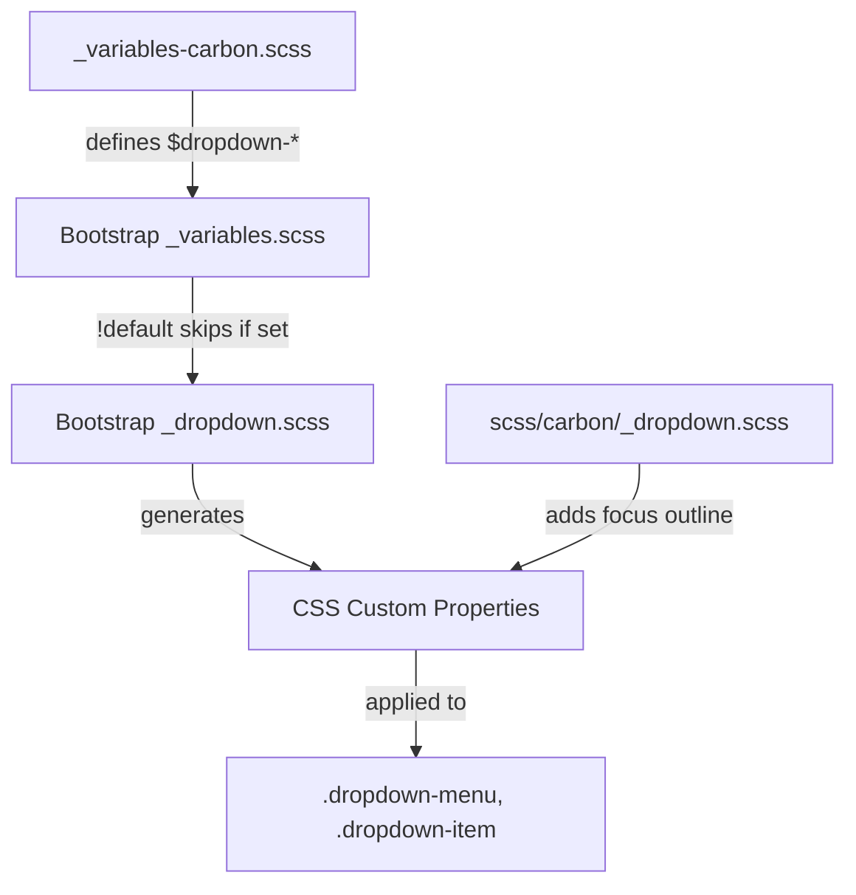

# Design Document

## Overview

This design specifies the implementation of Carbon Design System styling for Bootstrap's dropdown component. Dropdowns include menu containers, menu items, dividers, and headers. The implementation uses primarily variable overrides for colors, spacing, and borders, with custom styles needed only for the focus outline (Carbon uses outline instead of box-shadow) on dropdown items.

## Steering Document Alignment

### Technical Standards (tech.md)
- **Variable-Only Customization**: Use `$dropdown-*` variable overrides where possible
- **Custom Styles**: Required only for item focus outline state
- **No Bootstrap Source Modifications**: All changes in `_variables-carbon.scss` and `scss/carbon/_dropdown.scss`

### Project Structure (structure.md)
- **Primary file**: `scss/_variables-carbon.scss` - Dropdown variable overrides
- **Secondary file**: `scss/carbon/_dropdown.scss` - Custom styles for focus outline
- **Index update**: `scss/carbon/_index.scss` - Add import for dropdown custom styles

## Code Reuse Analysis

### Existing Components to Leverage
- **Bootstrap's `_dropdown.scss`**: Provides complete dropdown structure with CSS custom properties
- **Bootstrap's `_variables.scss`**: Defines `$dropdown-*` variables with `!default` flag
- **Existing Carbon variables**: Reference `$body-bg`, `$body-color`, `$gray-*`, `$primary`
- **Existing form focus pattern**: Similar focus outline approach in `scss/carbon/_form.scss`

### Integration Points
- **Variable cascade**: Our overrides → Bootstrap variables → CSS custom properties → Component styles
- **Existing color system**: Use theme-level variables for consistent colors
- **Focus pattern**: Reuse outline approach from form controls

## Architecture

The implementation combines variable overrides with minimal custom styles for focus:



## Components and Interfaces

### Variable Overrides

**File:** `scss/_variables-carbon.scss`

Add a new section for dropdown variables after the toast section:

```scss
// =============================================================================
// Carbon Dropdown Overrides
// =============================================================================
// Reference: https://carbondesignsystem.com/components/dropdown/style/
// =============================================================================

// stylelint-disable scss/dollar-variable-default

// -----------------------------------------------------------------------------
// Dropdown Menu Container
// -----------------------------------------------------------------------------
$dropdown-min-width:              10rem;                // Carbon: flexible width
$dropdown-padding-x:              0;                    // Carbon: no horizontal padding
$dropdown-padding-y:              .5rem;                // Carbon: 8px vertical padding
$dropdown-font-size:              .875rem;              // Carbon: 14px body text
$dropdown-color:                  $body-color;          // Carbon: $text-primary (#161616)
$dropdown-bg:                     $body-bg;             // Carbon: white
$dropdown-border-color:           $gray-200;            // Carbon: $border-subtle (#e0e0e0)
$dropdown-border-radius:          0;                    // Carbon: square corners
$dropdown-border-width:           1px;                  // Carbon: standard border
$dropdown-box-shadow:             0 2px 6px rgba(0, 0, 0, .3); // Carbon: drop shadow

// -----------------------------------------------------------------------------
// Dropdown Divider
// -----------------------------------------------------------------------------
$dropdown-divider-bg:             $gray-200;            // Carbon: $border-subtle (#e0e0e0)
$dropdown-divider-margin-y:       .5rem;                // Carbon: 8px spacing

// -----------------------------------------------------------------------------
// Dropdown Item
// -----------------------------------------------------------------------------
$dropdown-item-padding-y:         .5rem;                // Carbon: 8px vertical
$dropdown-item-padding-x:         1rem;                 // Carbon: 16px horizontal
$dropdown-link-color:             $body-color;          // Carbon: $text-primary (#161616)
$dropdown-link-hover-color:       $body-color;          // Carbon: maintain text color
$dropdown-link-hover-bg:          $gray-200;            // Carbon: $hover-ui (#e0e0e0)
$dropdown-link-active-color:      $white;               // Carbon: white on blue
$dropdown-link-active-bg:         $primary;             // Carbon: Blue 60 (#0f62fe)
$dropdown-link-disabled-color:    $gray-300;            // Carbon: $text-disabled (#c6c6c6)

// -----------------------------------------------------------------------------
// Dropdown Header
// -----------------------------------------------------------------------------
$dropdown-header-color:           $gray-700;            // Carbon: $text-secondary (#525252)
$dropdown-header-padding-y:       .5rem;                // Carbon: 8px
$dropdown-header-padding-x:       1rem;                 // Carbon: 16px

// -----------------------------------------------------------------------------
// Dropdown Dark Variant
// -----------------------------------------------------------------------------
$dropdown-dark-color:             $gray-100;            // Carbon: light text
$dropdown-dark-bg:                $gray-800;            // Carbon: Gray 80
$dropdown-dark-border-color:      $gray-700;            // Carbon: Gray 70
$dropdown-dark-link-color:        $gray-100;            // Carbon: light text
$dropdown-dark-link-hover-color:  $white;               // Carbon: white on hover
$dropdown-dark-link-hover-bg:     $gray-700;            // Carbon: Gray 70
$dropdown-dark-link-active-color: $white;               // Carbon: white
$dropdown-dark-link-active-bg:    $primary;             // Carbon: Blue 60
$dropdown-dark-link-disabled-color: $gray-500;          // Carbon: Gray 50
$dropdown-dark-header-color:      $gray-400;            // Carbon: Gray 40

// stylelint-enable scss/dollar-variable-default
// =============================================================================
// End Carbon Dropdown Overrides
// =============================================================================
```

### Custom Styles

**File:** `scss/carbon/_dropdown.scss`

Custom styles are required for the focus outline and header font styling:

```scss
// Carbon Dropdown Customizations
// Focus outline not available via Bootstrap variables
// Reference: https://carbondesignsystem.com/components/dropdown/style/

// -----------------------------------------------------------------------------
// Dropdown Item Focus State
// -----------------------------------------------------------------------------
.dropdown-item:focus {
  outline: 2px solid $primary;  // Carbon: $focus (Blue 60)
  outline-offset: -2px;         // Carbon: inset outline
  box-shadow: none;             // Disable Bootstrap's focus shadow
}

// -----------------------------------------------------------------------------
// Dropdown Header Typography
// -----------------------------------------------------------------------------
.dropdown-header {
  font-size: .75rem;            // Carbon: 12px label
  font-weight: 600;             // Carbon: semibold
}
```

### CSS Custom Properties (Expected Output)

The compiled CSS will include Bootstrap's generated custom properties with our overrides:

```css
.dropdown-menu {
  --bs-dropdown-zindex: 1000;
  --bs-dropdown-min-width: 10rem;
  --bs-dropdown-padding-x: 0;
  --bs-dropdown-padding-y: 0.5rem;
  --bs-dropdown-spacer: 0.125rem;
  --bs-dropdown-font-size: 0.875rem;
  --bs-dropdown-color: #161616;
  --bs-dropdown-bg: #fff;
  --bs-dropdown-border-color: #e0e0e0;
  --bs-dropdown-border-radius: 0;
  --bs-dropdown-border-width: 1px;
  --bs-dropdown-box-shadow: 0 2px 6px rgba(0, 0, 0, 0.3);
  --bs-dropdown-link-color: #161616;
  --bs-dropdown-link-hover-color: #161616;
  --bs-dropdown-link-hover-bg: #e0e0e0;
  --bs-dropdown-link-active-color: #fff;
  --bs-dropdown-link-active-bg: #0f62fe;
  --bs-dropdown-link-disabled-color: #c6c6c6;
  --bs-dropdown-item-padding-x: 1rem;
  --bs-dropdown-item-padding-y: 0.5rem;
  --bs-dropdown-header-color: #525252;
  --bs-dropdown-header-padding-x: 1rem;
  --bs-dropdown-header-padding-y: 0.5rem;
  --bs-dropdown-divider-bg: #e0e0e0;
  --bs-dropdown-divider-margin-y: 0.5rem;
}

.dropdown-item:focus {
  outline: 2px solid #0f62fe;
  outline-offset: -2px;
  box-shadow: none;
}

.dropdown-header {
  font-size: 0.75rem;
  font-weight: 600;
}
```

## Data Models

Not applicable - this is a CSS-only implementation with no data structures or JavaScript state management. Bootstrap's dropdown component handles all data management internally through its existing JavaScript plugin (`dropdown.js`), which remains unchanged by this styling update.

## Error Handling

### Build Errors
- **Missing variables**: If referenced variables (e.g., `$gray-200`, `$primary`) are undefined, Sass will error
- **Variable type mismatch**: Ensure color values are valid Sass colors

### Runtime Issues
- **CSS specificity**: Custom focus styles should apply correctly
- **Dark variant**: Verify dark dropdown styles apply with `.dropdown-menu-dark` class

## Testing Strategy

### Visual Testing
1. Create `demo/carbon-dropdown.html` with test cases:
   - Basic dropdown menu with items
   - Dropdown with header and divider
   - Dropdown with disabled items
   - Dropdown with active/selected item
   - Dark dropdown variant (`.dropdown-menu-dark`)
   - Split button dropdown
   - Dropup, dropend, dropstart variations
   - Dropdown in navbar

2. Visual comparison checklist:
   - [ ] Menu has white background
   - [ ] Menu has square corners (no border-radius)
   - [ ] Menu has subtle gray border (#e0e0e0)
   - [ ] Menu has drop shadow
   - [ ] Item text is dark (#161616)
   - [ ] Item padding is 8px/16px
   - [ ] Hover shows gray background (#e0e0e0)
   - [ ] Active item has blue background (#0f62fe) and white text
   - [ ] Disabled items show gray text (#c6c6c6)
   - [ ] Focus shows 2px blue outline
   - [ ] Divider is gray (#e0e0e0)
   - [ ] Header is 12px, gray (#525252), semibold
   - [ ] Dark variant has dark background and light text
   - [ ] Font size is 14px

### Build Testing
```bash
# Lint SCSS
npm run css-lint

# Build and verify no errors
npm run build-theme

# Check compiled CSS for dropdown styles
grep -A 20 "\.dropdown-menu {" dist/css/bootstrap.css
```

### Regression Testing
- Ensure dropdowns still open/close correctly with JavaScript
- Test keyboard navigation (Arrow keys, Enter, Escape)
- Verify dropdown positioning (dropup, dropend, dropstart)
- Test in navbar context
- Verify split button dropdowns work correctly
