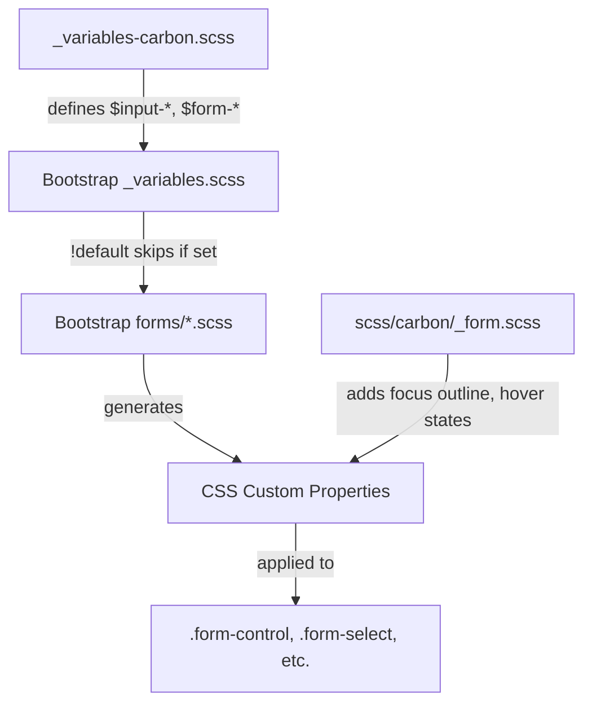

# Design Document

## Overview

This design specifies the implementation of Carbon Design System styling for Bootstrap's form components. Forms include text inputs, selects, labels, helper text, input groups, and validation states. The implementation uses primarily variable overrides for colors, sizing, and spacing, with custom styles needed for focus outlines (Carbon uses outline instead of box-shadow) and hover states.

## Steering Document Alignment

### Technical Standards (tech.md)
- **Variable-Only Customization**: Use `$input-*`, `$form-*` variable overrides where possible
- **Custom Styles**: Required only for focus outline and hover border states
- **No Bootstrap Source Modifications**: All changes in `_variables-carbon.scss` and `scss/carbon/_form.scss`

### Project Structure (structure.md)
- **Primary file**: `scss/_variables-carbon.scss` - Form variable overrides
- **Secondary file**: `scss/carbon/_form.scss` - Custom styles for focus and hover states
- **Index update**: `scss/carbon/_index.scss` - Add import for form custom styles

## Code Reuse Analysis

### Existing Components to Leverage
- **Bootstrap's form partials**: `scss/forms/_form-control.scss`, `_form-select.scss`, `_labels.scss`, etc.
- **Bootstrap's `_variables.scss`**: Defines `$input-*`, `$form-*` variables with `!default` flag
- **Existing Carbon variables**: Reference `$body-bg`, `$body-color`, `$gray-*`, `$primary`, `$success`, `$danger`
- **Existing button sizing pattern**: Reuse `$input-btn-*` calculation approach from buttons

### Integration Points
- **Variable cascade**: Our overrides → Bootstrap variables → CSS custom properties → Component styles
- **Existing color system**: Use theme-level variables for consistent colors
- **Existing border-radius**: Already set to 0 globally in `_variables-carbon.scss`

## Architecture

The implementation combines variable overrides with custom styles for focus/hover:



## Components and Interfaces

### Variable Overrides

**File:** `scss/_variables-carbon.scss`

Add a new section for form variables after the modal section:

```scss
// =============================================================================
// Carbon Form Overrides
// =============================================================================
// Reference: https://carbondesignsystem.com/components/form/style/
// =============================================================================

// stylelint-disable scss/dollar-variable-default

// -----------------------------------------------------------------------------
// Form Label
// -----------------------------------------------------------------------------
$form-label-margin-bottom:        .5rem;                // Carbon: 8px
$form-label-font-size:            .75rem;               // Carbon: 12px label-01
$form-label-font-weight:          400;                  // Carbon: regular weight
$form-label-color:                $gray-700;            // Carbon: $text-secondary (#525252)

// -----------------------------------------------------------------------------
// Form Text (Helper Text)
// -----------------------------------------------------------------------------
$form-text-margin-top:            .25rem;               // Carbon: 4px
$form-text-font-size:             .75rem;               // Carbon: 12px helper-text-01
$form-text-color:                 $gray-700;            // Carbon: $text-secondary (#525252)

// -----------------------------------------------------------------------------
// Input Sizing - Default (40px height)
// -----------------------------------------------------------------------------
// Height = (padding-y × 2) + (font-size × line-height) + (border × 2)
// 40px = (10px × 2) + (16px × 1.25) + (1px × 2) = 42px (close enough)
$input-btn-padding-y:             .625rem;              // Carbon: 10px
$input-btn-padding-x:             1rem;                 // Carbon: spacing-05 (16px)
$input-btn-font-size:             1rem;                 // Carbon: body-01 (16px)
$input-btn-line-height:           1.25;                 // Carbon: adjusted for height

// -----------------------------------------------------------------------------
// Input Sizing - Small (32px height)
// -----------------------------------------------------------------------------
// 32px = (5px × 2) + (14px × 1.29) + (1px × 2) ≈ 30px
$input-btn-padding-y-sm:          .3125rem;             // Carbon: 5px
$input-btn-padding-x-sm:          1rem;                 // Carbon: spacing-05 (16px)
$input-btn-font-size-sm:          .875rem;              // Carbon: body-compact-01 (14px)

// -----------------------------------------------------------------------------
// Input Sizing - Large (48px height)
// -----------------------------------------------------------------------------
// 48px = (14px × 2) + (16px × 1.25) + (1px × 2) = 50px (close)
$input-btn-padding-y-lg:          .875rem;              // Carbon: 14px
$input-btn-padding-x-lg:          1rem;                 // Carbon: spacing-05 (16px)
$input-btn-font-size-lg:          1rem;                 // Carbon: body-01 (16px)

// -----------------------------------------------------------------------------
// Input Colors
// -----------------------------------------------------------------------------
$input-bg:                        $body-bg;             // Carbon: $field (#ffffff)
$input-color:                     $body-color;          // Carbon: $text-primary (#161616)
$input-border-color:              $gray-500;            // Carbon: $border-strong (#8d8d8d)
$input-placeholder-color:         $gray-600;            // Carbon: $text-placeholder (#6f6f6f)

// -----------------------------------------------------------------------------
// Input Disabled State
// -----------------------------------------------------------------------------
$input-disabled-color:            $gray-300;            // Carbon: $text-disabled (#c6c6c6)
$input-disabled-bg:               $gray-100;            // Carbon: $field-disabled (#f4f4f4)
$input-disabled-border-color:     $gray-300;            // Carbon: $border-disabled (#c6c6c6)

// -----------------------------------------------------------------------------
// Input Focus State
// -----------------------------------------------------------------------------
// Note: Carbon uses outline, not box-shadow. Custom CSS needed for outline.
// These variables disable Bootstrap's default box-shadow focus.
$input-focus-border-color:        $primary;             // Carbon: $focus (#0f62fe)
$input-focus-box-shadow:          none;                 // Disable box-shadow, use outline
$input-btn-focus-box-shadow:      none;                 // Disable shared focus shadow

// -----------------------------------------------------------------------------
// Input Border
// -----------------------------------------------------------------------------
// Border radius already set to 0 globally
$input-border-width:              1px;                  // Carbon: standard border

// -----------------------------------------------------------------------------
// Input Group Addon
// -----------------------------------------------------------------------------
$input-group-addon-bg:            $gray-200;            // Carbon: $layer-02 (#e0e0e0)
$input-group-addon-border-color:  $gray-500;            // Carbon: match input border

// -----------------------------------------------------------------------------
// Form Select
// -----------------------------------------------------------------------------
// Most select variables inherit from $input-* variables
// Border radius already set to 0 globally
$form-select-focus-box-shadow:    none;                 // Disable box-shadow, use outline

// -----------------------------------------------------------------------------
// Form Validation
// -----------------------------------------------------------------------------
$form-feedback-valid-color:       $success;             // Carbon: #24a148
$form-feedback-invalid-color:     $danger;              // Carbon: #da1e28
$form-valid-color:                $success;             // Carbon: #24a148
$form-valid-border-color:         $success;             // Carbon: #24a148
$form-invalid-color:              $danger;              // Carbon: #da1e28
$form-invalid-border-color:       $danger;              // Carbon: #da1e28

// stylelint-enable scss/dollar-variable-default
// =============================================================================
// End Carbon Form Overrides
// =============================================================================
```

### Custom Styles

**File:** `scss/carbon/_form.scss`

Custom styles are required for properties Bootstrap doesn't expose as variables:

```scss
// Carbon Form Customizations
// Focus outline and hover states not available via Bootstrap variables
// Reference: https://carbondesignsystem.com/components/form/style/

// -----------------------------------------------------------------------------
// Form Control Focus State (Outline instead of box-shadow)
// -----------------------------------------------------------------------------
.form-control:focus,
.form-select:focus {
  outline: 2px solid $primary;  // Carbon: $focus (Blue 60)
  outline-offset: -2px;         // Carbon: inset outline
}

// -----------------------------------------------------------------------------
// Form Control Hover State
// -----------------------------------------------------------------------------
.form-control:hover:not(:disabled):not(:focus),
.form-select:hover:not(:disabled):not(:focus) {
  border-color: $gray-900;      // Carbon: $border-strong-hover (#161616)
}

// -----------------------------------------------------------------------------
// Validation Focus States
// -----------------------------------------------------------------------------
.form-control.is-invalid:focus,
.form-select.is-invalid:focus {
  outline: 2px solid $danger;   // Carbon: $support-error (Red 60)
  outline-offset: -2px;
}

.form-control.is-valid:focus,
.form-select.is-valid:focus {
  outline: 2px solid $success;  // Carbon: $support-success (Green 50)
  outline-offset: -2px;
}

// -----------------------------------------------------------------------------
// Input Group Addon Focus State
// -----------------------------------------------------------------------------
.input-group:focus-within .input-group-text {
  border-color: $primary;       // Carbon: match focus border
}
```

### CSS Custom Properties (Expected Output)

The compiled CSS will include Bootstrap's generated custom properties with our overrides:

```css
.form-control {
  --bs-body-color: #161616;
  --bs-body-bg: #fff;
  padding: 0.625rem 1rem;
  font-size: 1rem;
  line-height: 1.25;
  color: var(--bs-body-color);
  background-color: var(--bs-body-bg);
  border: 1px solid #8d8d8d;
  border-radius: 0;
}

.form-control:focus {
  border-color: #0f62fe;
  box-shadow: none;
  outline: 2px solid #0f62fe;
  outline-offset: -2px;
}

.form-control:disabled {
  color: #c6c6c6;
  background-color: #f4f4f4;
  border-color: #c6c6c6;
}

.form-label {
  margin-bottom: 0.5rem;
  font-size: 0.75rem;
  font-weight: 400;
  color: #525252;
}

.form-text {
  margin-top: 0.25rem;
  font-size: 0.75rem;
  color: #525252;
}
```

## Data Models

Not applicable - this is a CSS-only implementation with no data structures or JavaScript state management. Bootstrap's form validation JavaScript remains unchanged.

## Error Handling

### Build Errors
- **Missing variables**: If referenced variables (e.g., `$gray-500`, `$gray-600`) are undefined, Sass will error
- **Variable type mismatch**: Ensure color values are valid Sass colors

### Runtime Issues
- **CSS specificity**: Custom focus/hover styles may need verification to ensure they apply correctly
- **Validation states**: Verify focus outlines work correctly with `.is-valid` and `.is-invalid` classes

## Testing Strategy

### Visual Testing
1. Create `demo/carbon-form.html` with test cases:
   - Text input (default, small, large sizes)
   - Text input states (focus, hover, disabled)
   - Select dropdown (all sizes and states)
   - Labels and helper text
   - Input groups with prepend/append
   - Validation states (valid, invalid with messages)
   - Textarea
   - Password input with toggle

2. Visual comparison checklist:
   - [ ] Default input height is ~40px
   - [ ] Small input height is ~32px
   - [ ] Large input height is ~48px
   - [ ] Input background is white
   - [ ] Input text is dark (#161616)
   - [ ] Input border is gray (#8d8d8d)
   - [ ] Border-radius is 0 (square corners)
   - [ ] Placeholder text is gray (#6f6f6f)
   - [ ] Focus shows 2px blue outline (not box-shadow)
   - [ ] Hover shows darker border (#161616)
   - [ ] Disabled inputs have gray background (#f4f4f4)
   - [ ] Labels are 12px, gray (#525252)
   - [ ] Helper text is 12px, gray (#525252)
   - [ ] Error state shows red border and outline
   - [ ] Success state shows green border and outline
   - [ ] Input group addons have gray background (#e0e0e0)

### Build Testing
```bash
# Lint SCSS
npm run css-lint

# Build and verify no errors
npm run build-theme

# Check compiled CSS for form styles
grep -A 10 "\.form-control {" dist/css/bootstrap.css
grep -A 5 "\.form-label" dist/css/bootstrap.css
```

### Regression Testing
- Ensure form validation JavaScript still works
- Test keyboard navigation (Tab between fields)
- Verify screen reader compatibility
- Test all form sizes render correctly
- Verify input groups work with buttons and text addons
