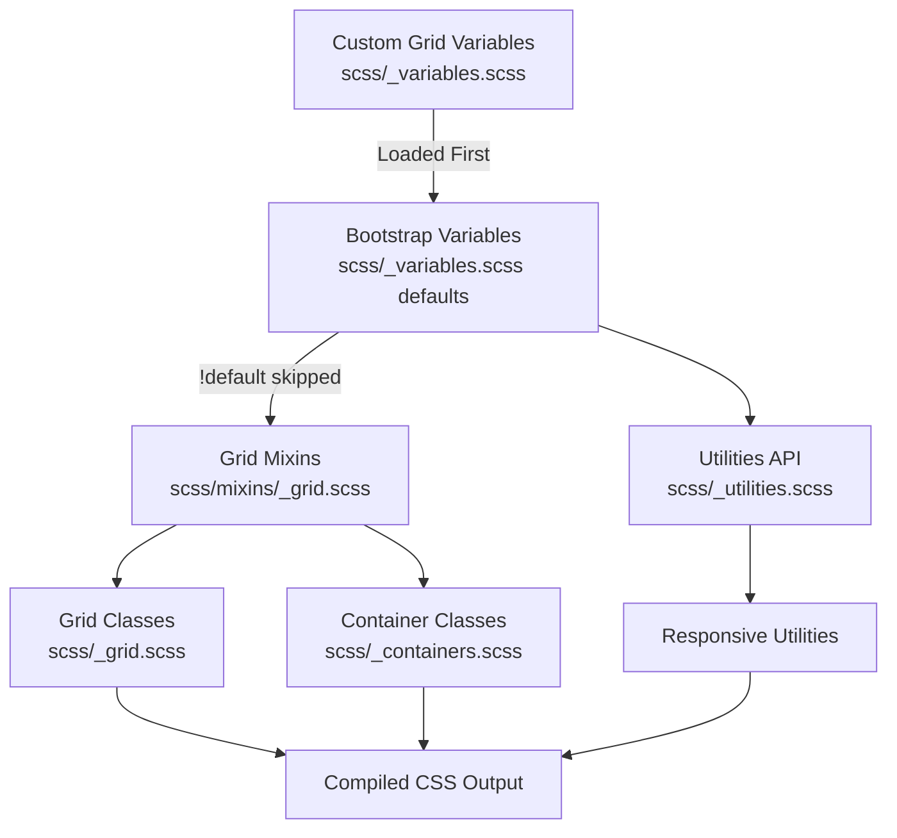

# Design Document: Update Theme Grid

## Overview

This design document describes how to update the Bootstrap theme's grid system to align with IBM's Carbon Design System 2x grid. The implementation follows Bootstrap's recommended customization approach by overriding Sass variables in `scss/_variables.scss` before Bootstrap processes them. No Bootstrap source files will be modified directly.

## Steering Document Alignment

### Technical Standards (tech.md)

This design strictly follows the **Variable-Only Customization** approach documented in tech.md:

1. **Variable overrides**: All grid changes are made by setting Sass variables before Bootstrap imports
2. **No source file modifications**: Bootstrap's grid-related files remain untouched
3. **Carbon reference comments**: Each variable override includes a comment referencing the Carbon specification

### Project Structure (structure.md)

Following structure.md conventions:

1. **Primary customization point**: `scss/_variables.scss` - all grid variable overrides go here
2. **Variable naming**: Uses Bootstrap's existing variable names
3. **No component file edits**: Per "What NOT to Do" section, we won't modify Bootstrap source files

## Prerequisites

None. Grid customization is a pure variable override that doesn't require any external dependencies.

## Code Reuse Analysis

### Existing Components to Leverage

- **`scss/_variables.scss`**: The existing variables file where all grid overrides will be added
  - Lines 595-602: `$grid-breakpoints` map
  - Lines 614-620: `$container-max-widths` map
  - Lines 630-632: `$grid-columns`, `$grid-gutter-width`, `$grid-row-columns`
  - Line 636: `$container-padding-x`
- **Bootstrap's `!default` pattern**: All Bootstrap variables use `!default`, so our overrides take precedence
- **Existing Carbon overrides**: Typography (lines 6-76) and Spacing (lines 78-115) sections already exist

### Integration Points

- **Grid system**: `scss/_grid.scss` uses these variables to generate the grid
- **Utilities API**: `scss/_utilities.scss` generates responsive utilities based on breakpoints
- **Container component**: Uses `$container-max-widths` and `$container-padding-x`
- **All responsive utilities**: Generated from `$grid-breakpoints` map

## Architecture

The grid customization flows through Bootstrap's existing architecture:



## Design Decisions

### Decision 1: Breakpoint Values

**Implementation**: Override `$grid-breakpoints` map with Carbon values mapped to Bootstrap names.

```scss
$grid-breakpoints: (
  xs: 0,
  sm: 320px,    // Carbon: sm
  md: 672px,    // Carbon: md
  lg: 1056px,   // Carbon: lg
  xl: 1312px,   // Carbon: xlg
  xxl: 1584px   // Carbon: max
);
```

**Rationale**:
- Maintains Bootstrap's 6-tier naming convention (xs through xxl)
- All responsive utilities automatically work at Carbon breakpoints
- No custom CSS or additional utilities needed

### Decision 2: Container Max-Widths

**Problem**: Bootstrap calculates container widths differently than Carbon. We need appropriate max-widths that work with Carbon breakpoints.

**Decision**: Calculate container max-widths as breakpoint minus gutter (32px), rounded to clean values.

```scss
$container-max-widths: (
  sm: 288px,    // 320px - 32px gutter
  md: 640px,    // 672px - 32px gutter
  lg: 1024px,   // 1056px - 32px gutter
  xl: 1280px,   // 1312px - 32px gutter
  xxl: 1584px   // Carbon max-width (no subtraction at max)
);
```

**Rationale**:
- Container width + gutter = breakpoint width (approximately)
- xxl uses full 1584px as Carbon specifies this as the max-width
- Clean, memorable values for developer experience

### Decision 3: Grid Columns

**Decision**: Set `$grid-columns: 16` globally.

**Rationale**:
- Matches Carbon's 16-column recommendation for modern layouts
- Provides more granular layout control (6.25% increments)
- Single variable change, fully supported by Bootstrap
- All column utilities (.col-1 through .col-16) auto-generated

### Decision 4: Grid Gutter Width

**Decision**: Set `$grid-gutter-width: 2rem` (32px) to match Carbon's wide mode.

**Rationale**:
- Carbon's wide mode (32px) is the default and most commonly used
- Aligns with Carbon's spacing scale (spacing-07 = 32px)
- Bootstrap's default is 1.5rem (24px), so this is a modest increase

### Decision 5: Container Padding

**Decision**: Set `$container-padding-x: $grid-gutter-width` (2rem/32px).

**Rationale**:
- Matches the grid gutter for visual consistency
- Carbon uses 32px padding at medium breakpoints (our most common use case)
- Bootstrap's default ties container padding to gutter width, maintaining this relationship

### Decision 6: Row Columns

**Decision**: Set `$grid-row-columns: 8` (increased from default 6).

**Rationale**:
- With 16 columns, allowing up to 8 items per row (.row-cols-8) is reasonable
- Maintains proportional relationship (half of total columns)
- Generates .row-cols-1 through .row-cols-8 utilities

## Components and Interfaces

### Component 1: Grid Breakpoints Override

- **Purpose**: Define responsive breakpoint values matching Carbon
- **Variable**: `$grid-breakpoints` Sass map
- **Dependencies**: None (base-level variable)
- **Impact**: All responsive utilities, media queries, and grid classes

### Component 2: Container Max-Widths Override

- **Purpose**: Define container widths for each breakpoint
- **Variable**: `$container-max-widths` Sass map
- **Dependencies**: `$grid-breakpoints` (breakpoint names must match)
- **Impact**: `.container` and `.container-{breakpoint}` classes

### Component 3: Grid Configuration Override

- **Purpose**: Configure column count, gutter width, and row columns
- **Variables**: `$grid-columns`, `$grid-gutter-width`, `$grid-row-columns`
- **Dependencies**: None
- **Impact**: All `.col-*`, `.row-cols-*`, `.g-*` (gutter) classes

### Component 4: Container Padding Override

- **Purpose**: Set container horizontal padding
- **Variable**: `$container-padding-x`
- **Dependencies**: `$grid-gutter-width` (should match)
- **Impact**: `.container` and `.container-fluid` padding

## Data Models

### Complete Variable Override

```scss
// ============================================================================
// Carbon Design System Grid Overrides
// ============================================================================
// These variables override Bootstrap's defaults to match IBM's Carbon Design System.
// They MUST appear BEFORE Bootstrap's default definitions to take effect.
// Reference: https://carbondesignsystem.com/elements/2x-grid/overview/
// ============================================================================

// stylelint-disable scss/dollar-variable-default

// -----------------------------------------------------------------------------
// Grid Breakpoints (Carbon 2x Grid)
// -----------------------------------------------------------------------------
$grid-breakpoints: (
  xs: 0,
  sm: 320px,    // Carbon: sm
  md: 672px,    // Carbon: md
  lg: 1056px,   // Carbon: lg
  xl: 1312px,   // Carbon: xlg
  xxl: 1584px   // Carbon: max
);

// -----------------------------------------------------------------------------
// Container Max-Widths
// -----------------------------------------------------------------------------
$container-max-widths: (
  sm: 288px,    // Carbon: sm - gutter
  md: 640px,    // Carbon: md - gutter
  lg: 1024px,   // Carbon: lg - gutter
  xl: 1280px,   // Carbon: xlg - gutter
  xxl: 1584px   // Carbon: max-width
);

// -----------------------------------------------------------------------------
// Grid Configuration
// -----------------------------------------------------------------------------
$grid-columns: 16;              // Carbon: 16-column grid
$grid-gutter-width: 2rem;       // Carbon: wide mode (32px)
$grid-row-columns: 8;           // Half of grid columns

// -----------------------------------------------------------------------------
// Container Padding
// -----------------------------------------------------------------------------
$container-padding-x: $grid-gutter-width; // Carbon: matches gutter

// stylelint-enable scss/dollar-variable-default
// ============================================================================
// End Carbon Grid Overrides
// ============================================================================
```

### Generated CSS Classes

The following classes will be generated with the new values:

**Column classes** (at each breakpoint):
- `.col-1` through `.col-16`
- `.col-sm-1` through `.col-sm-16`
- `.col-md-1` through `.col-md-16`
- `.col-lg-1` through `.col-lg-16`
- `.col-xl-1` through `.col-xl-16`
- `.col-xxl-1` through `.col-xxl-16`

**Offset classes** (at each breakpoint):
- `.offset-0` through `.offset-15`
- `.offset-sm-0` through `.offset-sm-15`
- (etc. for md, lg, xl, xxl)

**Row columns classes**:
- `.row-cols-1` through `.row-cols-8`
- `.row-cols-sm-1` through `.row-cols-sm-8`
- (etc. for md, lg, xl, xxl)

**Responsive utilities** (examples):
- `.d-none`, `.d-sm-block`, `.d-md-flex` (at Carbon breakpoints)
- `.flex-sm-row`, `.flex-lg-column` (at Carbon breakpoints)
- `.text-md-center`, `.text-xl-start` (at Carbon breakpoints)

### Breakpoint Comparison Table

| Bootstrap Name | Original Value | New Value (Carbon) | Change |
|----------------|----------------|-------------------|--------|
| xs | 0 | 0 | - |
| sm | 576px | 320px | -256px |
| md | 768px | 672px | -96px |
| lg | 992px | 1056px | +64px |
| xl | 1200px | 1312px | +112px |
| xxl | 1400px | 1584px | +184px |

## Error Handling

### Error Scenarios

1. **Breakpoint map syntax error**
   - **Handling**: Build will fail with Sass compilation error
   - **Prevention**: Follow exact Sass map syntax

2. **Breakpoints not ascending**
   - **Handling**: Bootstrap's `_assert-ascending` mixin will throw an error
   - **Prevention**: Ensure breakpoints are in ascending order

3. **Container max-width exceeds breakpoint**
   - **Handling**: Container may overflow at certain viewports
   - **Prevention**: Calculate max-widths appropriately

4. **Variable override not taking effect**
   - **Handling**: Grid uses Bootstrap defaults
   - **Prevention**: Ensure overrides appear BEFORE Bootstrap imports

## Testing Strategy

### Unit Testing

- **SCSS Compilation**: Verify build completes without errors using `npm run css`
- **Sass lint**: Run `npm run css-lint` to verify no style issues
- **Breakpoint assertions**: Bootstrap's built-in assertions verify ascending order

### Integration Testing

- **Column classes**: Verify `.col-1` through `.col-16` exist in output
- **Responsive utilities**: Test `.d-md-block` triggers at 672px (not 768px)
- **Container widths**: Verify `.container` max-widths at each breakpoint
- **Gutter width**: Verify `.g-*` classes use new gutter value

### End-to-End Testing

- **Visual inspection**: Review grid layouts in browser at each breakpoint
- **DevTools verification**: Check computed styles match expected values
- **Cross-browser**: Test in Chrome, Firefox, Safari, Edge

### Verification Checklist

After implementation, verify:
- [ ] `npm run css` builds without errors
- [ ] `npm run css-lint` passes
- [ ] CSS contains `.col-16` class (16 columns enabled)
- [ ] CSS contains `.col-md-*` classes triggering at 672px
- [ ] CSS contains `.container` with max-width 1584px at xxl
- [ ] Grid gutter is 32px (2rem)
- [ ] All responsive utilities respond at Carbon breakpoints
