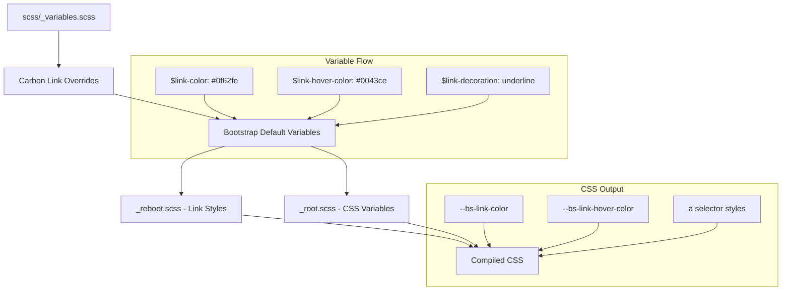

# Design Document: Update Theme Links

## Overview

This design document describes how to customize Bootstrap 5's link styling to match IBM's Carbon Design System. The implementation uses Bootstrap's variable override system for link colors and decoration. Since link colors are already partially defined in the codebase, this is primarily an enhancement to add visited/active state styling and ensure complete alignment with Carbon's link conventions.

## Steering Document Alignment

### Technical Standards (tech.md)

- **Variable Overrides**: Link variables set before Bootstrap imports them using `!default` pattern
- **No Source Modifications**: All changes through variables, no editing of `_reboot.scss` or other source files
- **Carbon Token References**: All values include comments referencing Carbon design tokens

### Project Structure (structure.md)

- **Primary File**: `scss/_variables.scss` for link variable overrides
- **Existing Pattern**: Follows the same approach used for colors, typography, and buttons
- **Comment Documentation**: Each variable includes Carbon reference

## Code Reuse Analysis

### Existing Components to Leverage

- **Carbon Color Overrides Pattern**: Lines 168-231 in `_variables.scss` demonstrate the override pattern
- **Existing Link Variables**: Lines 225-226 already define `$link-color` and `$link-hover-color`
- **Bootstrap Link Variables**: Lines 785-801 define all available link variables with `!default`

### Integration Points

- **Bootstrap Reboot**: `_reboot.scss` lines 244-252 apply link styling using variables
- **CSS Custom Properties**: `_root.scss` lines 82-90 expose link values as CSS variables
- **Component Usage**: Nav, buttons, cards, pagination all reference link variables

## Architecture



## Components and Interfaces

### Link Variables to Override

| Variable | Value | Bootstrap Default | Notes |
|----------|-------|-------------------|-------|
| `$link-color` | `$primary` | `$primary` | Use theme variable (currently `#0f62fe`) |
| `$link-hover-color` | `$info` | `shift-color($link-color, 20%)` | Use theme variable (currently `#0043ce`) |
| `$link-decoration` | `underline` | `underline` | Matches Bootstrap default |
| `$link-hover-decoration` | `underline` | `null` | Change to maintain underline on hover |
| `$link-shade-percentage` | `20%` | `20%` | Matches Bootstrap default |

### Icon Link Variables

| Variable | Carbon Value | Bootstrap Default | Notes |
|----------|--------------|-------------------|-------|
| `$icon-link-gap` | `.375rem` | `.375rem` | Matches Bootstrap default |
| `$icon-link-underline-offset` | `.25em` | `.25em` | Matches Bootstrap default |
| `$icon-link-icon-size` | `1em` | `1em` | Matches Bootstrap default |
| `$icon-link-icon-transition` | `.2s ease-in-out transform` | `.2s ease-in-out transform` | Matches Bootstrap default |
| `$icon-link-icon-transform` | `translate3d(.25em, 0, 0)` | `translate3d(.25em, 0, 0)` | Matches Bootstrap default |

### Generated CSS Custom Properties

The following CSS custom properties will be generated in `:root`:

```css
:root {
  --bs-link-color: #0f62fe;
  --bs-link-color-rgb: 15, 98, 254;
  --bs-link-decoration: underline;
  --bs-link-hover-color: #0043ce;
  --bs-link-hover-color-rgb: 0, 67, 206;
  --bs-link-hover-decoration: underline;
}
```

## Implementation Details

### Part 1: Update Link Variables in `_variables.scss`

The existing link color overrides at lines 225-226 need to be expanded. Update the Carbon Color Overrides section to reference Bootstrap's color variables:

```scss
// -----------------------------------------------------------------------------
// Link Colors
// -----------------------------------------------------------------------------
// Reference: https://carbondesignsystem.com/components/link/style
$link-color:            $primary; // Carbon: link-01 (Blue 60)
$link-hover-color:      $info;    // Carbon: hover-primary-text (Blue 70)
$link-decoration:       underline; // Carbon: links have underline
$link-hover-decoration: underline; // Carbon: maintain underline on hover
```

**Note**: Uses Bootstrap's theme color variables (`$primary`, `$info`) rather than hardcoded hex values. This ensures links automatically update if the theme palette changes.

### Visited and Active States

Bootstrap does not provide variables for visited (`:visited`) or active (`:active`) link states. These states are handled by browser defaults or require custom CSS.

**Design Decision**: Since Bootstrap doesn't expose visited/active variables and the steering documents prohibit source file modifications, visited/active styling will rely on:
1. Browser defaults for `:visited` (typically purple)
2. The existing `:hover` styling for visual feedback during `:active`

**Alternative Consideration**: If Carbon's visited state (`#161616`) is critical, a future enhancement could add a custom partial file specifically for link state overrides. This is noted as a future consideration, not part of this implementation.

## Error Handling

### Compilation Errors
- **Variable Not Found**: All variables use Bootstrap's existing names; no new variables introduced
- **Color Function Errors**: Using explicit hex values, not color functions

### Visual Regressions
- **Component Links**: Nav, buttons, cards all inherit from link variables automatically
- **Contrast Issues**: Carbon Blue 60 (`#0f62fe`) on white has 4.5:1 contrast ratio (WCAG AA compliant)

## Testing Strategy

### Visual Testing
1. Create `demo/carbon-links.html` to showcase all link states and variations
2. Compare with Carbon Design System documentation
3. Verify links in existing demo pages (buttons, borders) maintain proper styling

### Specific Test Cases

| Test | Expected Result | Requirement |
|------|-----------------|-------------|
| Default link color | `#0f62fe` | �1.1 |
| Hover link color | `#0043ce` | �1.2 |
| Default underline | `underline` present | �2.1 |
| Hover underline | `underline` maintained | �2.2 |
| Focus indicator | Visible outline | �3.1 |
| Icon link alignment | Icon properly aligned | �5.1 |

### Unit Testing
1. Build CSS with `npm run css` and verify compilation succeeds
2. Verify no SCSS linting errors with `npm run css-lint`
3. Inspect compiled CSS for correct link color values

### Integration Testing
1. Test links in all Bootstrap components (nav, cards, pagination, etc.)
2. Test links remain keyboard accessible
3. Test focus states are visible

## Appendix: Bootstrap Link Variable Locations

### Variables Definition (`_variables.scss` lines 785-801)
```scss
$link-color:                              $primary !default;
$link-decoration:                         underline !default;
$link-shade-percentage:                   20% !default;
$link-hover-color:                        shift-color($link-color, $link-shade-percentage) !default;
$link-hover-decoration:                   null !default;

$icon-link-gap:               .375rem !default;
$icon-link-underline-offset:  .25em !default;
$icon-link-icon-size:         1em !default;
$icon-link-icon-transition:   .2s ease-in-out transform !default;
$icon-link-icon-transform:    translate3d(.25em, 0, 0) !default;
```

### CSS Custom Properties (`_root.scss` lines 82-90)
```scss
--#{$prefix}link-color: #{$link-color};
--#{$prefix}link-color-rgb: #{to-rgb($link-color)};
--#{$prefix}link-decoration: #{$link-decoration};

--#{$prefix}link-hover-color: #{$link-hover-color};
--#{$prefix}link-hover-color-rgb: #{to-rgb($link-hover-color)};

@if $link-hover-decoration != null {
  --#{$prefix}link-hover-decoration: #{$link-hover-decoration};
}
```

### Link Styling (`_reboot.scss` lines 244-252)
```scss
a {
  color: rgba(var(--#{$prefix}link-color-rgb), var(--#{$prefix}link-opacity, 1));
  text-decoration: $link-decoration;

  &:hover {
    --#{$prefix}link-color-rgb: var(--#{$prefix}link-hover-color-rgb);
    text-decoration: $link-hover-decoration;
  }
}
```
