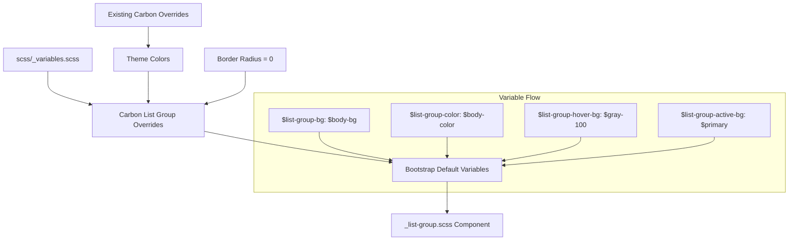

# Design Document: Update Theme List

## Overview

This design document describes how to customize Bootstrap 5's list styling to match IBM's Carbon Design System. The implementation primarily uses Bootstrap's variable override system for the List Group component. Basic HTML lists (`ol`, `ul`, `dl`) largely inherit from base typography and require minimal changes since Bootstrap's defaults align well with Carbon's approach.

## Steering Document Alignment

### Technical Standards (tech.md)

- **Variable Overrides**: List Group variables set before Bootstrap imports them using `!default` pattern
- **No Source Modifications**: All changes through variables, no editing of `_reboot.scss` or `_list-group.scss`
- **Carbon Token References**: All values include comments referencing Carbon design tokens

### Project Structure (structure.md)

- **Primary File**: `scss/_variables.scss` for List Group variable overrides
- **Existing Pattern**: Follows the same approach used for colors, typography, buttons, and borders
- **Comment Documentation**: Each variable includes Carbon reference

## Code Reuse Analysis

### Existing Components to Leverage

- **Carbon Color Overrides Pattern**: Lines 168-231 in `_variables.scss` demonstrate the override pattern
- **Carbon Button Overrides Pattern**: Lines 233-306 show component-specific overrides with `stylelint-disable`
- **Border Radius Overrides**: Lines 308-336 show how border-radius is set to 0 globally
- **Existing Theme Variables**: `$primary`, `$body-color`, `$body-bg`, `$border-color` already defined

### Integration Points

- **List Group Variables**: Lines 1917-1942 define all List Group variables with `!default`
- **Component Active Colors**: `$component-active-color` and `$component-active-bg` used for active states
- **Border Variables**: Global `$border-color` and `$border-radius` already set to Carbon values
- **Typography Variables**: Base typography already matches Carbon's body-long-02

## Architecture



## Components and Interfaces

### Basic Lists Analysis

Bootstrap's basic list styling in `_reboot.scss` uses hardcoded values:
- `padding-left: 2rem` for `ol` and `ul`
- `margin-bottom: 1rem` for lists
- `margin-bottom: 0` for nested lists

These defaults align well with Carbon's approach. No variable overrides are available for basic lists, and the values are appropriate. **No changes needed for basic HTML lists.**

### List Group Variables to Override

| Variable | Carbon Value | Bootstrap Default | Notes |
|----------|--------------|-------------------|-------|
| `$list-group-color` | `$body-color` | `var(--bs-body-color)` | Already matches via body-color |
| `$list-group-bg` | `$body-bg` | `var(--bs-body-bg)` | Already matches via body-bg |
| `$list-group-border-color` | `$gray-200` | `var(--bs-border-color)` | Use Carbon Gray 20 |
| `$list-group-border-width` | Default | `var(--bs-border-width)` | Keep Bootstrap default (1px) |
| `$list-group-border-radius` | `0` | `var(--bs-border-radius)` | Already 0 from border spec |
| `$list-group-item-padding-y` | `$spacer * .75` | `$spacer * .5` | Carbon spacing-04 (12px) |
| `$list-group-item-padding-x` | `$spacer` | `$spacer` | Matches (16px) |
| `$list-group-hover-bg` | `$gray-100` | `var(--bs-tertiary-bg)` | Carbon ui-01 (Gray 10) |
| `$list-group-active-color` | `$white` | `$component-active-color` | Keep white text on primary |
| `$list-group-active-bg` | `$primary` | `$component-active-bg` | Already uses primary |
| `$list-group-active-border-color` | `$primary` | `$list-group-active-bg` | Match active background |
| `$list-group-disabled-color` | `$gray-500` | `var(--bs-secondary-color)` | Carbon Gray 50 |
| `$list-group-disabled-bg` | `$body-bg` | `$list-group-bg` | Keep same as default bg |
| `$list-group-action-color` | `$body-color` | `var(--bs-secondary-color)` | Primary text color |
| `$list-group-action-hover-color` | `$body-color` | `var(--bs-emphasis-color)` | Keep primary text |
| `$list-group-action-active-color` | `$body-color` | `var(--bs-body-color)` | Matches |
| `$list-group-action-active-bg` | `$gray-200` | `var(--bs-secondary-bg)` | Carbon Gray 20 |

### Variables That Need Override

Based on analysis, only these variables need explicit override:

| Variable | Value | Reason |
|----------|-------|--------|
| `$list-group-item-padding-y` | `$spacer * .75` | Increase to 12px (Carbon spacing-04) |
| `$list-group-hover-bg` | `$gray-100` | Explicit Carbon Gray 10 |
| `$list-group-disabled-color` | `$gray-500` | Explicit Carbon Gray 50 |
| `$list-group-action-color` | `$body-color` | Use primary text instead of secondary |
| `$list-group-action-active-bg` | `$gray-200` | Explicit Carbon Gray 20 |

### Variables Already Correct

These variables already work correctly through existing Carbon overrides:
- `$list-group-color` - inherits from `$body-color`
- `$list-group-bg` - inherits from `$body-bg`
- `$list-group-border-color` - inherits from `$border-color`
- `$list-group-border-radius` - already 0 from border radius spec
- `$list-group-active-bg` - inherits from `$primary`
- `$list-group-active-color` - uses white (good contrast on primary)

## Implementation Details

### Add List Group Overrides in `_variables.scss`

Add after the Carbon Border Radius Overrides section (after line 336):

```scss
// ============================================================================
// Carbon List Group Overrides
// ============================================================================
// Reference: https://carbondesignsystem.com/components/list/style
// stylelint-disable scss/dollar-variable-default

// -----------------------------------------------------------------------------
// List Group Spacing
// -----------------------------------------------------------------------------
// Carbon uses spacing-04 (12px) for list item vertical padding
$list-group-item-padding-y: $spacer * .75; // Carbon: spacing-04 (12px)

// -----------------------------------------------------------------------------
// List Group Colors
// -----------------------------------------------------------------------------
// Action items use primary text color, not secondary
$list-group-action-color: $body-color; // Carbon: text-01

// -----------------------------------------------------------------------------
// List Group Interaction States
// -----------------------------------------------------------------------------
// Hover uses ui-01 (Gray 10), active uses Gray 20
$list-group-hover-bg:         $gray-100; // Carbon: ui-01 (Gray 10)
$list-group-action-active-bg: $gray-200; // Carbon: ui-02 (Gray 20)

// -----------------------------------------------------------------------------
// List Group Disabled State
// -----------------------------------------------------------------------------
$list-group-disabled-color: $gray-500; // Carbon: text-03 (Gray 50)

// stylelint-enable scss/dollar-variable-default
// ============================================================================
// End Carbon List Group Overrides
// ============================================================================
```

## Error Handling

### Compilation Errors
- **Variable Not Found**: All variables use Bootstrap's existing names; no new variables introduced
- **Circular References**: Using existing `$spacer`, `$body-color`, and gray scale variables

### Visual Regressions
- **Existing List Groups**: Will update automatically with new padding and colors
- **Active States**: Continue to use primary color for consistency
- **Disabled States**: Use explicit gray for better visibility

## Testing Strategy

### Visual Testing
1. Create `demo/carbon-lists.html` to showcase all list variations
2. Compare with Carbon Design System documentation
3. Verify List Group states (default, hover, active, disabled)
4. Test nested lists maintain proper indentation

### Specific Test Cases

| Test | Expected Result | Requirement |
|------|-----------------|-------------|
| List item text color | `#161616` (body-color) | §1.2 |
| List Group item padding | 12px vertical | §2.2 |
| List Group hover background | `#f4f4f4` (Gray 10) | §4.3 |
| List Group active background | `#0f62fe` (primary) | §4.4 |
| List Group disabled color | `#8d8d8d` (Gray 50) | §4.5 |
| List Group border radius | 0 | §5.3 |
| Definition term font-weight | Bold | §3.1 |

### Unit Testing
1. Build CSS with `npm run css` and verify compilation succeeds
2. Verify no SCSS linting errors with `npm run css-lint`
3. Inspect compiled CSS for correct List Group values

### Integration Testing
1. Test List Group in various contexts (cards, standalone)
2. Test actionable list items (links, buttons)
3. Test List Group with flush variant
4. Test keyboard navigation and focus states

## Appendix: Bootstrap List Group Variable Locations

### Variables Definition (`_variables.scss` lines 1917-1942)
```scss
$list-group-color:                  var(--#{$prefix}body-color) !default;
$list-group-bg:                     var(--#{$prefix}body-bg) !default;
$list-group-border-color:           var(--#{$prefix}border-color) !default;
$list-group-border-width:           var(--#{$prefix}border-width) !default;
$list-group-border-radius:          var(--#{$prefix}border-radius) !default;

$list-group-item-padding-y:         $spacer * .5 !default;
$list-group-item-padding-x:         $spacer !default;

$list-group-hover-bg:               var(--#{$prefix}tertiary-bg) !default;
$list-group-active-color:           $component-active-color !default;
$list-group-active-bg:              $component-active-bg !default;
$list-group-active-border-color:    $list-group-active-bg !default;

$list-group-disabled-color:         var(--#{$prefix}secondary-color) !default;
$list-group-disabled-bg:            $list-group-bg !default;

$list-group-action-color:           var(--#{$prefix}secondary-color) !default;
$list-group-action-hover-color:     var(--#{$prefix}emphasis-color) !default;

$list-group-action-active-color:    var(--#{$prefix}body-color) !default;
$list-group-action-active-bg:       var(--#{$prefix}secondary-bg) !default;
```

### Basic List Styling (`_reboot.scss` lines 160-176)
```scss
ol,
ul {
  padding-left: 2rem;
}

ol,
ul,
dl {
  margin-top: 0;
  margin-bottom: 1rem;
}

ol ol,
ul ul,
ol ul,
ul ol {
  margin-bottom: 0;
}
```
