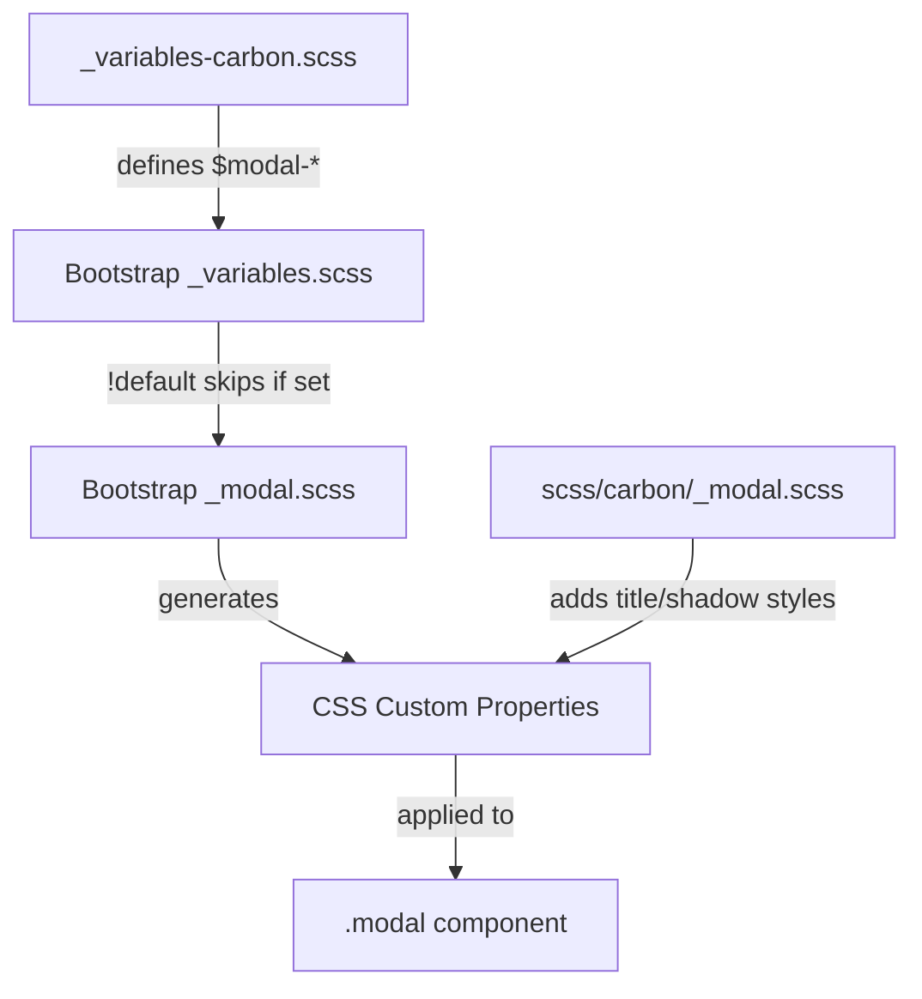

# Design Document

## Overview

This design specifies the implementation of Carbon Design System styling for Bootstrap's modal component (`.modal`). The modal is a dialog overlay that requires user interaction. This implementation uses primarily variable overrides, with minimal custom styles needed only for properties Bootstrap doesn't expose as variables (title font size/weight, box-shadow).

## Steering Document Alignment

### Technical Standards (tech.md)
- **Variable-Only Customization**: Use `$modal-*` variable overrides where possible
- **Custom Styles**: Required only for title typography and box-shadow enhancement
- **No Bootstrap Source Modifications**: All changes in `_variables-carbon.scss` and `scss/carbon/_modal.scss`

### Project Structure (structure.md)
- **Primary file**: `scss/_variables-carbon.scss` - Modal variable overrides
- **Secondary file**: `scss/carbon/_modal.scss` - Custom styles for title and shadow
- **Index update**: `scss/carbon/_index.scss` - Add import for modal custom styles

## Code Reuse Analysis

### Existing Components to Leverage
- **Bootstrap's `_modal.scss`**: Provides complete modal structure with CSS custom properties
- **Bootstrap's `_variables.scss`**: Defines `$modal-*` variables with `!default` flag
- **Existing Carbon variables**: Reference `$body-bg`, `$body-color`, `$gray-200`, `$gray-900` for color consistency
- **Existing popover/tooltip pattern**: Similar implementation approach in `_variables-carbon.scss`

### Integration Points
- **Variable cascade**: Our overrides ’ Bootstrap variables ’ CSS custom properties ’ Component styles
- **Existing color system**: Use theme-level variables for consistent colors

## Architecture

The implementation combines variable overrides with minimal custom styles:



## Components and Interfaces

### Variable Overrides

**File:** `scss/_variables-carbon.scss`

Add a new section for modal variables after the tooltip section:

```scss
// =============================================================================
// Carbon Modal Overrides
// =============================================================================
// Reference: https://carbondesignsystem.com/components/modal/style/
// =============================================================================

// stylelint-disable scss/dollar-variable-default

// -----------------------------------------------------------------------------
// Modal Container
// -----------------------------------------------------------------------------
$modal-inner-padding:               1rem;                 // Carbon: 16px spacing-05
$modal-content-color:               $body-color;          // Carbon: $text-primary
$modal-content-bg:                  $body-bg;             // Carbon: $layer (white)
$modal-content-border-color:        $gray-200;            // Carbon: $border-subtle
$modal-content-border-width:        1px;                  // Carbon: standard border
$modal-content-border-radius:       0;                    // Carbon: square corners
$modal-content-box-shadow-xs:       0 2px 6px rgba(0, 0, 0, .3);  // Carbon: drop shadow
$modal-content-box-shadow-sm-up:    0 2px 6px rgba(0, 0, 0, .3);  // Carbon: same shadow

// -----------------------------------------------------------------------------
// Modal Header
// -----------------------------------------------------------------------------
$modal-header-border-color:         $gray-200;            // Carbon: $border-subtle
$modal-header-border-width:         1px;                  // Carbon: standard border
$modal-header-padding-y:            1rem;                 // Carbon: 16px
$modal-header-padding-x:            1rem;                 // Carbon: 16px

// -----------------------------------------------------------------------------
// Modal Footer
// -----------------------------------------------------------------------------
$modal-footer-bg:                   $body-bg;             // Carbon: white background
$modal-footer-border-color:         $gray-200;            // Carbon: $border-subtle
$modal-footer-border-width:         1px;                  // Carbon: standard border

// -----------------------------------------------------------------------------
// Modal Backdrop
// -----------------------------------------------------------------------------
$modal-backdrop-bg:                 $gray-900;            // Carbon: Gray 100 (#161616)
$modal-backdrop-opacity:            .5;                   // Carbon: 50% opacity

// -----------------------------------------------------------------------------
// Modal Sizes
// -----------------------------------------------------------------------------
$modal-sm:                          448px;                // Carbon: small modal
$modal-md:                          576px;                // Carbon: default modal
$modal-lg:                          672px;                // Carbon: large modal
$modal-xl:                          896px;                // Carbon: extra-large modal

// stylelint-enable scss/dollar-variable-default
// =============================================================================
// End Carbon Modal Overrides
// =============================================================================
```

### Custom Styles

**File:** `scss/carbon/_modal.scss`

Custom styles are required for properties Bootstrap doesn't expose as variables:

```scss
// Carbon Modal Customizations
// Title typography not available via Bootstrap variables
// Reference: https://carbondesignsystem.com/components/modal/style/

// -----------------------------------------------------------------------------
// Modal Title Typography
// -----------------------------------------------------------------------------
.modal-title {
  font-size: 1.25rem;    // Carbon: 20px heading-03
  font-weight: 400;      // Carbon: regular weight
}

// -----------------------------------------------------------------------------
// Close Button Focus State
// -----------------------------------------------------------------------------
.modal-header .btn-close:focus-visible {
  outline: 2px solid $primary;  // Carbon: $focus (Blue 60)
  outline-offset: 1px;
}
```

### CSS Custom Properties (Expected Output)

The compiled CSS will include Bootstrap's generated custom properties with our overrides:

```css
.modal {
  --bs-modal-width: 576px;
  --bs-modal-padding: 1rem;
  --bs-modal-color: #161616;
  --bs-modal-bg: #fff;
  --bs-modal-border-color: #e0e0e0;
  --bs-modal-border-width: 1px;
  --bs-modal-border-radius: 0;
  --bs-modal-box-shadow: 0 2px 6px rgba(0, 0, 0, 0.3);
  --bs-modal-header-padding: 1rem 1rem;
  --bs-modal-header-border-color: #e0e0e0;
  --bs-modal-header-border-width: 1px;
  --bs-modal-footer-bg: #fff;
  --bs-modal-footer-border-color: #e0e0e0;
  --bs-modal-footer-border-width: 1px;
}

.modal-backdrop {
  --bs-backdrop-bg: #161616;
  --bs-backdrop-opacity: 0.5;
}

.modal-title {
  font-size: 1.25rem;
  font-weight: 400;
}
```

## Data Models

Not applicable - this is a CSS-only implementation with no data structures or JavaScript state management. Bootstrap's modal component handles all data management internally through its existing JavaScript plugin (`modal.js`), which remains unchanged by this styling update.

## Error Handling

### Build Errors
- **Missing variables**: If referenced variables (e.g., `$gray-200`, `$gray-900`) are undefined, Sass will error
- **Variable type mismatch**: Ensure color values are valid Sass colors

### Runtime Issues
- **CSS specificity**: Custom title styles may need verification to ensure they apply correctly
- **Focus state**: Verify close button focus is visible with the custom outline

## Testing Strategy

### Visual Testing
1. Create `demo/carbon-modal.html` with test cases:
   - Default modal with header, body, and footer
   - Modal without footer
   - Modal with long content (scrollable)
   - Small modal (`.modal-sm`)
   - Large modal (`.modal-lg`)
   - Extra-large modal (`.modal-xl`)
   - Centered modal (`.modal-dialog-centered`)
   - Static backdrop modal

2. Visual comparison checklist:
   - [ ] Container has white background
   - [ ] Container has square corners (no border-radius)
   - [ ] Container has subtle gray border (#e0e0e0)
   - [ ] Container has drop shadow
   - [ ] Backdrop is dark at 50% opacity
   - [ ] Header has 16px padding and bottom border
   - [ ] Title is 20px with regular weight
   - [ ] Body has 16px padding
   - [ ] Footer has 16px padding and top border
   - [ ] Close button shows blue focus outline
   - [ ] All size variants render at correct widths

### Build Testing
```bash
# Lint SCSS
npm run css-lint

# Build and verify no errors
npm run build-theme

# Check compiled CSS for modal styles
grep -A 20 "\.modal {" dist/css/bootstrap.css
```

### Regression Testing
- Ensure modals still open/close correctly with JavaScript
- Test keyboard navigation (Tab, Escape)
- Verify focus trap functionality
- Test static backdrop behavior
- Verify scrollable modal content works correctly
