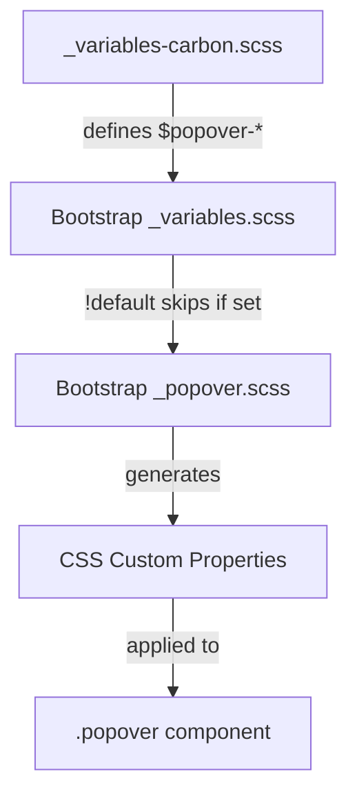

# Design Document

## Overview

This design specifies the implementation of Carbon Design System styling for Bootstrap's popover component. The popover is a contextual overlay used to display additional information or content when triggered. This implementation follows Bootstrap's variable-override approach, customizing the popover through Sass variables in `_variables-carbon.scss`.

## Steering Document Alignment

### Technical Standards (tech.md)
- **Variable-Only Customization**: All changes via `$popover-*` variable overrides
- **No Bootstrap Source Modifications**: Using `_variables-carbon.scss` which is imported before Bootstrap's `_variables.scss`
- **CSS Custom Properties**: Bootstrap's popover already uses CSS custom properties (`--bs-popover-*`), our variable overrides will flow through automatically

### Project Structure (structure.md)
- **Primary file**: `scss/_variables-carbon.scss` - Add popover variable overrides section
- **Secondary file**: `scss/carbon/_popover.scss` - Only if custom styles are needed beyond variables
- **Index update**: `scss/carbon/_index.scss` - Add import if custom styles file is created

## Code Reuse Analysis

### Existing Components to Leverage
- **Bootstrap's `_popover.scss`**: Provides full component structure with CSS custom properties
- **Bootstrap's `_variables.scss`**: Defines all `$popover-*` variables with `!default` flag
- **Existing Carbon variables**: Reference `$body-color`, `$body-bg`, `$gray-200`, `$gray-100` for color consistency

### Integration Points
- **Variable cascade**: Our overrides → Bootstrap variables → CSS custom properties → Component styles
- **Theme colors**: Uses existing Carbon color definitions from `_variables-carbon.scss`

## Architecture

The implementation follows Bootstrap's established pattern for component customization:



## Components and Interfaces

### Variable Overrides (Primary Implementation)

**File:** `scss/_variables-carbon.scss`

Add a new section for popover variables after the tooltip section (around line 597):

```scss
// =============================================================================
// Carbon Popover Overrides
// =============================================================================
// Reference: https://carbondesignsystem.com/components/popover/style/
// =============================================================================

// -----------------------------------------------------------------------------
// Container Styling
// -----------------------------------------------------------------------------
$popover-font-size:         .875rem;              // Carbon: 14px body text
$popover-bg:                $body-bg;             // Carbon: $layer (white)
$popover-border-width:      1px;                  // Carbon: subtle border
$popover-border-color:      $gray-200;            // Carbon: $border-subtle
$popover-border-radius:     2px;                  // Carbon: 2px standard radius
$popover-box-shadow:        0 2px 2px rgba(0, 0, 0, 0.2); // Carbon: drop shadow

// -----------------------------------------------------------------------------
// Header Styling
// -----------------------------------------------------------------------------
$popover-header-font-size:  1rem;                 // Carbon: 16px header
$popover-header-bg:         $body-bg;             // Carbon: same as body (no distinct header bg)
$popover-header-color:      $body-color;          // Carbon: $text-primary
$popover-header-padding-y:  .5rem;                // Carbon: 8px vertical
$popover-header-padding-x:  1rem;                 // Carbon: spacing-05 (16px)

// -----------------------------------------------------------------------------
// Body Styling
// -----------------------------------------------------------------------------
$popover-body-color:        $body-color;          // Carbon: $text-primary
$popover-body-padding-y:    1rem;                 // Carbon: spacing-05 (16px)
$popover-body-padding-x:    1rem;                 // Carbon: spacing-05 (16px)

// -----------------------------------------------------------------------------
// Size Constraints
// -----------------------------------------------------------------------------
$popover-max-width:         368px;                // Carbon: max-inline-size

// -----------------------------------------------------------------------------
// Arrow/Caret Styling
// -----------------------------------------------------------------------------
$popover-arrow-width:       .75rem;               // Carbon: 12px
$popover-arrow-height:      .375rem;              // Carbon: 6px
```

### CSS Custom Properties (Auto-generated)

Bootstrap's `_popover.scss` automatically generates these CSS custom properties from our variable overrides:

```css
.popover {
  --bs-popover-max-width: 368px;
  --bs-popover-font-size: 0.875rem;
  --bs-popover-bg: #fff;
  --bs-popover-border-width: 1px;
  --bs-popover-border-color: #e0e0e0;
  --bs-popover-border-radius: 2px;
  --bs-popover-box-shadow: 0 2px 2px rgba(0, 0, 0, 0.2);
  --bs-popover-header-padding-x: 1rem;
  --bs-popover-header-padding-y: 0.5rem;
  --bs-popover-header-font-size: 1rem;
  --bs-popover-header-color: #161616;
  --bs-popover-header-bg: #fff;
  --bs-popover-body-padding-x: 1rem;
  --bs-popover-body-padding-y: 1rem;
  --bs-popover-body-color: #161616;
  --bs-popover-arrow-width: 0.75rem;
  --bs-popover-arrow-height: 0.375rem;
  /* ... */
}
```

### Custom Styles (If Needed)

**File:** `scss/carbon/_popover.scss`

Only create if variable overrides are insufficient. Potential use cases:
- Custom focus styling on popover triggers
- Animation timing adjustments
- High-contrast variant

```scss
// Carbon Popover Customizations
// Only add styles not achievable via variable overrides
// Reference: https://carbondesignsystem.com/components/popover/style/

// Example: If header border needs specific styling
.popover-header {
  border-bottom-color: var(--bs-popover-border-color);
}
```

## Data Models

Not applicable - this is a CSS-only implementation with no data structures.

## Error Handling

### Build Errors
- **Missing variables**: If a referenced variable (e.g., `$body-bg`) is undefined, Sass will error. Ensure `_variables-carbon.scss` is imported after `_functions.scss`.
- **Invalid values**: Sass will error if invalid CSS values are provided. Use standard CSS units (rem, px, %).

### Runtime Issues
- **CSS custom properties undefined**: If Bootstrap's popover component changes in future versions, our overrides may not apply. Monitor Bootstrap changelog on updates.

## Testing Strategy

### Visual Testing
1. Create `demo/carbon-popover.html` with test cases:
   - Basic popover (body only)
   - Popover with header and body
   - All placement directions (top, bottom, left, right)
   - Popover with long content (test max-width constraint)

2. Visual comparison checklist:
   - [ ] Background color matches Carbon `$layer` (white)
   - [ ] Border is subtle gray (`#e0e0e0`)
   - [ ] Border radius is 2px (nearly square)
   - [ ] Shadow is subtle (`0 2px 2px rgba(0,0,0,0.2)`)
   - [ ] Arrow size is 12px × 6px
   - [ ] Header/body padding is 16px
   - [ ] Font sizes are 14px body, 16px header
   - [ ] Max-width constrains at 368px

### Build Testing
```bash
# Lint SCSS
npm run css-lint

# Build and verify no errors
npm run build-theme

# Check compiled CSS for expected values
grep -A 20 "^\.popover {" dist/css/bootstrap.css
```

### Regression Testing
- Ensure existing Bootstrap popover JavaScript functionality works unchanged
- Test dismiss on click outside, ESC key, programmatic hide/show
