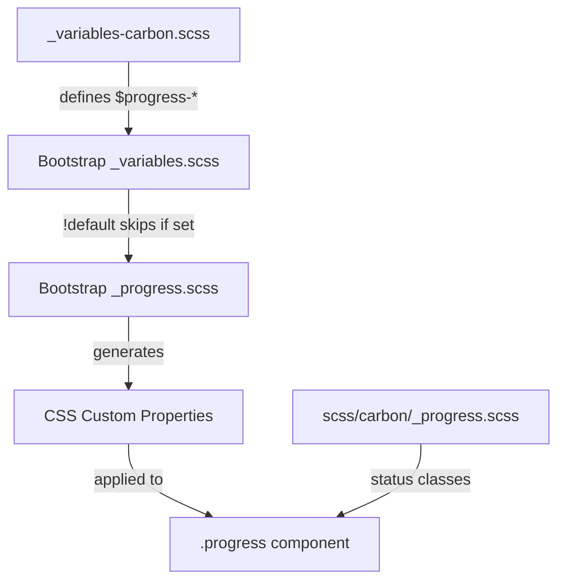

# Design Document

## Overview

This design specifies the implementation of Carbon Design System styling for Bootstrap's progress bar component. The progress bar visually indicates the status of an ongoing process. This implementation follows Bootstrap's variable-override approach, customizing the progress bar through Sass variables in `_variables-carbon.scss`, with additional custom styles for status states in `scss/carbon/_progress.scss`.

## Steering Document Alignment

### Technical Standards (tech.md)
- **Variable-Only Customization**: Primary changes via `$progress-*` variable overrides
- **No Bootstrap Source Modifications**: Using `_variables-carbon.scss` imported before Bootstrap's `_variables.scss`
- **CSS Custom Properties**: Bootstrap's progress bar uses CSS custom properties (`--bs-progress-*`), our variable overrides will flow through automatically

### Project Structure (structure.md)
- **Primary file**: `scss/_variables-carbon.scss` - Add progress bar variable overrides section
- **Secondary file**: `scss/carbon/_progress.scss` - Custom styles for status states (success/error)
- **Index update**: `scss/carbon/_index.scss` - Add import for progress custom styles

## Code Reuse Analysis

### Existing Components to Leverage
- **Bootstrap's `_progress.scss`**: Provides full component structure with CSS custom properties
- **Bootstrap's `_variables.scss`**: Defines all `$progress-*` variables with `!default` flag
- **Existing Carbon variables**: Reference `$primary`, `$success`, `$danger`, `$gray-100` for color consistency

### Integration Points
- **Variable cascade**: Our overrides → Bootstrap variables → CSS custom properties → Component styles
- **Theme colors**: Uses existing Carbon color definitions from `_variables-carbon.scss`

## Architecture

The implementation follows Bootstrap's established pattern for component customization:



## Components and Interfaces

### Variable Overrides (Primary Implementation)

**File:** `scss/_variables-carbon.scss`

Add a new section for progress bar variables after the popover section:

```scss
// =============================================================================
// Carbon Progress Bar Overrides
// =============================================================================
// Reference: https://carbondesignsystem.com/components/progress-bar/style/
// =============================================================================

// stylelint-disable scss/dollar-variable-default

// -----------------------------------------------------------------------------
// Progress Track
// -----------------------------------------------------------------------------
$progress-height:           .5rem;                // Carbon: 8px default
$progress-bg:               $gray-100;            // Carbon: $layer (Gray 10)
$progress-border-radius:    0;                    // Carbon: square corners
$progress-box-shadow:       none;                 // Carbon: flat design

// -----------------------------------------------------------------------------
// Progress Bar (Indicator)
// -----------------------------------------------------------------------------
$progress-bar-color:        $white;               // Carbon: text on bar
$progress-bar-bg:           $primary;             // Carbon: $interactive (Blue 60)
$progress-bar-transition:   width .4s ease;       // Carbon: smooth transition

// -----------------------------------------------------------------------------
// Progress Font
// -----------------------------------------------------------------------------
$progress-font-size:        .75rem;               // Carbon: 12px for labels

// stylelint-enable scss/dollar-variable-default
// =============================================================================
// End Carbon Progress Bar Overrides
// =============================================================================
```

### Custom Styles (Status States)

**File:** `scss/carbon/_progress.scss`

Create custom styles for status states and small variant:

```scss
// Carbon Progress Bar Customizations
// Status states and size variants not achievable via variable overrides
// Reference: https://carbondesignsystem.com/components/progress-bar/style/

// -----------------------------------------------------------------------------
// Small Variant (4px height)
// -----------------------------------------------------------------------------
.progress-sm {
  --#{$prefix}progress-height: .25rem;  // Carbon: 4px small
}

// -----------------------------------------------------------------------------
// Status States
// -----------------------------------------------------------------------------

// Success state
.progress-success .progress-bar,
.progress-bar-success {
  --#{$prefix}progress-bar-bg: #{$success};  // Carbon: $support-success
}

// Error state
.progress-error .progress-bar,
.progress-bar-error {
  --#{$prefix}progress-bar-bg: #{$danger};   // Carbon: $support-error
}
```

### CSS Custom Properties (Auto-generated)

Bootstrap's `_progress.scss` automatically generates these CSS custom properties from our variable overrides:

```css
.progress,
.progress-stacked {
  --bs-progress-height: 0.5rem;
  --bs-progress-font-size: 0.75rem;
  --bs-progress-bg: #f4f4f4;
  --bs-progress-border-radius: 0;
  --bs-progress-box-shadow: none;
  --bs-progress-bar-color: #fff;
  --bs-progress-bar-bg: #0f62fe;
  --bs-progress-bar-transition: width 0.4s ease;
}
```

## Data Models

Not applicable - this is a CSS-only implementation with no data structures.

## Error Handling

### Build Errors
- **Missing variables**: If a referenced variable (e.g., `$gray-100`) is undefined, Sass will error. Ensure `_variables-carbon.scss` is imported after `_functions.scss`.
- **Invalid values**: Sass will error if invalid CSS values are provided. Use standard CSS units (rem, px).

### Runtime Issues
- **CSS custom properties undefined**: If Bootstrap's progress component changes in future versions, our overrides may not apply. Monitor Bootstrap changelog on updates.

## Testing Strategy

### Visual Testing
1. Create `demo/carbon-progress-bar.html` with test cases:
   - Default progress bar (various percentages: 0%, 25%, 50%, 75%, 100%)
   - Small variant progress bar
   - Success status progress bar
   - Error status progress bar
   - Progress bar with label text
   - Stacked progress bars

2. Visual comparison checklist:
   - [ ] Track background is gray (`#f4f4f4`)
   - [ ] Track has square corners (no border radius)
   - [ ] Track has no shadow (flat design)
   - [ ] Default height is 8px (0.5rem)
   - [ ] Small variant height is 4px (0.25rem)
   - [ ] Bar color is blue (`#0f62fe`)
   - [ ] Success bar color is green (`#24a148`)
   - [ ] Error bar color is red (`#da1e28`)
   - [ ] Transitions are smooth

### Build Testing
```bash
# Lint SCSS
npm run css-lint

# Build and verify no errors
npm run build-theme

# Check compiled CSS for expected values
grep -A 15 "^\.progress," dist/css/bootstrap.css
```

### Regression Testing
- Ensure existing Bootstrap progress bar JavaScript functionality works unchanged
- Test striped and animated variants still function (though Carbon styling is flat)
- Test stacked progress bars
