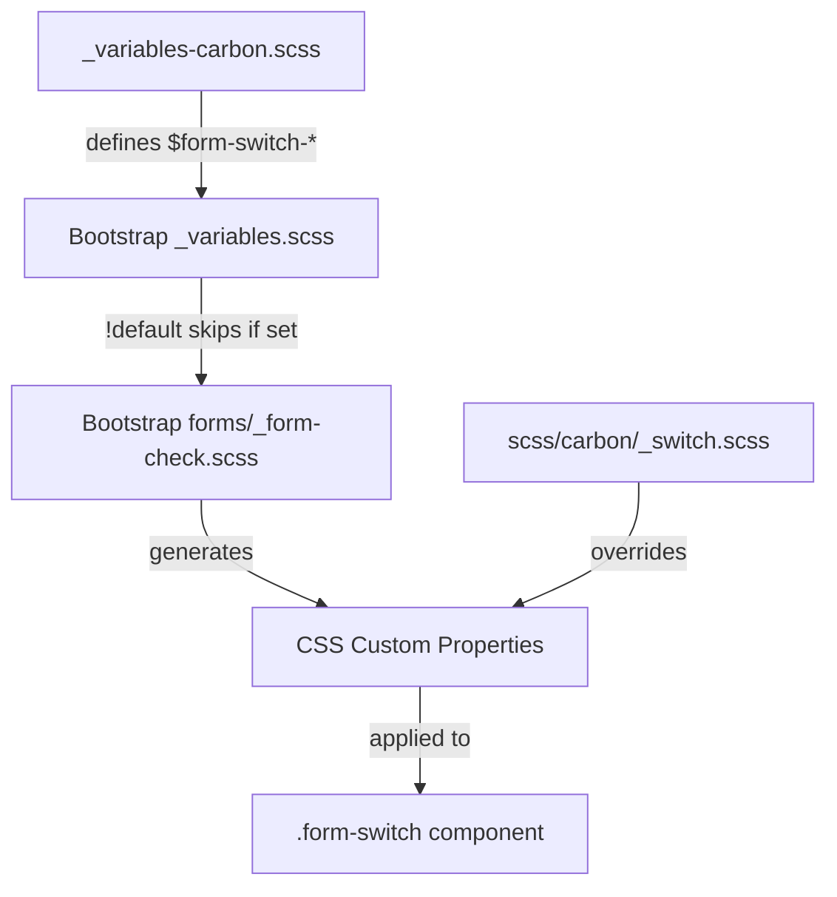

# Design Document

## Overview

This design specifies the implementation of Carbon Design System styling for Bootstrap's switch component (`.form-switch`). The switch is a binary toggle control. This implementation requires both variable overrides and custom styles because Bootstrap's switch architecture uses SVG data URIs for the handle, and Carbon's toggle has specific fixed dimensions rather than em-based sizing.

## Steering Document Alignment

### Technical Standards (tech.md)
- **Variable-Only Customization**: Use `$form-switch-*` variable overrides where possible
- **Custom Styles**: Required for fixed pixel dimensions, handle positioning, and small variant
- **No Bootstrap Source Modifications**: All changes in `_variables-carbon.scss` and `scss/carbon/_switch.scss`

### Project Structure (structure.md)
- **Primary file**: `scss/_variables-carbon.scss` - Switch variable overrides
- **Secondary file**: `scss/carbon/_switch.scss` - Custom styles for Carbon-specific styling
- **Index update**: `scss/carbon/_index.scss` - Add import for switch custom styles

## Code Reuse Analysis

### Existing Components to Leverage
- **Bootstrap's `forms/_form-check.scss`**: Provides base switch structure with CSS custom properties
- **Bootstrap's `_variables.scss`**: Defines `$form-switch-*` variables with `!default` flag
- **Existing Carbon variables**: Reference `$primary`, `$success`, `$gray-*` for color consistency

### Integration Points
- **Variable cascade**: Our overrides → Bootstrap variables → CSS custom properties → Component styles
- **Existing focus pattern**: Use same focus outline approach as other Carbon components

## Architecture

The implementation combines variable overrides with custom styles:



## Components and Interfaces

### Variable Overrides

**File:** `scss/_variables-carbon.scss`

Add a new section for switch variables after the progress bar section:

```scss
// =============================================================================
// Carbon Switch/Toggle Overrides
// =============================================================================
// Reference: https://carbondesignsystem.com/components/toggle/style/
// =============================================================================

// stylelint-disable scss/dollar-variable-default

// -----------------------------------------------------------------------------
// Switch Track
// -----------------------------------------------------------------------------
$form-switch-width:           3rem;                 // Carbon: 48px
$form-switch-padding-start:   $form-switch-width + .5em;
$form-switch-border-radius:   .75rem;               // Carbon: 12px pill shape
$form-switch-transition:      background-position .15s ease-in-out, background-color .15s ease-in-out;

// -----------------------------------------------------------------------------
// Switch Handle Colors (SVG circle)
// -----------------------------------------------------------------------------
// OFF state: gray track, white handle
$form-switch-color:           $white;               // Carbon: white handle
$form-switch-bg-image:        url("data:image/svg+xml,<svg xmlns='http://www.w3.org/2000/svg' viewBox='-4 -4 8 8'><circle r='3' fill='#{$form-switch-color}'/></svg>");

// Focus state: same white handle
$form-switch-focus-color:     $white;
$form-switch-focus-bg-image:  url("data:image/svg+xml,<svg xmlns='http://www.w3.org/2000/svg' viewBox='-4 -4 8 8'><circle r='3' fill='#{$form-switch-focus-color}'/></svg>");

// Checked state: white handle on green track
$form-switch-checked-color:   $white;
$form-switch-checked-bg-image: url("data:image/svg+xml,<svg xmlns='http://www.w3.org/2000/svg' viewBox='-4 -4 8 8'><circle r='3' fill='#{$form-switch-checked-color}'/></svg>");

// stylelint-enable scss/dollar-variable-default
// =============================================================================
// End Carbon Switch/Toggle Overrides
// =============================================================================
```

### Custom Styles

**File:** `scss/carbon/_switch.scss`

Custom styles are required because:
1. Bootstrap's switch height is em-based; Carbon uses fixed 24px
2. Track colors need specific Carbon values
3. Handle needs 18px diameter with specific positioning
4. Small variant needs different dimensions
5. Disabled state needs specific colors (not opacity)

```scss
// Carbon Switch/Toggle Customizations
// Fixed dimensions and Carbon-specific styling
// Reference: https://carbondesignsystem.com/components/toggle/style/

// -----------------------------------------------------------------------------
// Track Overrides
// -----------------------------------------------------------------------------
.form-switch .form-check-input {
  // Fixed dimensions (Carbon: 48px × 24px)
  width: 3rem;              // 48px
  height: 1.5rem;           // 24px

  // OFF state track color
  background-color: $gray-500;  // Carbon: $toggle-off (#8d8d8d)
  border: 0;

  // Handle sizing via background-size
  // SVG viewBox is 8×8, we want 18px handle
  background-size: 1.125rem;  // 18px handle

  // Handle position: 3px from left edge
  background-position: left 3px center;

  &:focus {
    background-color: $gray-500;
    box-shadow: none;
  }

  &:focus-visible {
    outline: 2px solid $primary;  // Carbon: $focus (Blue 60)
    outline-offset: 1px;
  }

  // ON state
  &:checked {
    background-color: $success;  // Carbon: $support-success (#24a148)
    // Handle translates 24px to the right (48px - 18px - 3px - 3px = 24px)
    background-position: right 3px center;
  }

  &:checked:focus {
    background-color: $success;
  }

  // Disabled state
  &:disabled {
    background-color: $gray-300;  // Carbon: disabled track
    opacity: 1;  // Override Bootstrap's opacity

    // Dimmed handle for disabled
    --#{$prefix}form-switch-bg: url("data:image/svg+xml,<svg xmlns='http://www.w3.org/2000/svg' viewBox='-4 -4 8 8'><circle r='3' fill='%238d8d8d'/></svg>");
  }

  &:disabled:checked {
    background-color: $gray-300;
  }
}

// Disabled label styling
.form-switch .form-check-input:disabled ~ .form-check-label {
  color: $gray-300;  // Carbon: $text-disabled
  opacity: 1;
}

// -----------------------------------------------------------------------------
// Small Variant
// -----------------------------------------------------------------------------
.form-switch-sm .form-check-input {
  // Small dimensions (Carbon: 32px × 16px)
  width: 2rem;              // 32px
  height: 1rem;             // 16px

  // Smaller handle: 10px
  background-size: .625rem;  // 10px handle

  // Handle position: 3px from edge
  background-position: left 3px center;

  &:checked {
    // Handle translates 16px (32px - 10px - 3px - 3px = 16px)
    background-position: right 3px center;
  }
}

.form-switch-sm {
  // Adjust padding for smaller switch
  padding-left: 2.5rem;  // 32px + 8px gap
}
```

### CSS Custom Properties (Expected Output)

The compiled CSS will include Bootstrap's generated custom properties with our overrides:

```css
.form-switch .form-check-input {
  --bs-form-switch-bg: url("data:image/svg+xml,...");
  width: 3rem;
  height: 1.5rem;
  background-color: #8d8d8d;
  border: 0;
  background-size: 1.125rem;
  background-position: left 3px center;
  border-radius: 0.75rem;
}

.form-switch .form-check-input:checked {
  background-color: #24a148;
  background-position: right 3px center;
}
```

## Data Models

Not applicable - this is a CSS-only implementation with no data structures.

## Error Handling

### Build Errors
- **Missing variables**: If referenced variables (e.g., `$gray-500`, `$success`) are undefined, Sass will error
- **SVG encoding**: URL-encoded SVG must use proper escaping (`%23` for `#`)

### Runtime Issues
- **CSS specificity**: Custom styles may need increased specificity to override Bootstrap defaults

## Testing Strategy

### Visual Testing
1. Create `demo/carbon-switch.html` with test cases:
   - Default switch (OFF state)
   - Default switch (ON state)
   - Small switch variant (OFF and ON)
   - Disabled switch (OFF state)
   - Disabled switch (ON state)
   - Switch with label text
   - Focus state demonstration

2. Visual comparison checklist:
   - [ ] Track is 48px × 24px (default) or 32px × 16px (small)
   - [ ] Track has pill shape (12px border-radius)
   - [ ] OFF track is gray (#8d8d8d)
   - [ ] ON track is green (#24a148)
   - [ ] Handle is white circle, 18px (default) or 10px (small)
   - [ ] Handle is 3px from track edge
   - [ ] Handle animates smoothly when toggled
   - [ ] Focus shows 2px blue outline with 1px offset
   - [ ] Disabled track is light gray (#c6c6c6)
   - [ ] Disabled handle is dimmed gray

### Build Testing
```bash
# Lint SCSS
npm run css-lint

# Build and verify no errors
npm run build-theme

# Check compiled CSS for switch styles
grep -A 30 "\.form-switch" dist/css/bootstrap.css
```

### Regression Testing
- Ensure switch still functions with keyboard (Space to toggle)
- Test with screen readers for proper state announcements
- Verify RTL layout reverses handle position correctly
