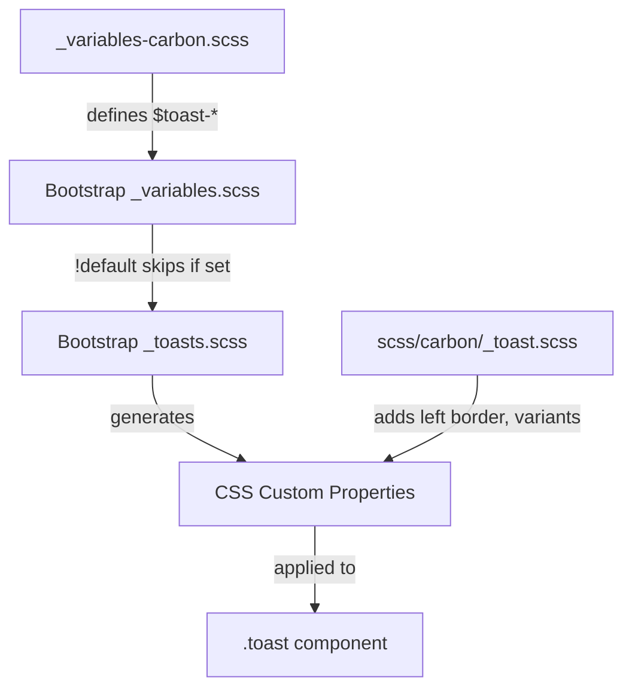

# Design Document

## Overview

This design specifies the implementation of Carbon Design System styling for Bootstrap's toast component. Toasts are ephemeral notification messages that share styling with Carbon's inline notifications. The implementation uses variable overrides for container styling, with custom styles needed for the left accent border (status indicator) and variant classes that Bootstrap doesn't provide by default.

## Steering Document Alignment

### Technical Standards (tech.md)
- **Variable-Only Customization**: Use `$toast-*` variable overrides where possible
- **Custom Styles**: Required for left accent border and toast variants (`.toast-success`, `.toast-warning`, etc.)
- **No Bootstrap Source Modifications**: All changes in `_variables-carbon.scss` and `scss/carbon/_toast.scss`

### Project Structure (structure.md)
- **Primary file**: `scss/_variables-carbon.scss` - Toast variable overrides
- **Secondary file**: `scss/carbon/_toast.scss` - Custom styles for left border and variants
- **Index update**: `scss/carbon/_index.scss` - Add import for toast custom styles

## Code Reuse Analysis

### Existing Components to Leverage
- **Bootstrap's `_toasts.scss`**: Provides complete toast structure with CSS custom properties
- **Bootstrap's `_variables.scss`**: Defines `$toast-*` variables with `!default` flag
- **Existing Carbon variables**: Reference `$body-bg`, `$body-color`, `$gray-*`, `$primary`, `$success`, `$warning`, `$danger`, `$info`
- **Existing alert pattern**: `scss/carbon/_alert.scss` uses same left-border approach for Carbon notifications

### Integration Points
- **Variable cascade**: Our overrides → Bootstrap variables → CSS custom properties → Component styles
- **Existing color system**: Use theme-level variables for consistent colors
- **Alert pattern**: Reuse left-border notification approach from alerts

## Architecture

The implementation combines variable overrides with custom styles for left border and variants:



## Components and Interfaces

### Variable Overrides

**File:** `scss/_variables-carbon.scss`

Add a new section for toast variables after the form section:

```scss
// =============================================================================
// Carbon Toast Overrides
// =============================================================================
// Reference: https://carbondesignsystem.com/components/notification/style/
// =============================================================================

// stylelint-disable scss/dollar-variable-default

// -----------------------------------------------------------------------------
// Toast Container
// -----------------------------------------------------------------------------
$toast-max-width:                 350px;                // Carbon: standard width
$toast-padding-x:                 .75rem;               // Carbon: 12px horizontal
$toast-padding-y:                 .75rem;               // Carbon: 12px vertical
$toast-font-size:                 .875rem;              // Carbon: 14px body text
$toast-color:                     $body-color;          // Carbon: $text-primary (#161616)
$toast-background-color:          $body-bg;             // Carbon: white (no transparency)
$toast-border-width:              1px;                  // Carbon: standard border
$toast-border-color:              $gray-200;            // Carbon: $border-subtle (#e0e0e0)
$toast-border-radius:             0;                    // Carbon: square corners
$toast-box-shadow:                0 2px 6px rgba(0, 0, 0, .3); // Carbon: drop shadow

// -----------------------------------------------------------------------------
// Toast Header
// -----------------------------------------------------------------------------
$toast-header-color:              $body-color;          // Carbon: $text-primary (#161616)
$toast-header-background-color:   $body-bg;             // Carbon: white
$toast-header-border-color:       $gray-200;            // Carbon: $border-subtle (#e0e0e0)

// stylelint-enable scss/dollar-variable-default
// =============================================================================
// End Carbon Toast Overrides
// =============================================================================
```

### Custom Styles

**File:** `scss/carbon/_toast.scss`

Custom styles are required for the left accent border and variant classes:

```scss
// Carbon Toast Customizations
// Left accent border and variant classes for notification status
// Reference: https://carbondesignsystem.com/components/notification/style/

// -----------------------------------------------------------------------------
// Base Toast - Left Accent Border
// -----------------------------------------------------------------------------
.toast {
  border-left-width: 3px;
  border-left-color: $primary;  // Carbon: Blue 60 (default)
}

// -----------------------------------------------------------------------------
// Toast Variants (Status Colors)
// -----------------------------------------------------------------------------
.toast-success {
  border-left-color: $success;  // Carbon: Green 50 (#24a148)
}

.toast-warning {
  border-left-color: $warning;  // Carbon: Yellow 30 (#f1c21b)
}

.toast-danger {
  border-left-color: $danger;   // Carbon: Red 60 (#da1e28)
}

.toast-info {
  border-left-color: $info;     // Carbon: Blue 70 (#0043ce)
}

// -----------------------------------------------------------------------------
// Toast Header Timestamp Color
// -----------------------------------------------------------------------------
.toast-header .text-body-secondary {
  color: $gray-700 !important;  // Carbon: $text-secondary (#525252)
}

// -----------------------------------------------------------------------------
// Close Button Focus State
// -----------------------------------------------------------------------------
.toast-header .btn-close:focus {
  outline: 2px solid $primary;  // Carbon: $focus (Blue 60)
  outline-offset: -2px;
  box-shadow: none;
}
```

### CSS Custom Properties (Expected Output)

The compiled CSS will include Bootstrap's generated custom properties with our overrides:

```css
.toast {
  --bs-toast-zindex: 1090;
  --bs-toast-padding-x: 0.75rem;
  --bs-toast-padding-y: 0.75rem;
  --bs-toast-spacing: 2rem;
  --bs-toast-max-width: 350px;
  --bs-toast-font-size: 0.875rem;
  --bs-toast-color: #161616;
  --bs-toast-bg: #fff;
  --bs-toast-border-width: 1px;
  --bs-toast-border-color: #e0e0e0;
  --bs-toast-border-radius: 0;
  --bs-toast-box-shadow: 0 2px 6px rgba(0, 0, 0, 0.3);
  --bs-toast-header-color: #161616;
  --bs-toast-header-bg: #fff;
  --bs-toast-header-border-color: #e0e0e0;
  border-left-width: 3px;
  border-left-color: #0f62fe;
}

.toast-success {
  border-left-color: #24a148;
}

.toast-warning {
  border-left-color: #f1c21b;
}

.toast-danger {
  border-left-color: #da1e28;
}

.toast-info {
  border-left-color: #0043ce;
}
```

## Data Models

Not applicable - this is a CSS-only implementation with no data structures or JavaScript state management. Bootstrap's toast component handles all data management internally through its existing JavaScript plugin (`toast.js`), which remains unchanged by this styling update.

## Error Handling

### Build Errors
- **Missing variables**: If referenced variables (e.g., `$gray-200`, `$primary`) are undefined, Sass will error
- **Variable type mismatch**: Ensure color values are valid Sass colors

### Runtime Issues
- **CSS specificity**: Custom left-border styles should work without issues
- **Variant classes**: Verify variant classes apply correctly alongside base `.toast` class

## Testing Strategy

### Visual Testing
1. Create `demo/carbon-toast.html` with test cases:
   - Default toast with header, body, and close button
   - Success toast (`.toast-success`)
   - Warning toast (`.toast-warning`)
   - Danger toast (`.toast-danger`)
   - Info toast (`.toast-info`)
   - Toast with timestamp
   - Stacked toasts in toast container
   - Toast with autohide disabled

2. Visual comparison checklist:
   - [ ] Toast has white background (no transparency)
   - [ ] Toast has square corners (no border-radius)
   - [ ] Toast has subtle gray border (#e0e0e0)
   - [ ] Toast has drop shadow
   - [ ] Toast has 3px left accent border
   - [ ] Default toast has blue left border (#0f62fe)
   - [ ] Success toast has green left border (#24a148)
   - [ ] Warning toast has yellow left border (#f1c21b)
   - [ ] Danger toast has red left border (#da1e28)
   - [ ] Info toast has blue-70 left border (#0043ce)
   - [ ] Toast text is dark (#161616)
   - [ ] Timestamp text is gray (#525252)
   - [ ] Close button shows blue focus outline
   - [ ] Body font size is 14px

### Build Testing
```bash
# Lint SCSS
npm run css-lint

# Build and verify no errors
npm run build-theme

# Check compiled CSS for toast styles
grep -A 20 "\.toast {" dist/css/bootstrap.css
```

### Regression Testing
- Ensure toasts still show/hide correctly with JavaScript
- Test keyboard navigation (Tab to close button, Enter to dismiss)
- Verify stacked toasts in toast container work correctly
- Test autohide functionality
- Verify toast animations (fade) work correctly
