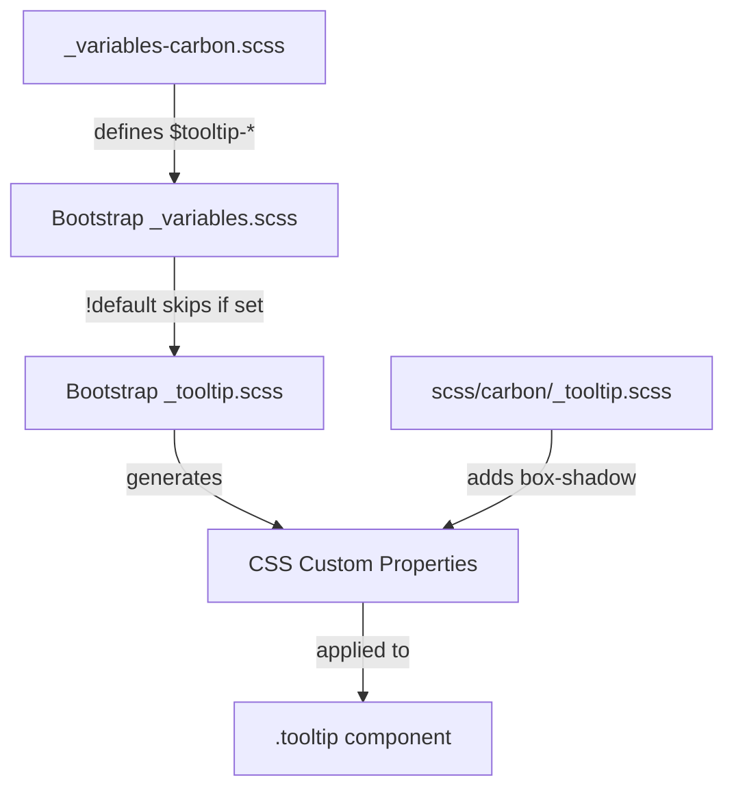

# Design Document

## Overview

This design specifies the implementation of Carbon Design System styling for Bootstrap's tooltip component (`.tooltip`). The tooltip displays contextual information on hover or focus. This implementation uses primarily variable overrides, with minimal custom styles needed only for the box-shadow which Bootstrap doesn't expose as a variable.

## Steering Document Alignment

### Technical Standards (tech.md)
- **Variable-Only Customization**: Use `$tooltip-*` variable overrides where possible
- **Custom Styles**: Required only for box-shadow (not exposed as Bootstrap variable)
- **No Bootstrap Source Modifications**: All changes in `_variables-carbon.scss` and `scss/carbon/_tooltip.scss`

### Project Structure (structure.md)
- **Primary file**: `scss/_variables-carbon.scss` - Tooltip variable overrides
- **Secondary file**: `scss/carbon/_tooltip.scss` - Custom styles for box-shadow
- **Index update**: `scss/carbon/_index.scss` - Add import for tooltip custom styles

## Code Reuse Analysis

### Existing Components to Leverage
- **Bootstrap's `_tooltip.scss`**: Provides complete tooltip structure with CSS custom properties
- **Bootstrap's `_variables.scss`**: Defines `$tooltip-*` variables with `!default` flag
- **Existing Carbon variables**: Reference `$gray-800`, `$white` for color consistency
- **Existing popover pattern**: Similar implementation approach in `_variables-carbon.scss`

### Integration Points
- **Variable cascade**: Our overrides � Bootstrap variables � CSS custom properties � Component styles
- **Existing color system**: Use theme-level `$gray-800` (#393939) for background

## Architecture

The implementation combines variable overrides with minimal custom styles:



## Components and Interfaces

### Variable Overrides

**File:** `scss/_variables-carbon.scss`

Add a new section for tooltip variables after the switch section:

```scss
// =============================================================================
// Carbon Tooltip Overrides
// =============================================================================
// Reference: https://carbondesignsystem.com/components/tooltip/style/
// =============================================================================

// stylelint-disable scss/dollar-variable-default

// -----------------------------------------------------------------------------
// Tooltip Container
// -----------------------------------------------------------------------------
$tooltip-font-size:         .875rem;              // Carbon: 14px body text
$tooltip-max-width:         288px;                // Carbon: standard tooltip width
$tooltip-color:             $white;               // Carbon: white text on dark bg
$tooltip-bg:                $gray-800;            // Carbon: Gray 80 (#393939)
$tooltip-border-radius:     2px;                  // Carbon: 2px standard radius
$tooltip-opacity:           1;                    // Carbon: fully opaque
// Note: Line-height is not overridden because Bootstrap's reset-text() mixin
// sets line-height to $line-height-base (1.5), which is acceptable for tooltips.
// Carbon specifies ~1.29 but this only affects multi-line tooltips minimally.

// -----------------------------------------------------------------------------
// Tooltip Padding
// -----------------------------------------------------------------------------
$tooltip-padding-y:         .5rem;                // Carbon: 8px vertical
$tooltip-padding-x:         1rem;                 // Carbon: 16px horizontal

// -----------------------------------------------------------------------------
// Tooltip Arrow/Caret
// -----------------------------------------------------------------------------
$tooltip-arrow-width:       .5rem;                // Carbon: 8px
$tooltip-arrow-height:      .25rem;               // Carbon: 4px

// stylelint-enable scss/dollar-variable-default
// =============================================================================
// End Carbon Tooltip Overrides
// =============================================================================
```

### Custom Styles

**File:** `scss/carbon/_tooltip.scss`

Custom styles are required because Bootstrap doesn't expose box-shadow as a tooltip variable:

```scss
// Carbon Tooltip Customizations
// Box-shadow not available via Bootstrap variables
// Reference: https://carbondesignsystem.com/components/tooltip/style/

// -----------------------------------------------------------------------------
// Tooltip Shadow
// -----------------------------------------------------------------------------
.tooltip-inner {
  box-shadow: 0 2px 6px rgba(0, 0, 0, .3);  // Carbon: drop shadow
}
```

### CSS Custom Properties (Expected Output)

The compiled CSS will include Bootstrap's generated custom properties with our overrides:

```css
.tooltip {
  --bs-tooltip-zindex: 1080;
  --bs-tooltip-max-width: 288px;
  --bs-tooltip-padding-x: 1rem;
  --bs-tooltip-padding-y: 0.5rem;
  --bs-tooltip-font-size: 0.875rem;
  --bs-tooltip-color: #fff;
  --bs-tooltip-bg: #393939;
  --bs-tooltip-border-radius: 2px;
  --bs-tooltip-opacity: 1;
  --bs-tooltip-arrow-width: 0.5rem;
  --bs-tooltip-arrow-height: 0.25rem;
}

.tooltip-inner {
  max-width: var(--bs-tooltip-max-width);
  padding: var(--bs-tooltip-padding-y) var(--bs-tooltip-padding-x);
  color: var(--bs-tooltip-color);
  background-color: var(--bs-tooltip-bg);
  border-radius: var(--bs-tooltip-border-radius);
  box-shadow: 0 2px 6px rgba(0, 0, 0, 0.3);
}
```

## Data Models

Not applicable - this is a CSS-only implementation with no data structures or JavaScript state management. Bootstrap's tooltip component handles all data management internally through its existing JavaScript plugin (`tooltip.js`), which remains unchanged by this styling update. The tooltip's behavior (show/hide, placement, triggers) is controlled entirely by Bootstrap's JavaScript and data attributes, with our changes affecting only the visual presentation through CSS variables and styles.

## Error Handling

### Build Errors
- **Missing variables**: If referenced variables (e.g., `$gray-800`, `$white`) are undefined, Sass will error
- **Variable type mismatch**: Ensure color values are valid Sass colors

### Runtime Issues
- **CSS specificity**: Custom box-shadow may need verification to ensure it applies correctly

## Testing Strategy

### Visual Testing
1. Create `demo/carbon-tooltip.html` with test cases:
   - Tooltip on button (top placement)
   - Tooltip on link (bottom placement)
   - Tooltip on icon (left placement)
   - Tooltip on text (right placement)
   - Long text tooltip (wrapping behavior)
   - Tooltip with focus trigger

2. Visual comparison checklist:
   - [ ] Background is dark gray (#393939)
   - [ ] Text is white (#ffffff)
   - [ ] Font size is 14px
   - [ ] Padding is 8px vertical, 16px horizontal
   - [ ] Border-radius is 2px
   - [ ] Arrow is 8px � 4px and matches background color
   - [ ] Box-shadow is visible (subtle elevation)
   - [ ] Tooltip is fully opaque (no transparency)
   - [ ] All placements work correctly (top, bottom, left, right)

### Build Testing
```bash
# Lint SCSS
npm run css-lint

# Build and verify no errors
npm run build-theme

# Check compiled CSS for tooltip styles
grep -A 20 "\.tooltip {" dist/css/bootstrap.css
```

### Regression Testing
- Ensure tooltips still appear/disappear correctly with JavaScript
- Test keyboard focus trigger functionality
- Verify RTL layout support
