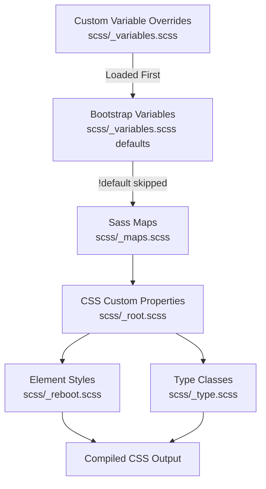
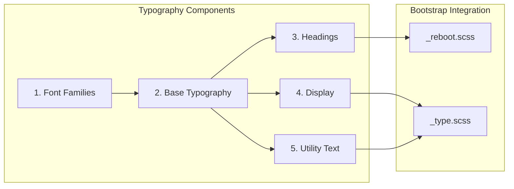

# Design Document: Update Theme Typography

## Overview

This design document describes how to update the Bootstrap theme's typography to match IBM's Carbon Design System. The implementation follows Bootstrap's recommended customization approach by overriding Sass variables in `scss/_variables.scss` before Bootstrap processes them. No Bootstrap source files will be modified directly.

## Steering Document Alignment

### Technical Standards (tech.md)

This design strictly follows the **Variable-Only Customization** approach documented in tech.md:

1. **Variable overrides**: All typography changes are made by setting Sass variables before Bootstrap imports
2. **No source file modifications**: `_reboot.scss`, `_type.scss`, and other Bootstrap files remain untouched
3. **Carbon reference comments**: Each variable override includes a comment referencing the Carbon specification

The design uses the Carbon Design Tokens documented in tech.md:
- **Sans-serif**: IBM Plex Sans
- **Monospace**: IBM Plex Mono
- **Base size**: 16px (1rem)
- **Line height**: 1.5 for body text

### Project Structure (structure.md)

Following structure.md conventions:

1. **Primary customization point**: `scss/_variables.scss` - all typography variable overrides go here
2. **Variable naming**: Uses Bootstrap's `$component-state-property-size` convention
3. **No component file edits**: Per "What NOT to Do" section, we won't modify `_type.scss` or `_reboot.scss`

## Prerequisites

### Font Loading (Out of Scope)

IBM Plex fonts must be loaded before the theme is used. This is handled separately from the SCSS customization:

**Recommended approach** - Add to HTML `<head>`:
```html
<link href="https://fonts.googleapis.com/css2?family=IBM+Plex+Mono:wght@400;600&family=IBM+Plex+Sans:wght@300;400;500;600;700&display=swap" rel="stylesheet">
```

**Alternative** - Self-host font files or use variable fonts for optimal performance.

Font loading implementation is outside the scope of this typography variable update.

## Code Reuse Analysis

### Existing Components to Leverage

- **`scss/_variables.scss`**: The existing variables file where all typography overrides will be added (lines 600-723 contain current typography variables)
- **`scss/_root.scss`**: Automatically generates CSS custom properties from Sass variables (lines 44-56 handle font variables)
- **`scss/_reboot.scss`**: Already uses the variables we'll override; no changes needed
- **`scss/_type.scss`**: Already uses the variables we'll override; no changes needed
- **Bootstrap's `!default` pattern**: All Bootstrap variables use `!default`, so our overrides take precedence

### Integration Points

- **CSS Custom Properties**: Variables flow from `_variables.scss` → `_root.scss` → CSS output as `--bs-font-*` properties
- **RFS (Responsive Font Sizing)**: Bootstrap's RFS mixin will continue to work with our font sizes
- **Component inheritance**: All components using `$font-*` variables will automatically use our overrides
- **Heading utility classes**: `.h1` through `.h6` classes will also reflect changes since they `@extend` the heading elements

## Architecture

The typography customization flows through Bootstrap's existing architecture:





## Design Decisions

### Decision 1: Heading Font Weights

**Problem**: Carbon specifies different font-weights per heading level:
- h1-h3: font-weight 400
- h4-h6: font-weight 600

Bootstrap's `$headings-font-weight` applies a single value to ALL headings. This creates a conflict with the requirements.

**Options Considered**:
1. Use weight 400 (matches h1-h3, incorrect for h4-h6)
2. Use weight 500 (compromise, matches neither exactly)
3. Use weight 600 (matches h4-h6, incorrect for h1-h3)
4. Add custom CSS overrides per heading level (violates variable-only approach)

**Decision**: Use **weight 400** for all headings.

**Rationale**:
- Weight 400 matches Carbon's h1-h3 specifications exactly
- h1-h3 are the most visually prominent headings and benefit most from correct weight
- h4-h6 are smaller headings where the weight difference is less noticeable
- This maintains the variable-only approach without custom CSS
- Can be refined in a future iteration if needed

### Decision 2: Heading Line Heights

**Problem**: Carbon specifies different line-heights per heading level (1.25, 1.28572, 1.4, 1.375). Bootstrap's `$headings-line-height` applies a single value to ALL headings.

**Decision**: Use **line-height 1.3** as a balanced value.

**Rationale**:
- 1.3 falls within the range of Carbon's values (1.25 to 1.4)
- Provides adequate spacing for all heading sizes
- Maintains consistency across headings
- Variable-only approach without custom CSS

### Decision 3: Responsive Font Sizing (RFS)

**Context**: Both Bootstrap and Carbon have responsive typography systems, but they work differently:

| Aspect | Bootstrap RFS | Carbon Type Sets |
|--------|--------------|------------------|
| Approach | Single breakpoint, automatic scaling | Multiple breakpoints (42rem, 66rem, 82rem) |
| Scaling | Formula-based (`$rfs-factor`) | Explicit sizes per breakpoint |
| Breakpoint | 1200px (75rem) default | 672px, 1056px, 1312px |
| Fluid sizing | Below breakpoint | Between breakpoints with `calc()` + `vw` |

**Carbon's responsive heading sizes** (from documentation):
| Heading | Mobile | 42rem (672px) | 66rem (1056px) | 82rem+ (1312px) |
|---------|--------|---------------|----------------|-----------------|
| h1 | 2rem | 2.25rem | 2.625rem | 3rem → 3.75rem |
| h2 | 1.75rem | - | - | 2rem |
| h3 | 1.25rem | (consistent) | (consistent) | (consistent) |
| h4-h6 | 0.875-1rem | (consistent) | (consistent) | (consistent) |

**Decision**: Use Bootstrap's RFS with tuned settings to approximate Carbon's behavior.

**Rationale**:
- Implementing Carbon's exact multi-breakpoint system would require custom CSS/media queries, violating the variable-only approach
- Bootstrap's RFS provides similar fluid scaling behavior
- We can tune RFS variables to better match Carbon's scaling

**RFS Configuration** (to be added to variable overrides):
```scss
// RFS tuning to approximate Carbon's responsive behavior
$rfs-base-value: 1rem;        // Carbon's smallest body size
$rfs-breakpoint: 1056px;      // Closer to Carbon's 66rem breakpoint
$rfs-factor: 8;               // Slightly more aggressive scaling than default (10)
```

**Impact**:
- Headings will scale fluidly below 1056px viewport width
- Scaling approximates Carbon's behavior but isn't an exact match
- Can be refined in future iterations if more precise Carbon matching is needed

## Components and Interfaces

### Component 1: Font Family Variables

- **Purpose**: Define IBM Plex font families to replace Bootstrap's system font stack
- **Variables to Override**:
  - `$font-family-sans-serif`: IBM Plex Sans with fallbacks
  - `$font-family-monospace`: IBM Plex Mono with fallbacks
- **Dependencies**: None (base-level variables)
- **Reuses**: Bootstrap's `$font-family-base` and `$font-family-code` which reference these

### Component 2: Base Typography Variables

- **Purpose**: Set body text typography matching Carbon's body-long-02 token
- **Variables to Override**:
  - `$font-size-base`: 1rem (16px) - matches Carbon, unchanged from Bootstrap
  - `$font-weight-base`: 400 - matches Carbon, unchanged from Bootstrap
  - `$line-height-base`: 1.5 - matches Carbon, unchanged from Bootstrap
  - `$font-size-sm`: 0.875rem (14px) - matches Carbon body-short-01
  - `$font-size-lg`: 1.25rem (20px)
- **Dependencies**: Font family variables
- **Reuses**: Bootstrap's existing typography system

### Component 3: Heading Typography Variables

- **Purpose**: Map Bootstrap headings to Carbon's productive heading tokens
- **Variables to Override**:
  - `$h1-font-size`: 2rem - Carbon productive-heading-05
  - `$h2-font-size`: 1.75rem - Carbon productive-heading-04
  - `$h3-font-size`: 1.25rem - Carbon productive-heading-03
  - `$h4-font-size`: 1rem - Carbon productive-heading-02
  - `$h5-font-size`: 0.875rem - Carbon productive-heading-01
  - `$h6-font-size`: 0.875rem - Carbon productive-heading-01
  - `$headings-font-weight`: 400 (see Design Decision 1)
  - `$headings-line-height`: 1.3 (see Design Decision 2)
- **Dependencies**: `$font-size-base`
- **Reuses**: Bootstrap's heading placeholder `%heading` in `_reboot.scss`

### Component 4: Display Typography Variables

- **Purpose**: Style large display headings with Carbon-inspired values
- **Variables to Override**:
  - `$display-font-sizes` map (see Data Models section for exact values)
  - `$display-font-weight`: 300 (light) - Carbon expressive style
  - `$display-line-height`: 1.2
- **Dependencies**: None
- **Reuses**: Bootstrap's `.display-*` classes in `_type.scss`

### Component 5: Utility Typography Variables

- **Purpose**: Style supporting text elements (lead, small, blockquote, code)
- **Variables to Override**:
  - `$lead-font-size`: 1.25rem
  - `$lead-font-weight`: 300
  - `$small-font-size`: 0.875em
  - `$blockquote-font-size`: 1.25rem
  - `$code-font-size`: 0.875em
- **Dependencies**: Base typography variables
- **Reuses**: Bootstrap's utility classes

## Data Models

### Complete Variable Override List

```scss
// ============================================
// Carbon Typography Variable Overrides
// Add these at the TOP of scss/_variables.scss
// BEFORE Bootstrap's default variable definitions
// ============================================

// ---------------------------------------------
// Font Families (Carbon: IBM Plex)
// ---------------------------------------------
$font-family-sans-serif: "IBM Plex Sans", system-ui, -apple-system, "Segoe UI", Roboto, "Helvetica Neue", "Noto Sans", "Liberation Sans", Arial, sans-serif, "Apple Color Emoji", "Segoe UI Emoji", "Segoe UI Symbol", "Noto Color Emoji"; // Carbon: IBM Plex Sans
$font-family-monospace: "IBM Plex Mono", SFMono-Regular, Menlo, Monaco, Consolas, "Liberation Mono", "Courier New", monospace; // Carbon: IBM Plex Mono

// ---------------------------------------------
// Base Typography (Carbon: body-long-02)
// ---------------------------------------------
$font-size-base: 1rem;        // Carbon: 16px
$font-weight-base: 400;       // Carbon: regular
$line-height-base: 1.5;       // Carbon: body-long-02
$font-size-sm: .875rem;       // Carbon: 14px (body-short-01)
$font-size-lg: 1.25rem;       // Carbon: 20px

// ---------------------------------------------
// Heading Typography (Carbon: productive headings)
// ---------------------------------------------
$h1-font-size: 2rem;          // Carbon: productive-heading-05
$h2-font-size: 1.75rem;       // Carbon: productive-heading-04
$h3-font-size: 1.25rem;       // Carbon: productive-heading-03
$h4-font-size: 1rem;          // Carbon: productive-heading-02
$h5-font-size: .875rem;       // Carbon: productive-heading-01
$h6-font-size: .875rem;       // Carbon: productive-heading-01
$headings-font-weight: 400;   // Carbon: h1-h3 use 400
$headings-line-height: 1.3;   // Carbon: balanced value

// ---------------------------------------------
// Display Typography (Carbon: expressive style)
// ---------------------------------------------
$display-font-sizes: (
  1: 3.75rem,   // 60px - Carbon expressive
  2: 3.25rem,   // 52px
  3: 2.75rem,   // 44px
  4: 2.25rem,   // 36px
  5: 2rem,      // 32px
  6: 1.75rem    // 28px
);
$display-font-weight: 300;    // Carbon: light weight for display
$display-line-height: 1.2;    // Carbon: tighter for large text

// ---------------------------------------------
// Utility Typography
// ---------------------------------------------
$lead-font-size: 1.25rem;     // Carbon: emphasis text
$lead-font-weight: 300;       // Carbon: light emphasis
$small-font-size: .875em;     // Carbon: 14px equivalent
$blockquote-font-size: 1.25rem;
$code-font-size: .875em;      // Carbon: code-02

// ---------------------------------------------
// Responsive Font Sizing (RFS) Tuning
// ---------------------------------------------
$rfs-base-value: 1rem;        // Carbon: minimum body size
$rfs-breakpoint: 1056px;      // Carbon: 66rem breakpoint
$rfs-factor: 8;               // More aggressive than default (10)
```

### Typography Variable Mapping Table

| Bootstrap Variable | Carbon Token | Value | Notes |
|-------------------|--------------|-------|-------|
| `$font-family-sans-serif` | IBM Plex Sans | See font stack above | Primary typeface |
| `$font-family-monospace` | IBM Plex Mono | See font stack above | Code typeface |
| `$font-size-base` | body-long-02 | 1rem (16px) | Unchanged |
| `$line-height-base` | body-long-02 | 1.5 | Unchanged |
| `$h1-font-size` | productive-heading-05 | 2rem | 32px |
| `$h2-font-size` | productive-heading-04 | 1.75rem | 28px |
| `$h3-font-size` | productive-heading-03 | 1.25rem | 20px |
| `$h4-font-size` | productive-heading-02 | 1rem | 16px |
| `$h5-font-size` | productive-heading-01 | 0.875rem | 14px |
| `$h6-font-size` | productive-heading-01 | 0.875rem | 14px |
| `$headings-font-weight` | varies | 400 | Design decision |
| `$headings-line-height` | varies | 1.3 | Balanced |
| `$display-font-weight` | expressive | 300 | Light |
| `$display-line-height` | expressive | 1.2 | Tight |

### CSS Custom Properties Generated

The following CSS custom properties will be automatically generated by `_root.scss`:

```css
:root {
  --bs-font-sans-serif: "IBM Plex Sans", system-ui, ...;
  --bs-font-monospace: "IBM Plex Mono", SFMono-Regular, ...;
  --bs-body-font-family: var(--bs-font-sans-serif);
  --bs-body-font-size: 1rem;
  --bs-body-font-weight: 400;
  --bs-body-line-height: 1.5;
}
```

## Error Handling

### Error Scenarios

1. **IBM Plex fonts not loaded**
   - **Handling**: Font stack includes comprehensive fallbacks (system-ui, Segoe UI, etc.)
   - **User Impact**: Site renders with system fonts; design remains readable, just not IBM Plex

2. **Variable override not taking effect**
   - **Handling**: Ensure override appears BEFORE Bootstrap's `_variables.scss` is processed
   - **User Impact**: Would see Bootstrap default typography; caught during development/testing

3. **CSS variable not generated**
   - **Handling**: `_root.scss` automatically generates CSS custom properties from Sass variables
   - **User Impact**: Fonts might not update dynamically; verify in browser DevTools

## Testing Strategy

### Unit Testing

- **SCSS Compilation**: Verify build completes without errors using `npm run css`
- **Variable Override Verification**: Check that compiled CSS contains expected font families and sizes
- **CSS Custom Property Generation**: Verify `--bs-font-sans-serif` and `--bs-font-monospace` in output
- **Sass lint**: Run `npm run css-lint` to verify no style issues

### Integration Testing

- **Component Typography**: Verify buttons, forms, navbars use updated typography
- **Utility Classes**: Test `.fs-*`, `.fw-*`, `.lh-*` utilities work with new values
- **Heading Classes**: Verify `.h1` through `.h6` classes match element styles
- **Responsive Behavior**: Test RFS scaling at different viewport widths

### End-to-End Testing

- **Font Loading**: Open site in browser and verify IBM Plex renders
- **Visual Inspection**: Review all heading levels, body text, and code blocks
- **Fallback Testing**: Block Google Fonts and verify fallback fonts render correctly
- **Cross-browser**: Test in Chrome, Firefox, Safari, Edge
- **Performance**: Verify font-display: swap prevents invisible text

### Performance Testing

- **Font File Size**: Verify total font weight is under 200KB (from requirements)
- **Lighthouse Audit**: Check for font-related performance warnings
- **Network Tab**: Verify fonts load with `font-display: swap`
